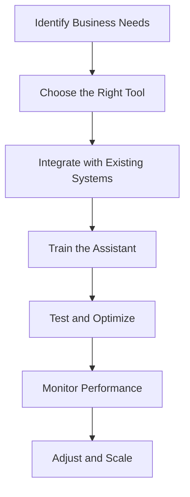

---

# Exploring AI Agents: Your Business's New Virtual Assistant

In today’s fast-paced business environment, efficiency is key to staying ahead. Enter the AI virtual assistant—your new best friend in the quest for productivity. These intelligent agents are designed to handle a variety of tasks, from scheduling meetings to managing emails, allowing you to focus on what truly matters: growing your business. In this article, we’ll explore the capabilities of AI virtual assistants, their benefits, and how they can revolutionize your business operations.

## What is an AI Virtual Assistant?

An AI virtual assistant is a software application that uses artificial intelligence to perform tasks traditionally handled by human assistants. These tasks can range from simple administrative functions like data entry to more complex roles such as customer service and analytics. The goal is to streamline operations, reduce manual labor, and ultimately enhance productivity.

### Key Features of AI Virtual Assistants

AI virtual assistants come packed with features that can help businesses operate more smoothly. Here are some essential functionalities:

- **Task Automation**: Automate repetitive tasks such as scheduling, reminders, and email management.
- **Data Management**: Organize and analyze data to provide insights that help in decision-making.
- **Natural Language Processing (NLP)**: Understand and respond to human language, making interactions seamless.
- **Integration**: Connect with other software tools, such as CRMs and project management platforms, for a unified workflow.

## How AI Virtual Assistants Enhance Productivity

Imagine having an assistant that never sleeps, working tirelessly to manage your calendar, answer customer queries, and even analyze data. Here are some practical examples of how AI virtual assistants can boost productivity in various business scenarios:

### 1. Scheduling Meetings

One of the most time-consuming tasks for professionals is scheduling meetings. AI virtual assistants like x.ai or Clara can handle this task by coordinating between participants' calendars, finding suitable times, and sending invites—all without human intervention. This not only saves time but also minimizes the back-and-forth communication that often accompanies scheduling.

### 2. Customer Support

AI virtual assistants can also serve as the first point of contact for customers. Tools like Ada and Drift use chatbots to answer frequently asked questions, resolve issues, and even guide customers through purchasing processes. This ensures that human agents can focus on more complex inquiries, enhancing overall customer satisfaction.

### 3. Data Insights

Many AI virtual assistants have built-in analytics capabilities. Tools like Microsoft Power Virtual Agents can analyze customer interactions and provide insights into prevalent issues, helping businesses refine their strategies and improve products or services. This data-driven approach can significantly enhance decision-making processes.

## Pros and Cons of AI Virtual Assistants

### Pros

- **24/7 Availability**: AI virtual assistants are always on, allowing businesses to provide support and services at any hour.
- **Cost-Effective**: They can reduce the need for a large administrative staff, resulting in significant cost savings.
- **Increased Efficiency**: Automating repetitive tasks frees up time for employees to focus on more strategic initiatives.

### Cons

- **Limited Understanding**: While AI has come a long way, it can still struggle with complex queries or nuance in human communication.
- **Dependence on Technology**: Over-reliance on AI can lead to reduced human interaction, which may affect company culture.
- **Privacy Concerns**: Handling sensitive data raises questions about security and privacy, requiring businesses to ensure compliance with regulations.

## Choosing the Right AI Virtual Assistant

With numerous options available, selecting the right AI virtual assistant for your business can be daunting. Here’s a quick comparison of some popular tools to help you make an informed decision.

<table>
  <tr>
    <th>Tool</th>
    <th>Best For</th>
    <th>Key Features</th>
    <th>Pricing</th>
  </tr>
  <tr>
    <td>X.ai</td>
    <td>Scheduling</td>
    <td>Calendar integration, email coordination</td>
    <td>Starts at $8/month</td>
  </tr>
  <tr>
    <td>Drift</td>
    <td>Customer support</td>
    <td>Chatbot, lead generation</td>
    <td>Custom pricing</td>
  </tr>
  <tr>
    <td>Ada</td>
    <td>Customer engagement</td>
    <td>AI-driven chat, multilingual support</td>
    <td>Starts at $49/month</td>
  </tr>
  <tr>
    <td>Microsoft Power Virtual Agents</td>
    <td>Data insights</td>
    <td>Data analytics, integration with Microsoft products</td>
    <td>Starts at $1,000/month</td>
  </tr>
</table>

## Workflow of Implementing an AI Virtual Assistant

Integrating an AI virtual assistant into your business requires a well-thought-out plan. Here’s a simple workflow to guide you through the process:

## Conclusion

AI virtual assistants are no longer a futuristic concept; they are a practical solution that can enhance productivity and streamline operations in your business. By identifying your specific needs and choosing the right tool, you can leverage these intelligent agents to automate tedious tasks, improve customer interactions, and gain valuable insights from your data.

Ready to take your business to the next level? Explore various AI virtual assistants today, and see how these powerful tools can transform your operations and boost your productivity.

### Call to Action

Don’t wait! Start exploring AI virtual assistants that fit your business needs. Check out the tools mentioned in this article, and take the first step toward a smarter, more efficient workplace!

## 関連記事

- [AI Agents: The Future of Personal Assistants in 2026](/posts/ai-agents-the-future-of-personal-assistants-in-2026/)
- [AI Automation: A Game Changer for Small Businesses](/posts/ai-automation-a-game-changer-for-small-businesses/)
- [AI Automation: The Key to Enhanced Business Efficiency](/posts/ai-automation-the-key-to-enhanced-business-efficiency/)
