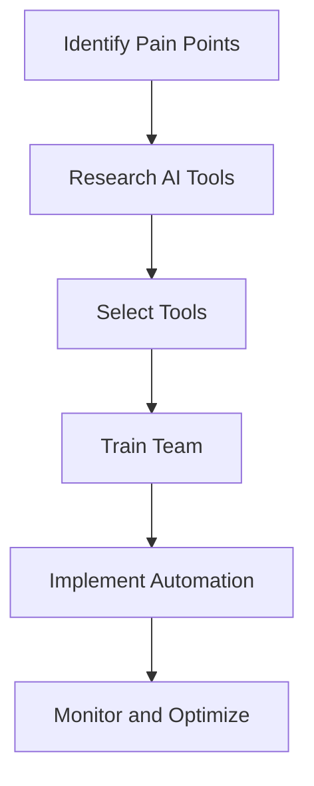

---

## Exploring AI Automation for Small Businesses

In today’s fast-paced digital landscape, small businesses are increasingly turning to technology to streamline operations and enhance productivity. One of the most promising advancements is AI automation. But what exactly does this mean for small business owners? In this article, we’ll explore the impact of AI automation on small businesses, delve into practical use cases, and provide insights on how to effectively implement these tools for maximum benefit.

### What is AI Automation?

AI automation refers to the use of artificial intelligence technologies to automate repetitive tasks and processes within a business. This can include everything from customer service inquiries to inventory management and data analysis. By leveraging AI, small businesses can save time, reduce human error, and free up valuable resources to focus on strategic growth initiatives.

### Why Should Small Businesses Consider AI Automation?

The advantages of AI automation for small businesses are numerous:

- **Increased Efficiency**: Automating routine tasks allows employees to focus on higher-value activities, enhancing overall productivity.
- **Cost Savings**: By reducing the need for manual labor on repetitive tasks, businesses can cut operational costs.
- **Improved Accuracy**: AI systems can perform tasks with precision, minimizing the risk of human error.
- **Enhanced Customer Experience**: AI tools can provide personalized interactions and support, leading to higher customer satisfaction.

### Practical Examples of AI Automation in Small Businesses

1. **Customer Service Automation**
   - **Chatbots**: Implementing AI-driven chatbots on your website can provide 24/7 customer support. These bots can answer frequently asked questions, guide users through processes, and escalate issues to human agents when necessary. For instance, a small e-commerce store might use a chatbot to handle order inquiries, freeing up staff to manage other responsibilities.

2. **Email Marketing**
   - **Personalization**: AI tools can analyze customer data to create tailored email campaigns. For example, Mailchimp’s AI features can segment your audience based on purchasing behavior, ensuring that customers receive relevant content, thereby boosting engagement rates.

3. **Inventory Management**
   - **Predictive Analytics**: Small retailers can use AI to forecast inventory needs based on historical sales data and trends. This helps in maintaining optimal stock levels, reducing overstock or stockouts. Tools like TradeGecko utilize AI to automate reordering processes based on predictive insights.

4. **Human Resources**
   - **Recruitment Automation**: AI-driven platforms like BreezyHR can streamline the recruitment process by screening resumes, scheduling interviews, and even conducting preliminary assessments. This saves HR teams hours of manual work, allowing them to focus on candidate engagement.

5. **Financial Management**
   - **Expense Tracking**: AI tools like Expensify can automatically categorize expenses and generate reports, simplifying the bookkeeping process for small business owners.

### Pros and Cons of AI Automation for Small Businesses

While the benefits are substantial, it’s essential to consider some challenges as well.

#### Pros
- **Time Savings**: Automating tasks reduces the time spent on routine activities.
- **Scalability**: AI tools can grow with your business, adapting to increased demands.
- **Data-Driven Insights**: AI can analyze vast amounts of data, providing actionable insights to inform business strategies.

#### Cons
- **Implementation Costs**: Initial investment in AI tools can be high, which may be a barrier for some small businesses.
- **Maintenance and Updates**: Ongoing maintenance and updates are required to keep AI systems functioning optimally.
- **Job Displacement Concerns**: There may be fears about job loss among employees due to automation.

### How to Get Started with AI Automation

Starting with AI automation doesn’t have to be overwhelming. Here’s a step-by-step guide to help small businesses implement AI tools effectively:

1. **Identify Pain Points**: Determine which tasks consume the most time and resources. Focus on processes that can benefit most from automation.
   
2. **Research Tools**: Explore available AI automation tools that fit your specific needs. Below is a comparison table of popular AI automation tools for small businesses:

   <table>
   <tr>
       <th>Tool</th>
       <th>Use Case</th>
       <th>Pricing</th>
       <th>Best For</th>
   </tr>
   <tr>
       <td>Zapier</td>
       <td>Task automation between apps</td>
       <td>Starts at $19.99/month</td>
       <td>Integrating multiple applications</td>
   </tr>
   <tr>
       <td>Mailchimp</td>
       <td>Email marketing automation</td>
       <td>Free to start, paid plans available</td>
       <td>Email marketing and newsletters</td>
   </tr>
   <tr>
       <td>HubSpot</td>
       <td>CRM and marketing automation</td>
       <td>Free CRM, paid marketing tools</td>
       <td>Comprehensive marketing solutions</td>
   </tr>
   <tr>
       <td>QuickBooks</td>
       <td>Financial management</td>
       <td>Starts at $25/month</td>
       <td>Accounting and bookkeeping</td>
   </tr>
   </table>

3. **Start Small**: Choose one or two tasks to automate initially. This allows you to measure success and make adjustments as needed.

4. **Train Your Team**: Ensure that your team is trained on how to use new tools effectively. This will maximize the benefits of automation.

5. **Measure and Iterate**: Monitor the performance of the automated processes. Use metrics to gauge success and gather feedback for continuous improvement.

### A Visual Workflow of AI Automation Implementation

To better understand the implementation of AI automation, here’s a simple workflow diagram:

### Conclusion

AI automation presents a transformative opportunity for small businesses to enhance efficiency, reduce costs, and improve customer experiences. By carefully evaluating your needs, selecting the right tools, and implementing them strategically, you can unlock the full potential of AI in your operations. 

Are you ready to take your small business to the next level with AI automation? Start exploring the tools mentioned in this article, and don’t hesitate to reach out for personalized advice on your automation journey. Embrace the future and watch your business thrive!

--- 

By adopting AI automation, small businesses can not only survive but thrive in an increasingly competitive marketplace. Don’t wait—begin your AI journey today!

## 関連記事

- [AI Automation: A Game Changer for Small Businesses](/posts/ai-automation-a-game-changer-for-small-businesses/)
- [AI Agents: The Future of Personal Assistants in 2026](/posts/ai-agents-the-future-of-personal-assistants-in-2026/)
- [AI Automation: The Key to Enhanced Business Efficiency](/posts/ai-automation-the-key-to-enhanced-business-efficiency/)
