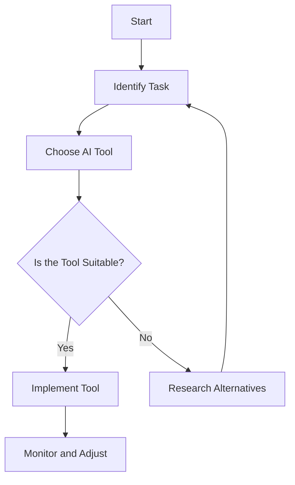

---

# Exploring the Latest AI Tools for Enhanced Productivity

In today's fast-paced digital landscape, staying ahead of the competition requires not just hard work, but also smart work. Enter the latest AI tools designed to enhance productivity and efficiency across various sectors. From automating mundane tasks to providing insightful data analysis, these tools can be game-changers for individuals and organizations alike. In this article, we'll dive deep into some of the most innovative AI tools currently available and explore how they can transform your productivity.

## Why AI Tools Matter

The integration of AI into everyday tasks is not just a trend; it's a necessity. Businesses are constantly looking for ways to optimize their operations, reduce costs, and improve the quality of their output. AI tools can help achieve these objectives by streamlining workflows, enhancing decision-making, and even fostering creativity. 

For example, imagine a marketing team that spends hours analyzing data to identify trends. With AI tools, these insights can be generated in seconds, allowing the team to focus on strategy rather than data crunching. 

### Potential Benefits of Using AI Tools

- **Time-Saving:** Automating repetitive tasks frees up valuable time for more strategic work.
- **Increased Accuracy:** AI tools reduce human error, especially in data processing and analysis.
- **Enhanced Insights:** By analyzing large datasets quickly, AI can unveil trends and patterns that may be missed manually.
- **Better Decision-Making:** With access to real-time data and analytics, businesses can make informed decisions swiftly.

## Latest AI Tools to Boost Productivity

Let's explore some of the latest AI tools that have taken the productivity world by storm. We will look at their features, advantages, and potential downsides.

### 1. Notion AI

Notion is a well-known productivity tool, and its recent AI enhancements have made it even more attractive. Notion AI helps users write, brainstorm, and generate ideas efficiently.

#### Features

- **Content Generation:** Generate ideas, outlines, or even full documents based on prompts.
- **Task Management:** Automatically organize tasks and set reminders.
  
#### Pros and Cons

| Pros                             | Cons                             |
|----------------------------------|----------------------------------|
| Streamlined content creation      | Can lack deep contextual understanding |
| Integrates with existing Notion features | Requires an internet connection |

### 2. Trello with Butler

Trello is a popular project management tool, and with the Butler automation feature, it allows users to automate tasks and manage workflows effortlessly.

#### Features

- **Automated Task Creation:** Set triggers for task assignments based on board activity.
- **Custom Commands:** Create rules for actions that can be executed automatically.

#### Pros and Cons

| Pros                             | Cons                             |
|----------------------------------|----------------------------------|
| Saves time with automation        | May require some initial setup   |
| User-friendly interface          | Limited to Trello’s environment   |

### 3. Jasper AI

Jasper AI is designed for content creators and marketers, providing AI-driven writing assistance that can enhance creativity and efficiency.

#### Features

- **SEO Optimization:** Suggests keywords and phrases to improve search engine visibility.
- **Versatile Content Types:** Can generate blog posts, social media content, and email drafts.

#### Pros and Cons

| Pros                             | Cons                             |
|----------------------------------|----------------------------------|
| High-quality content generation    | Subscription-based pricing       |
| AI learns from your writing style | May need editing for tone       |

### 4. Slack with Workflow Builder

Slack is not just a communication tool; its Workflow Builder feature allows teams to automate repetitive tasks and streamline communication effectively.

#### Features

- **Custom Workflows:** Automate notifications, reminders, and task assignments within Slack.
- **Integration with Other Apps:** Connect Slack with tools like Google Drive and Trello.

#### Pros and Cons

| Pros                             | Cons                             |
|----------------------------------|----------------------------------|
| Enhances team collaboration       | Might overwhelm new users       |
| Highly customizable               | Requires time to set up workflows |

## How to Choose the Right AI Tool for You

When faced with multiple options, selecting the right AI tool can be daunting. Here’s a simple decision-making process to guide you:

1. **Identify Your Needs:** Assess what tasks are repetitive or time-consuming.
2. **Research Tools:** Look into various AI tools that address your specific needs.
3. **Trial Periods:** Take advantage of free trials to test the tools before committing.
4. **Seek Feedback:** Consult with your team or community to gather opinions on different tools.

### Comparison of Popular AI Tools for Productivity

Here’s a quick comparison table summarizing the features, pros, and cons of the tools we've discussed:

<table>
  <tr>
    <th>Tool</th>
    <th>Features</th>
    <th>Pros</th>
    <th>Cons</th>
  </tr>
  <tr>
    <td>Notion AI</td>
    <td>Content generation, task management</td>
    <td>Streamlined content creation</td>
    <td>Can lack deep contextual understanding</td>
  </tr>
  <tr>
    <td>Trello with Butler</td>
    <td>Automated task creation, custom commands</td>
    <td>Saves time with automation</td>
    <td>May require some initial setup</td>
  </tr>
  <tr>
    <td>Jasper AI</td>
    <td>SEO optimization, versatile content types</td>
    <td>High-quality content generation</td>
    <td>Subscription-based pricing</td>
  </tr>
  <tr>
    <td>Slack with Workflow Builder</td>
    <td>Custom workflows, app integration</td>
    <td>Enhances team collaboration</td>
    <td>Might overwhelm new users</td>
  </tr>
</table>

## Conclusion

The latest AI tools are not just about technology; they're about empowering individuals and teams to work smarter, not harder. By automating repetitive tasks, enhancing creativity, and improving decision-making processes, these tools can significantly boost productivity.

Whether you're a freelancer, a team leader, or part of a large organization, there’s likely an AI tool that can help you achieve your goals more efficiently. So why wait? Start exploring these tools today and see how they can transform your productivity!

### Call to Action

Are you ready to supercharge your productivity with the latest AI tools? Dive into the world of AI and discover the perfect tool for your needs. Share your experiences with us in the comments below, or check out our other articles for more tips on leveraging technology for success!