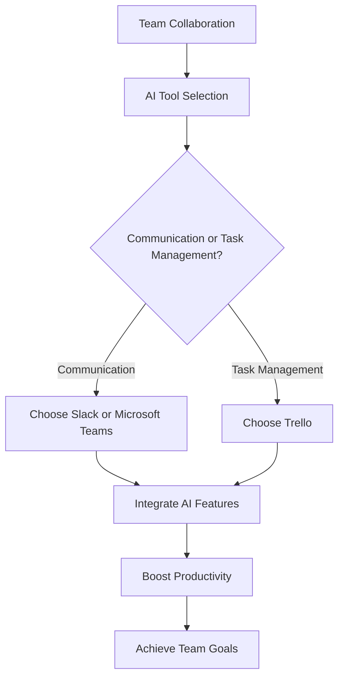

---

## Future of Work: AI Tools That Enhance Team Collaboration

In today's fast-paced digital landscape, collaboration is more critical than ever. The rise of remote and hybrid work models has pushed teams to seek innovative solutions that not only facilitate communication but also enhance productivity. Enter AI tools for collaboration—technologies designed to streamline workflows, improve decision-making, and foster a more cohesive work environment. In this blog post, we will explore some of the most effective AI tools for collaboration, their unique features, pros and cons, and practical use cases to help you harness their potential.

### Why AI Tools for Collaboration?

AI tools for collaboration are designed to leverage artificial intelligence to automate mundane tasks, analyze data, and provide insights that support informed decision-making. By integrating these tools into your team's workflow, you can:

- **Enhance Communication**: AI tools can facilitate seamless communication through chatbots, virtual assistants, and automated scheduling.
- **Boost Productivity**: Automating repetitive tasks frees up valuable time for your team to focus on what truly matters.
- **Foster Innovation**: AI-driven insights can help teams identify trends and opportunities that may have gone unnoticed.

### Key AI Tools for Team Collaboration

Let’s dive into some of the most effective AI tools that can enhance team collaboration.

#### 1. Slack with AI Integrations

Slack is a popular messaging platform that has become synonymous with team communication. With the rise of AI, it has also integrated various AI-driven features that improve collaboration.

**Pros:**
- Real-time messaging and file sharing
- Integrations with numerous third-party apps
- Customizable notifications

**Cons:**
- Can become overwhelming with too many channels
- Limited features in the free version

**Use Case:** A marketing team can utilize Slack to streamline communications across various projects, keeping all discussions in one place and reducing email clutter. Integrating AI-powered bots can automate reminders and updates, ensuring that everyone stays informed.

#### 2. Microsoft Teams with AI Capabilities

Microsoft Teams is another leading collaboration platform that incorporates AI features to enhance productivity.

**Pros:**
- Seamless integration with Microsoft Office tools
- Video conferencing and screen sharing capabilities
- Powerful search functionality

**Cons:**
- Some users find the interface complex
- Requires a Microsoft 365 subscription for full features

**Use Case:** A product development team can use Microsoft Teams to hold virtual brainstorming sessions, share documents, and collaborate in real-time on product designs, all while utilizing AI to transcribe meetings and summarize discussions.

#### 3. Trello with AI Automation

Trello is a project management tool that uses boards, lists, and cards to help teams organize tasks. It now offers AI capabilities to automate workflows.

**Pros:**
- User-friendly interface
- Visual task management
- Automation features with Butler

**Cons:**
- Limited project management features in the free plan
- May not be suitable for larger projects or teams

**Use Case:** A content creation team can use Trello to manage their editorial calendar, with AI automating the assignment of tasks based on team members' workloads, ensuring an even distribution of tasks.

### Comparison of AI Collaboration Tools

To help you choose the best AI collaboration tool for your team, here’s a quick comparison table of the features and capabilities of Slack, Microsoft Teams, and Trello.

<table>
  <tr>
    <th>Tool</th>
    <th>Real-Time Messaging</th>
    <th>Integrations</th>
    <th>AI Features</th>
    <th>Best For</th>
  </tr>
  <tr>
    <td>Slack</td>
    <td>Yes</td>
    <td>Extensive</td>
    <td>AI Bots, Automations</td>
    <td>Communication Focused Teams</td>
  </tr>
  <tr>
    <td>Microsoft Teams</td>
    <td>Yes</td>
    <td>Microsoft 365 Apps</td>
    <td>Meeting Transcriptions, Insights</td>
    <td>Organizations Using Microsoft Ecosystem</td>
  </tr>
  <tr>
    <td>Trello</td>
    <td>No</td>
    <td>Many Third-Party Integrations</td>
    <td>Automation with Butler</td>
    <td>Project Management and Task Organization</td>
  </tr>
</table>

### AI-Enhanced Workflow Diagram

To visualize how AI tools can enhance team collaboration, here's a simple workflow diagram.

### Making the Most of AI Tools for Collaboration

To truly harness the power of AI tools for collaboration, follow these best practices:

1. **Choose the Right Tool**: Assess your team's needs and choose a tool that fits those requirements. Don't try to force a tool that doesn't align with your workflow.
  
2. **Train Your Team**: Ensure that all team members are trained on how to use the tools effectively. This can include workshops, tutorials, or dedicated support.

3. **Regularly Review Usage**: Monitor how your team uses these tools and seek feedback. This will help you identify areas for improvement and ensure that the tools are meeting your team's needs.

4. **Encourage Collaboration**: Foster a culture of collaboration within your team. Encourage team members to share their experiences and insights gained from using AI tools.

### Conclusion

The future of work is undeniably intertwined with AI tools that enhance team collaboration. By integrating the right AI tools into your workflow, you can improve communication, boost productivity, and foster a culture of innovation. Whether you choose Slack, Microsoft Teams, or Trello, leveraging these technologies will not only streamline processes but also empower your team to reach new heights.

Ready to enhance your team's collaboration with AI tools? Start exploring these solutions today and see how they can transform your work environment!

### Call to Action

If you found this article helpful, don’t forget to share it with your colleagues and subscribe to our blog for more insights on AI tools and productivity! What AI tools for collaboration have you tried, and how have they impacted your workflow? Let us know in the comments below!

## 関連記事

- [Revolutionizing Team Collaboration with AI Tools](/posts/revolutionizing-team-collaboration-with-ai-tools/)
- [AI Agents: The Future of Personal Assistants in 2026](/posts/ai-agents-the-future-of-personal-assistants-in-2026/)
- [AI Tools for Small Businesses: Increase Your ROI](/posts/ai-tools-for-small-businesses-increase-your-roi/)
