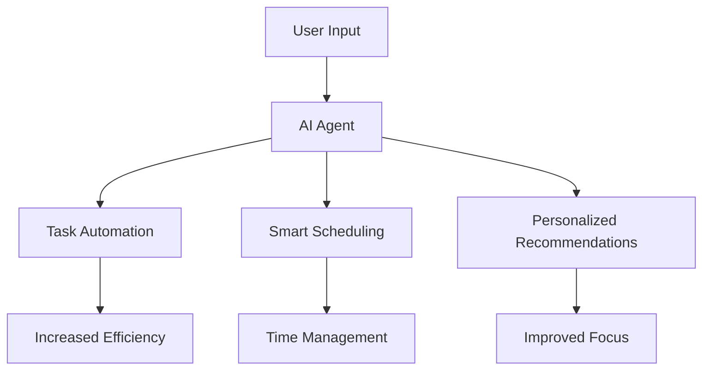

---

## Future Trends: AI Agents in Personal Productivity

In recent years, the landscape of personal productivity has been reshaped by the emergence of AI agents. These intelligent tools are designed to assist with everything from scheduling meetings to managing tasks more efficiently. As we move into the future, understanding how AI agents can optimize our productivity is crucial. In this article, we will explore emerging trends, practical applications, and the potential challenges associated with AI agents in personal productivity.

### What Are AI Agents?

AI agents are software applications that automate tasks, make recommendations, and facilitate communication. They leverage machine learning, natural language processing, and other AI technologies to understand user preferences and work patterns. Examples include virtual assistants like Siri, task management tools like Todoist, and advanced AI platforms like [Notion AI](https://www.notion.so/product/ai?ref=AFFILIATE_ID).

### The Role of AI Agents in Personal Productivity

AI agents can significantly enhance personal productivity by automating mundane tasks, providing insights, and suggesting improvements. Let’s dive deeper into some of the most notable ways AI agents are revolutionizing how we work.

#### 1. Task Automation

One of the primary functions of AI agents is task automation. Applications like Zapier and IFTTT allow users to create workflows that automate repetitive tasks. For instance, if you frequently receive emails with attachments, you can set up an AI agent to automatically save those attachments to your cloud storage.

**Example Use Case:**
Imagine you run a small business and receive numerous customer inquiries via email. An AI agent can filter these emails, categorize them based on urgency, and even send automated responses, allowing you to focus on critical business decisions instead of getting bogged down by routine queries.

#### 2. Smart Scheduling

AI agents excel at scheduling and calendar management. Tools like x.ai and Clockwise use AI to analyze your preferences and make intelligent scheduling decisions. By automatically finding the best time slots for meetings, they help reduce the dreaded back-and-forth email chain.

**Example Use Case:**
Suppose you’re a project manager with a busy calendar. An AI agent can analyze your schedule and propose optimal meeting times that consider your availability, preferences, and even time zone differences with clients.

#### 3. Personalized Recommendations

AI agents are also capable of providing personalized recommendations based on user behavior. Tools like Todoist leverage AI to suggest tasks based on past performance and current workload, effectively prioritizing your to-do list.

**Example Use Case:**
If you frequently postpone certain types of tasks like "writing reports," an AI agent can remind you to tackle these at the optimal time, perhaps when you have higher energy levels or fewer prior commitments.

### Future Trends in AI Agents for Personal Productivity

The future of AI agents in personal productivity is bright and full of innovation. Here are some trends to watch for:

#### 1. Enhanced Natural Language Processing (NLP)

As NLP technology advances, AI agents will become more conversational and capable of understanding nuanced human language. This will enable them to handle more complex requests and provide more personalized assistance.

### 2. Integration with Other Tools

In the future, AI agents will seamlessly integrate with various productivity tools, creating a cohesive ecosystem. This means that your AI agent could pull data from your email, calendar, and project management tool to provide holistic insights.

### 3. AI Agents as Collaborative Partners

The future will see AI agents taking on more collaborative roles. Rather than merely serving as assistants, they will operate as partners in productivity, learning from user interactions and adapting to their working styles.

### Pros and Cons of Using AI Agents in Personal Productivity

While AI agents offer numerous benefits, they also come with challenges. Here's a quick overview:

| Pros | Cons |
|------|------|
| Automates repetitive tasks | Potential for over-reliance |
| Offers personalized insights | Privacy concerns with data sharing |
| Increases time management efficiency | Learning curve for new tools |
| Enhances communication | Limited understanding of complex tasks |

### Choosing the Right AI Agent for Your Needs

With a plethora of AI agents available, selecting the right one can be daunting. Here’s a quick comparison of some popular AI productivity tools:

<table>
  <tr>
    <th>Tool</th>
    <th>Key Features</th>
    <th>Best For</th>
  </tr>
  <tr>
    <td>Todoist</td>
    <td>Task management, priority suggestions</td>
    <td>Individuals needing task organization</td>
  </tr>
  <tr>
    <td>x.ai</td>
    <td>Smart scheduling, meeting management</td>
    <td>Busy professionals needing meeting coordination</td>
  </tr>
  <tr>
    <td>Zapier</td>
    <td>Task automation, integrations</td>
    <td>Teams looking to automate workflows</td>
  </tr>
  <tr>
    <td>[Notion AI](https://www.notion.so/product/ai?ref=AFFILIATE_ID)</td>
    <td>Content creation, project management</td>
    <td>Creative teams needing collaboration tools</td>
  </tr>
</table>

### Conclusion

AI agents are set to transform personal productivity for the better. As these tools evolve, they will provide even more tailored solutions to help us work smarter and more efficiently. By integrating AI agents into your daily routine, you can enhance your productivity, free up valuable time, and focus on what truly matters.

Ready to embrace the future of productivity? Explore the various AI agents available and find the one that fits your needs today. Your journey towards enhanced productivity starts now!

--- 

By taking advantage of AI agents, you can unlock new levels of efficiency and effectiveness in your work. Don't wait—start experimenting with these tools today!

## 関連記事

- [AI Agents: The Future of Personal Assistants in 2026](/posts/ai-agents-the-future-of-personal-assistants-in-2026/)
- [AI Automation: A Game Changer for Small Businesses](/posts/ai-automation-a-game-changer-for-small-businesses/)
- [AI Automation: The Key to Enhanced Business Efficiency](/posts/ai-automation-the-key-to-enhanced-business-efficiency/)
