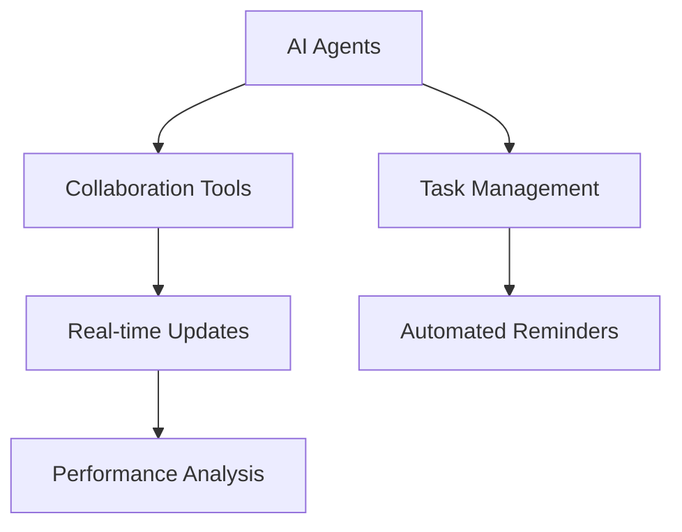

---

## Future Trends: AI Agents Transforming Workflows in 2026

As we look towards 2026, the evolution of AI agents is set to redefine the way we work and interact with technology. In recent years, we've witnessed rapid advancements in artificial intelligence, and this trajectory is only expected to accelerate. AI agents are becoming more sophisticated, capable, and integrated into our daily workflows, making them indispensable for businesses aiming to enhance productivity and efficiency. In this blog post, we will explore the key trends in AI agents, their potential impact on various industries, and how they can transform workflows for the better.

### What Are AI Agents?

Before diving into the trends, let’s clarify what we mean by AI agents. AI agents are software programs that can autonomously perform tasks and make decisions based on data analysis. They use machine learning, natural language processing, and other AI technologies to interact with users and automate processes. From virtual assistants like Siri and Alexa to more complex enterprise-level solutions, AI agents are already making waves in various sectors.

### Current State of AI Agents

As of now, AI agents are used in customer service, data analysis, and personal assistance, among other areas. Companies are leveraging these tools to streamline operations, reduce costs, and enhance user experiences. However, as we approach 2026, we can expect to see several transformative trends emerge.

### Trend 1: Hyper-Personalization in Customer Interactions

One of the most significant trends will be the shift towards hyper-personalized interactions. AI agents will increasingly analyze customer data to tailor experiences to individual preferences. 

#### Real-World Example:

Imagine an AI-driven chatbot for an e-commerce platform that not only helps customers find products but also recommends items based on their browsing history, past purchases, and even seasonal trends. This level of personalization boosts engagement and drives sales.

### Trend 2: Enhanced Collaboration Tools

AI agents will play a pivotal role in enhancing collaboration among remote teams. By integrating with project management tools, AI agents can help manage tasks, set reminders, and even analyze team performance to suggest improvements.

#### Use Case:

Consider a marketing team working remotely. An AI agent can analyze the progress of various campaigns, suggest optimizations, and automate follow-up tasks for team members, ensuring nothing falls through the cracks.

### Trend 3: AI-Driven Analytics and Decision-Making

As AI agents become more sophisticated, their analytical capabilities will improve exponentially. Businesses will rely on these agents to sift through vast amounts of data and provide actionable insights.

#### Example:

A financial institution might use an AI agent to analyze market trends and customer behavior, enabling real-time investment decisions. This allows for more agile responses to market changes, increasing profitability.

### Trend 4: Integration of AI Agents Across Platforms

In 2026, we can expect seamless integration of AI agents across various platforms and tools. This will enhance user experience and enable more effective workflows.

#### Pros and Cons:

| Pros                                | Cons                              |
|-------------------------------------|-----------------------------------|
| Improved efficiency                 | Potential data privacy issues      |
| Enhanced user experience            | Dependence on technology           |
| Cost-effective solutions            | Risk of job displacement           |

### Trend 5: Ethical AI and Transparency

As AI agents become more prevalent, ethical considerations will be paramount. Organizations will need to ensure that their AI systems are transparent and fair, especially in decision-making processes.

#### Example:

A hiring platform could implement an AI agent to screen candidates. However, it must ensure that the algorithms used are free from bias and provide clear explanations for decisions made, fostering trust among users.

### Preparing for the Future

To stay ahead of the curve, organizations must adopt a proactive approach to integrating AI agents into their workflows. This includes:

- **Investing in Training**: Equip your team with the necessary skills to work alongside AI agents.
- **Embracing Change**: Foster a culture that embraces technological advancements and encourages innovation.
- **Monitoring Trends**: Keep an eye on the latest developments in AI technologies to remain competitive.

### Conclusion

The future of AI agents is bright, and their potential to transform workflows by 2026 is immense. By embracing these trends, businesses can enhance productivity, streamline operations, and deliver personalized experiences to their customers. Now is the time to prepare for this shift and harness the power of AI agents.

Are you ready to integrate AI agents into your workflow? Start your journey today by exploring the latest AI tools that can streamline your processes and enhance your productivity. Don’t let the future pass you by; take action now!

### Call to Action

Want to learn more about how AI agents can revolutionize your business? Subscribe to AI Tools Lab and stay updated on the latest AI tools and trends that can help you maximize your productivity!

## 関連記事

- [AI Agents: The Future of Personal Assistants in 2026](/posts/ai-agents-the-future-of-personal-assistants-in-2026/)
- [AI Automation: A Game Changer for Small Businesses](/posts/ai-automation-a-game-changer-for-small-businesses/)
- [AI Automation: Revolutionizing Business Operations in 2026](/posts/ai-automation-revolutionizing-business-operations-in-2026/)
