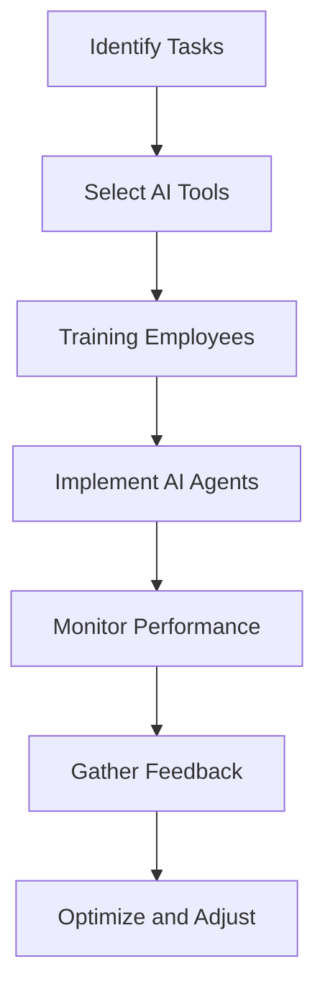

---

# Harnessing AI Agents for Enhanced Workplace Productivity

In today's fast-paced work environment, businesses are continually seeking innovative solutions to enhance productivity. Enter AI agents—intelligent software programs designed to perform tasks, streamline operations, and provide decision support. These digital assistants are revolutionizing how we work, making it easier for teams to focus on what truly matters. 

In this article, we will explore the multifaceted role of AI agents in enhancing workplace productivity, delve into practical applications, and weigh the pros and cons of implementing these tools within your organization.

## What Are AI Agents?

AI agents are automated programs that leverage artificial intelligence to perform tasks that typically require human intelligence. They can analyze data, make decisions, and even interact with users in natural language. These agents vary in complexity from simple chatbots to sophisticated machine learning systems that can make predictions based on vast data sets. 

### The Role of AI Agents in the Workplace

AI agents can play several roles in the workplace, including:

- **Automation**: Automating repetitive tasks such as data entry, scheduling, and email sorting.
- **Collaboration**: Facilitating communication between team members and streamlining project management.
- **Decision Support**: Providing insights and recommendations based on data analysis, helping teams make informed decisions.

Let's take a closer look at how AI agents can be harnessed for enhanced productivity.

## Practical Applications of AI Agents

### 1. Automating Routine Tasks

One of the most significant advantages of AI agents is their ability to automate mundane tasks. For example, AI-powered tools like **Zapier** allow you to connect different applications and automate workflows. 

**Use Case**: If you are in sales, you can set up an AI agent to automatically add new leads from your email to a CRM system, send welcome emails, and even schedule follow-up reminders. This not only saves time but also reduces the chances of human error.

### 2. Enhancing Communication

AI agents can streamline communication in the workplace. Tools like **Slackbot** or **Microsoft Teams’ AI features** can help manage team interactions more efficiently.

**Use Case**: Imagine a scenario where your team is working on a project with tight deadlines. An AI agent can automatically notify team members about upcoming deadlines, remind them of tasks, and even summarize meeting notes, ensuring everyone stays on the same page.

### 3. Data Analysis and Insights

AI agents can analyze vast amounts of data quickly, providing valuable insights that can inform business strategies. Tools such as **IBM Watson** or **Google Cloud AI** can help businesses sift through data to find trends and make data-driven decisions.

**Use Case**: A marketing team can use AI agents to analyze customer data and behavior patterns, allowing them to tailor their campaigns more effectively. This leads to improved conversion rates and better ROI on marketing efforts.

### 4. Personal Assistants for Enhanced Productivity

AI-driven personal assistants like **Siri**, **Google Assistant**, and **Amazon Alexa** can help individuals manage their schedules, set reminders, and even provide information on demand.

**Use Case**: A busy executive can use an AI personal assistant to schedule meetings, set reminders for important deadlines, and even prepare reports by pulling data from various sources—all by voice command.

## Pros and Cons of AI Agents in the Workplace

### Pros

1. **Increased Efficiency**: By automating routine tasks, AI agents free up valuable time for employees to focus on more strategic work.
2. **Enhanced Decision-making**: Access to real-time data and insights allows teams to make informed decisions quickly.
3. **Improved Collaboration**: AI agents facilitate communication and collaboration, ensuring that team members are aligned and informed.

### Cons

1. **Cost of Implementation**: Depending on the complexity of the tools, the initial investment can be significant.
2. **Learning Curve**: Employees may require training to effectively use AI agents, which can temporarily slow down productivity.
3. **Data Security Concerns**: Storing sensitive business data with AI tools raises potential privacy and security issues.

## Comparing Popular AI Agents for Productivity

When considering AI agents for workplace productivity, it's essential to evaluate the options available. Below is a comparison of three popular AI tools: **Zapier**, **Slackbot**, and **IBM Watson**.

<table>
    <tr>
        <th>Feature</th>
        <th>Zapier</th>
        <th>Slackbot</th>
        <th>IBM Watson</th>
    </tr>
    <tr>
        <td>Automation</td>
        <td>Yes</td>
        <td>No</td>
        <td>Yes</td>
    </tr>
    <tr>
        <td>Data Analysis</td>
        <td>No</td>
        <td>No</td>
        <td>Yes</td>
    </tr>
    <tr>
        <td>Communication</td>
        <td>No</td>
        <td>Yes</td>
        <td>No</td>
    </tr>
    <tr>
        <td>Integration with Other Tools</td>
        <td>Wide Range</td>
        <td>Limited to Slack</td>
        <td>Multiple Options</td>
    </tr>
    <tr>
        <td>User-Friendliness</td>
        <td>High</td>
        <td>High</td>
        <td>Moderate</td>
    </tr>
</table>

## Workflow of Implementing AI Agents

When integrating AI agents into your workplace, consider the following workflow:

## Conclusion

AI agents present a powerful opportunity to enhance workplace productivity. By automating routine tasks, enhancing communication, and providing valuable insights, these tools can help organizations operate more efficiently. However, as with any technology, it is essential to weigh the pros and cons and carefully consider the implementation process.

Are you ready to take your workplace productivity to the next level with AI agents? Start exploring the various tools available and see how they can transform your work processes today!

### Call to Action

Don't miss out on the productivity revolution! Subscribe to AI Tools Lab for the latest insights on AI tools, best practices, and tips to maximize your business potential. Let's harness the power of AI together!

## 関連記事

- [Enhancing Productivity with AI Agents in 2026](/posts/enhancing-productivity-with-ai-agents-in-2026/)
- [Maximizing Productivity with AI Agents in 2026](/posts/maximizing-productivity-with-ai-agents-in-2026/)
- [Top AI Agents Revolutionizing Productivity in 2026](/posts/top-ai-agents-revolutionizing-productivity-in-2026/)
