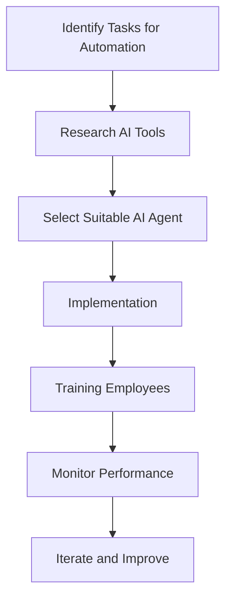

---

## Harnessing AI Agents for Maximum Productivity in 2026

As we stride into 2026, the landscape of productivity is being transformed by the rise of AI agents. These digital assistants are not just a passing trend; they represent a fundamental shift in how we approach our daily tasks, manage workflows, and enhance overall efficiency. In this article, we will explore the concept of AI agents, their potential applications, and how they can significantly boost productivity in various sectors.

### What Are AI Agents?

AI agents are intelligent systems designed to perform tasks autonomously or semi-autonomously, utilizing machine learning, natural language processing, and data analysis. These agents can range from simple chatbots to complex systems capable of executing intricate workflows.

**Use Cases for AI Agents:**

1. **Customer Support:** AI agents can handle queries, troubleshoot issues, and provide information to customers, freeing up human agents for more complex tasks.
2. **Project Management:** Tools like Trello and Asana are integrating AI agents to help teams manage tasks, deadlines, and project timelines more effectively.
3. **Personal Assistants:** Virtual assistants like Google Assistant and Siri are evolving to understand context better and help users manage their schedules and reminders efficiently.

### The Role of AI Agents in Boosting Productivity

AI agents can drastically change the way we approach productivity. Here are several ways they can help:

#### 1. Automating Repetitive Tasks

One of the most significant advantages of AI agents is their ability to automate mundane tasks. For example, an AI agent can schedule meetings based on participants' availability, send reminders, and even follow up with attendees. This automation allows individuals and teams to focus on higher-value work.

#### 2. Enhanced Decision Making

AI agents can analyze vast amounts of data and provide insights that would take humans much longer to gather. For instance, in marketing, AI-driven analytics tools can suggest the best time to post on social media, optimize ad spend, and predict customer behavior, thereby enabling businesses to make informed decisions quickly.

#### 3. Improved Collaboration

AI agents can facilitate better collaboration among teams. Tools like Slack are integrating AI capabilities to summarize conversations, highlight important points, and even suggest relevant documents or files during discussions. This feature can reduce time spent in meetings and help teams stay aligned on their goals.

#### 4. Personalization of User Experience

AI agents can learn from user behavior and preferences to offer personalized experiences. For example, e-commerce platforms use AI agents to recommend products based on previous purchases, enhancing customer satisfaction and driving sales.

### Pros and Cons of AI Agents for Productivity

While the benefits of AI agents are numerous, it’s essential to consider potential drawbacks as well. Here’s a quick overview:

| **Pros**                                   | **Cons**                                      |
|--------------------------------------------|-----------------------------------------------|
| Automate repetitive tasks                  | Potential job displacement                     |
| Enhance decision-making                    | Dependence on technology                       |
| Improve collaboration                       | Security and privacy concerns                  |
| Personalize user experience                | Quality of AI can vary significantly           |

### Choosing the Right AI Agent for Your Needs

With so many AI agents available, selecting the right one can be overwhelming. Here’s a comparison of some popular AI tools for productivity in 2026:

<table>
    <tr>
        <th>Tool</th>
        <th>Features</th>
        <th>Best For</th>
        <th>Price</th>
    </tr>
    <tr>
        <td>Zapier</td>
        <td>Automates workflows between apps</td>
        <td>Small businesses</td>
        <td>From $19.99/month</td>
    </tr>
    <tr>
        <td>Notion</td>
        <td>All-in-one workspace with AI features</td>
        <td>Project management</td>
        <td>From $8/month</td>
    </tr>
    <tr>
        <td>[Grammarly](https://www.grammarly.com/?ref=AFFILIATE_ID)</td>
        <td>AI-powered writing assistant</td>
        <td>Content creators</td>
        <td>From $12/month</td>
    </tr>
    <tr>
        <td>[Jasper](https://www.jasper.ai/?ref=AFFILIATE_ID)</td>
        <td>AI content generation</td>
        <td>Marketing teams</td>
        <td>From $29/month</td>
    </tr>
</table>

### The Future of AI Agents in Productivity

As we look ahead, the role of AI agents in productivity will only grow. With advancements in AI and machine learning, we can expect these agents to become even more intuitive and capable. The introduction of AI agents that can learn from their interactions and adapt to user preferences will further enhance their effectiveness.

### Workflow of Implementing AI Agents

To harness the full potential of AI agents, organizations should follow a structured approach:

This diagram illustrates the key steps in implementing AI agents to maximize productivity.

### Conclusion

The integration of AI agents into our daily workflows is no longer a futuristic concept; it's happening now. By automating repetitive tasks, enhancing decision-making, and improving collaboration, these virtual assistants can significantly boost productivity across various industries. As we embrace this technology, it’s essential to choose the right tools that align with our needs and monitor their performance for continuous improvement.

Are you ready to elevate your productivity with AI agents? Explore the tools mentioned in this article and start integrating them into your workflow today! Don't let the future of productivity pass you by—take action now and experience the transformative power of AI agents.

### Call to Action

For more insights on AI tools and how they can enhance your productivity, subscribe to our newsletter and stay updated with the latest trends and technologies in the AI landscape!

## 関連記事

- [Boost Productivity with AI Agents: 2026 Strategies](/posts/boost-productivity-with-ai-agents-2026-strategies/)
- [Boosting Productivity with AI Agents in 2026](/posts/boosting-productivity-with-ai-agents-in-2026/)
- [Enhancing Productivity with AI Agents in 2026](/posts/enhancing-productivity-with-ai-agents-in-2026/)
