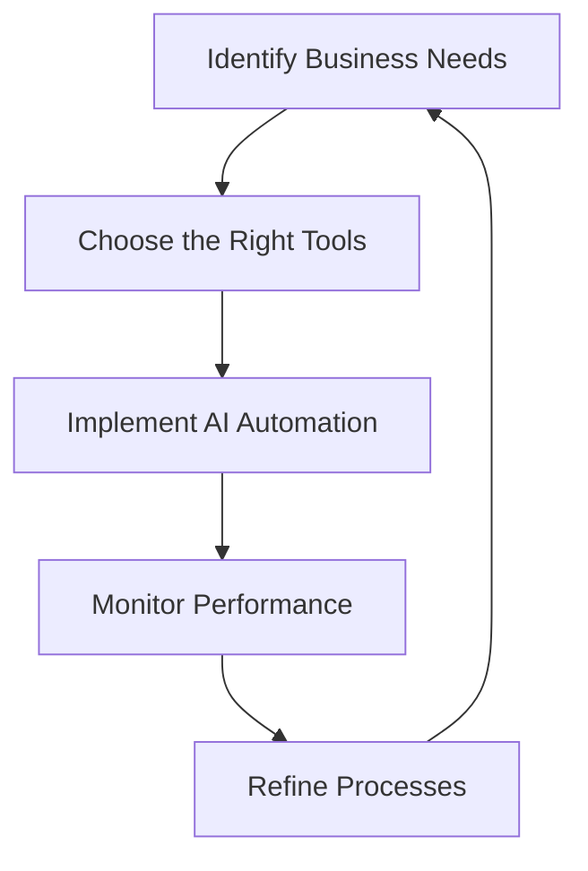

---

# Harnessing AI Automation for Business Growth in 2026

As we dive deeper into the digital age, businesses are increasingly looking for ways to leverage technology to streamline operations and drive growth. Enter AI automation—a game-changer that promises to enhance productivity, reduce costs, and elevate customer experiences. But what does the landscape of AI automation for business look like in 2026? Let’s explore how businesses can harness AI automation to foster growth, the tools available, and the best practices to implement.

## What is AI Automation?

AI automation refers to the use of artificial intelligence technologies to perform tasks or processes that would typically require human intervention. This includes everything from data analysis to customer service, and it can be applied in various sectors such as finance, healthcare, marketing, and beyond. The primary goal is to improve efficiency, accuracy, and speed while reducing the burden on human resources.

### Benefits of AI Automation in Business

1. **Increased Efficiency**: Automating mundane tasks allows employees to focus on higher-value work, thereby driving productivity. For example, a marketing team can use AI to automate social media posting while concentrating on strategy development.

2. **Cost Reduction**: By automating repetitive tasks, businesses can reduce labor costs. Consider a customer support team using AI chatbots to handle common inquiries, cutting down on the need for large support staff.

3. **Improved Decision-Making**: AI can analyze vast amounts of data quickly, providing actionable insights that facilitate better decision-making. A retail chain could use AI to analyze consumer buying patterns and optimize inventory accordingly.

4. **Enhanced Customer Experience**: Personalization has become crucial in customer service. AI tools can analyze customer preferences and behaviors to tailor experiences, like personalized email marketing campaigns.

5. **Scalability**: AI automation allows businesses to scale operations without a proportional increase in costs. For instance, e-commerce platforms can handle a surge in traffic during sales seasons without additional manpower.

## AI Automation Tools to Consider in 2026

With various AI automation tools available, it can be challenging to choose the right one. Below, we’ll compare some of the most popular AI automation tools that businesses can leverage for growth.

### Comparison of Popular AI Automation Tools

<table>
    <tr>
        <th>Tool</th>
        <th>Best For</th>
        <th>Key Features</th>
        <th>Pros</th>
        <th>Cons</th>
    </tr>
    <tr>
        <td>Zapier</td>
        <td>Workflow Automation</td>
        <td>Connection of apps, automated workflows</td>
        <td>User-friendly, extensive integrations</td>
        <td>Limited customization options</td>
    </tr>
    <tr>
        <td>UiPath</td>
        <td>Robotic Process Automation</td>
        <td>Task automation, data extraction</td>
        <td>Advanced automation capabilities</td>
        <td>High learning curve</td>
    </tr>
    <tr>
        <td>HubSpot</td>
        <td>Marketing Automation</td>
        <td>Email marketing, CRM integration</td>
        <td>Comprehensive marketing tools</td>
        <td>Can be pricey for small businesses</td>
    </tr>
    <tr>
        <td>[ChatGPT](https://chat.openai.com/?ref=AFFILIATE_ID)</td>
        <td>Customer Service</td>
        <td>Conversational AI, content generation</td>
        <td>Highly versatile, natural language processing</td>
        <td>May require supervision for accuracy</td>
    </tr>
</table>

### Use Cases for AI Automation

#### 1. Customer Support

Imagine a scenario where your customer service team is overwhelmed during peak hours. Implementing AI chatbots can help manage inquiries, respond to FAQs, and even escalate issues to human agents when necessary. This not only improves response times but also enhances the customer experience.

#### 2. Marketing Campaigns

Businesses can use AI to analyze their target audience's behavior and preferences. For instance, an online retailer can segment customers based on their purchase history and send targeted email campaigns, thus increasing conversion rates.

#### 3. Human Resources

AI can streamline recruitment processes by automatically screening resumes and scheduling interviews. Tools like HireVue use AI to analyze candidates' video interviews, helping HR teams identify the best talent more efficiently.

## Challenges of Implementing AI Automation

While the benefits are substantial, businesses must also be aware of potential challenges:

- **Integration with Existing Systems**: Ensuring that new AI tools work seamlessly with existing software can be complex and may require additional resources.
  
- **Change Management**: Employees may resist adopting new technologies. It’s crucial to provide adequate training and support to ease the transition.
  
- **Data Privacy Concerns**: With increased automation comes the need for stringent data security measures. Businesses must ensure compliance with regulations like GDPR.

### Future Trends in AI Automation

As we look forward to 2026, several trends are emerging in the field of AI automation:

1. **Increased Personalization**: Expect AI to provide even more personalized experiences, making interactions feel more human-like.
  
2. **AI Ethics and Governance**: As automation grows, so does the need for ethical considerations and governance frameworks to guide AI usage.
  
3. **Hyperautomation**: This trend involves the use of multiple automation technologies, including AI, to automate processes end-to-end.

## Conclusion: Embrace AI Automation for Business Success

As we approach 2026, incorporating AI automation into your business strategy is not just an option; it's a necessity for growth. By streamlining operations, reducing costs, and enhancing customer experiences, AI automation can position your business for long-term success. 

However, it’s essential to carefully choose the right tools and manage the transition effectively. Whether you’re in customer service, marketing, or HR, there’s an AI automation solution tailored to your needs.

**Ready to take the leap into AI automation?** Explore our comprehensive guides and resources at AI Tools Lab to find the best tools and strategies tailored for your specific business needs. Don't let your competition get ahead—start your AI automation journey today!

## 関連記事

- [Automating Business Processes with AI in 2026](/posts/automating-business-processes-with-ai-in-2026/)
- [How AI Automation is Transforming Business Operations](/posts/how-ai-automation-is-transforming-business-operations/)
- [Revolutionizing Business with AI Automation Strategies](/posts/revolutionizing-business-with-ai-automation-strategies/)
