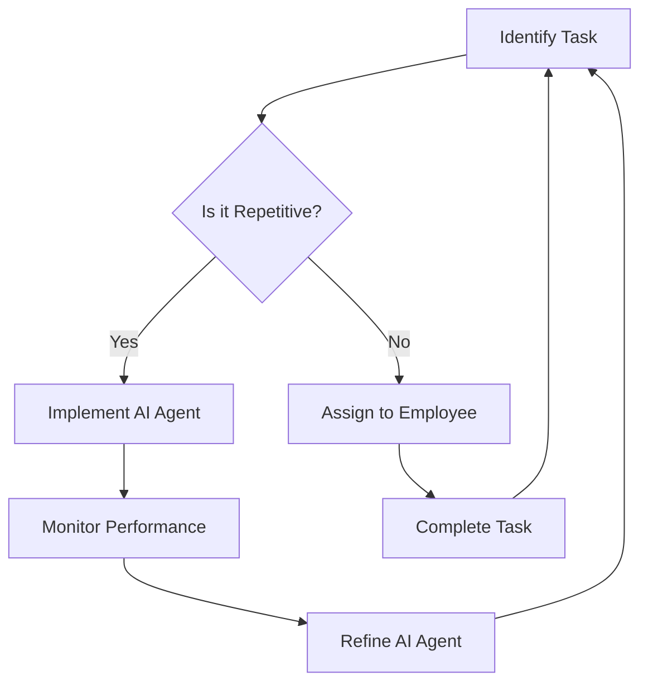

---

# How AI Agents Are Revolutionizing Workplace Productivity

In today's fast-paced work environment, the pressure to maximize productivity is at an all-time high. Enter AI agents—intelligent software designed to automate repetitive tasks, enhance collaboration, and streamline decision-making processes. These digital assistants are not just a trend; they are becoming essential tools for businesses aiming to stay competitive. In this article, we'll explore how AI agents are reshaping workplace productivity, the benefits they offer, and some practical examples of their application.

## What Are AI Agents?

AI agents are software programs that utilize artificial intelligence to perform specific tasks autonomously. They can analyze data, learn from user interactions, and even interact with other software systems. Different from traditional automation tools, AI agents can adapt and improve their performance over time.

### Key Features of AI Agents

- **Natural Language Processing (NLP)**: Allows AI agents to understand and respond to human language, making interactions more intuitive.
- **Machine Learning (ML)**: Enables AI agents to learn from past experiences and improve their performance over time.
- **Integration Capabilities**: Many AI agents can seamlessly integrate with existing software tools, enhancing their utility across various platforms.

## How AI Agents Enhance Workplace Productivity

### 1. Automating Repetitive Tasks

One of the most significant advantages of AI agents is their ability to automate mundane tasks. For example, customer support AI agents can handle routine inquiries, allowing human agents to focus on more complex issues. This not only improves response times but also enhances customer satisfaction.

**Use Case**: Chatbots like Drift and Intercom can manage basic customer queries, freeing up support staff to deal with more nuanced customer needs.

### 2. Enhancing Collaboration

AI agents can facilitate better collaboration among teams by organizing tasks, scheduling meetings, and even providing reminders. Tools like Slack and Microsoft Teams have integrated AI features that can summarize conversations, suggest action items, and more.

**Example**: An AI agent within your project management tool could aggregate updates from team members and generate concise summaries, ensuring everyone is on the same page without endless email threads.

### 3. Streamlining Decision-Making

AI agents can analyze vast amounts of data quickly, providing insights that help teams make informed decisions. By using predictive analytics, these agents can identify trends and suggest actions based on historical data.

**Use Case**: AI tools like Tableau or Microsoft Power BI can analyze sales data and predict future trends, enabling marketing teams to adjust their strategies effectively.

## Pros and Cons of Using AI Agents

### Pros

- **Efficiency**: AI agents can perform tasks faster than humans, leading to increased productivity.
- **Cost-Effective**: Automating routine tasks can reduce labor costs and allow employees to focus on higher-value activities.
- **24/7 Availability**: AI agents can operate around the clock, ensuring support and productivity aren't limited by human working hours.

### Cons

- **Job Displacement**: There are concerns that AI could replace jobs, particularly in roles that involve repetitive tasks.
- **Dependence on Technology**: Relying too heavily on AI can lead to a lack of critical thinking and problem-solving skills among employees.
- **Data Privacy**: The use of AI agents raises concerns about data security, especially when handling sensitive information.

## Comparing Popular AI Agents for Workplace Productivity

When selecting an AI agent for your workplace, it’s essential to consider various options. Below is a comparison of some popular AI agents that enhance workplace productivity:

<table>
  <tr>
    <th>AI Agent</th>
    <th>Features</th>
    <th>Best For</th>
    <th>Pricing</th>
  </tr>
  <tr>
    <td>Drift</td>
    <td>Chatbot, lead generation, scheduling</td>
    <td>Sales teams</td>
    <td>Starts at $50/month</td>
  </tr>
  <tr>
    <td>Intercom</td>
    <td>Customer support automation, messaging</td>
    <td>Customer service</td>
    <td>Starts at $39/month</td>
  </tr>
  <tr>
    <td>Slackbot</td>
    <td>Task automation, reminders, scheduling</td>
    <td>Team collaboration</td>
    <td>Free and paid plans</td>
  </tr>
  <tr>
    <td>Zapier</td>
    <td>Workflow automation, app integrations</td>
    <td>General productivity</td>
    <td>Starts at $19.99/month</td>
  </tr>
</table>

## Workflow of AI Agents in Productivity

Understanding how AI agents fit into your existing workflows can help you leverage their full potential. The following diagram illustrates a typical workflow involving AI agents in a workplace setting:

## Best Practices for Implementing AI Agents

1. **Start Small**: Begin with a single task or area where AI can provide immediate value.
2. **Train Your Team**: Ensure that employees understand how to work alongside AI agents and maximize their benefits.
3. **Monitor and Optimize**: Regularly review the performance of your AI agents and make adjustments as needed to improve efficiency.
4. **Ensure Data Security**: Implement stringent data privacy measures to protect sensitive information processed by AI agents.

## Conclusion

AI agents are not just a passing fad; they are revolutionizing how we approach productivity in the workplace. By automating tasks, enhancing collaboration, and streamlining decision-making, these intelligent assistants can significantly improve efficiency and effectiveness. However, it’s essential to approach their implementation thoughtfully, considering both the pros and cons.

Ready to boost your workplace productivity with AI agents? Start exploring the tools mentioned above and discover how they can transform your team’s workflow. Don’t let your business fall behind; embrace the future of work today!

--- 

Incorporating AI agents into your business strategy could be the game-changer you've been waiting for. What are you waiting for? Dive into the world of AI and redefine productivity in your workplace!

## 関連記事

- [Boosting Productivity with AI Agents in 2026](/posts/boosting-productivity-with-ai-agents-in-2026/)
- [Enhancing Productivity with AI Agents in 2026](/posts/enhancing-productivity-with-ai-agents-in-2026/)
- [Harnessing AI Agents for Enhanced Workplace Productivity](/posts/harnessing-ai-agents-for-enhanced-workplace-productivity/)
