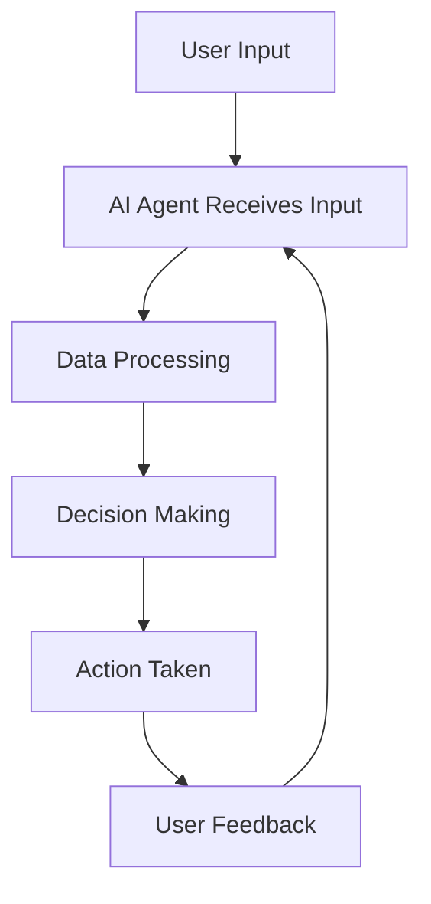

---

## How AI Agents Are Transforming Business Operations

In today’s fast-paced digital landscape, businesses are constantly searching for ways to enhance efficiency and streamline operations. Enter AI agents—intelligent software programs designed to perform tasks autonomously or assist humans in their decision-making processes. These agents are not just tools; they're transforming the way businesses operate, leading to increased productivity and innovation.

### What Are AI Agents?

AI agents are systems that can perceive their environment, reason about it, and take actions to achieve specific goals. They leverage machine learning, natural language processing, and other AI technologies to understand and respond to user requests or environmental changes. From chatbots that handle customer inquiries to complex algorithms that optimize supply chain logistics, AI agents are taking center stage in modern business operations.

### The Role of AI Agents in Business

Let's dive into some practical use cases where AI agents are making a significant impact across industries.

#### 1. Customer Support

One of the most common applications of AI agents is in customer support. AI-powered chatbots can engage with customers 24/7, answering queries, providing product information, and resolving complaints without human intervention. For instance, companies like Zendesk and Intercom offer robust AI solutions that help businesses maintain high levels of customer satisfaction.

##### Pros:
- Available 24/7
- Quick response times
- Reduces the workload on human agents

##### Cons:
- Limited ability to handle complex inquiries
- Can lead to customer frustration if not properly programmed

#### 2. Human Resources

AI agents can streamline HR processes, such as recruitment and employee onboarding. Tools like HireVue use AI to analyze candidates' video interviews, assessing their suitability based on predefined criteria. This not only speeds up the hiring process but also helps eliminate bias.

##### Pros:
- Speeds up recruitment
- Reduces human bias in candidate selection

##### Cons:
- Can overlook nuances in a candidate's personality
- Dependence on technology may raise ethical concerns

#### 3. Supply Chain Management

In supply chain management, AI agents can predict demand, optimize inventory levels, and manage logistics. Companies like IBM and SAP offer AI-driven solutions that help businesses forecast trends and automate procurement processes, resulting in significant cost savings.

##### Pros:
- Enhances forecasting accuracy
- Reduces operational costs

##### Cons:
- Initial setup can be expensive
- Requires ongoing maintenance and updates

### How AI Agents Work

Understanding the inner workings of AI agents can shed light on their capabilities and limitations. Here’s a simplified workflow of how an AI agent might operate in a business setting:

### The Future of AI Agents in Business

The future looks bright for AI agents as advancements in technology continue to evolve. Here are a few trends that are likely to shape the landscape:

1. **Increased Personalization:** AI agents will become more adept at personalizing interactions based on user data, leading to enhanced customer experiences.
   
2. **Integration with IoT:** AI agents will work seamlessly with Internet of Things (IoT) devices, providing real-time insights and automating various business processes.

3. **Ethical AI:** As AI technology continues to advance, companies will need to address ethical concerns, ensuring that AI agents operate transparently and fairly.

### Pros and Cons of Using AI Agents

To summarize the advantages and disadvantages of implementing AI agents in business operations, here’s a quick comparison:

| Pros                          | Cons                           |
|-------------------------------|--------------------------------|
| Increased efficiency           | Initial setup costs            |
| 24/7 availability              | Limited understanding of complex issues |
| Data-driven decision making     | Dependence on technology       |
| Enhanced customer experience    | Ethical concerns               |

### Conclusion: Embracing the AI Revolution

AI agents are undeniably reshaping the business landscape, offering innovative solutions that drive efficiency and enhance productivity. As technology progresses, the potential applications for AI agents will only expand, enabling companies to operate smarter and more effectively.

If you haven't yet considered integrating AI agents into your business operations, now is the time to explore the possibilities. Whether you're looking to improve customer service, streamline HR processes, or optimize supply chains, AI agents can be a game-changer.

Are you ready to harness the power of AI agents in your business? Start your journey today by researching the best tools available and see how they can transform your operations!

### Call to Action

Don’t wait for the competition to catch up! Explore AI tools that can integrate AI agents into your operations today. Subscribe to our newsletter for the latest insights, reviews, and resources on AI tools that can revolutionize your business!

## 関連記事

- [AI Agents: The Future of Personal Assistants in 2026](/posts/ai-agents-the-future-of-personal-assistants-in-2026/)
- [AI Automation: A Game Changer for Small Businesses](/posts/ai-automation-a-game-changer-for-small-businesses/)
- [AI Automation: The Key to Enhanced Business Efficiency](/posts/ai-automation-the-key-to-enhanced-business-efficiency/)
