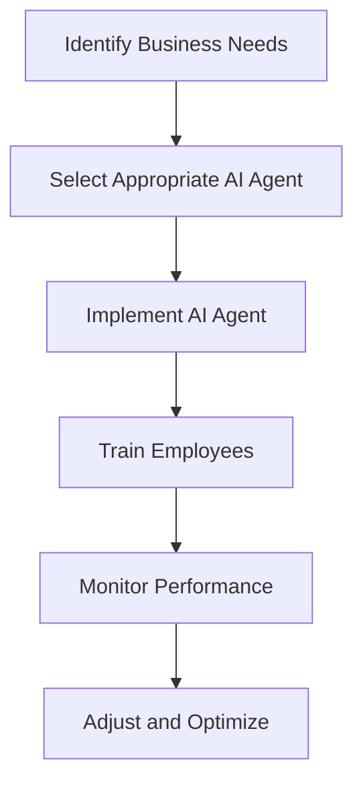

---

# How AI Agents are Transforming Business Productivity

In today’s fast-paced digital landscape, businesses are constantly seeking innovative ways to enhance productivity and efficiency. Enter AI agents – powerful tools designed to automate routine tasks, analyze data, and provide actionable insights. But how exactly are these AI agents transforming business productivity? Let’s dive deep into the world of AI agents, explore their functionalities, and examine their impact on various industries.

## What Are AI Agents?

AI agents are autonomous systems that utilize artificial intelligence to perform tasks traditionally executed by humans. They can learn from their environment, adapt to new information, and execute operations with minimal human intervention. Ranging from chatbots that handle customer inquiries to complex data analysis tools, AI agents are becoming increasingly integral to business operations.

### Key Functions of AI Agents

1. **Automation of Repetitive Tasks**: AI agents can handle mundane tasks such as data entry, scheduling meetings, and generating reports, allowing employees to focus on more strategic initiatives.
   
2. **Data Analysis and Insights**: These agents can sift through vast amounts of data, identifying trends and providing insights that help businesses make informed decisions.

3. **Enhanced Customer Engagement**: AI agents, particularly in the form of chatbots, provide round-the-clock support to customers, improving response times and overall satisfaction.

4. **Predictive Analytics**: By analyzing historical data, AI agents can forecast future trends, helping businesses to adapt their strategies proactively.

## Benefits of Implementing AI Agents in Business

### 1. Increased Efficiency

One of the most significant advantages of using AI agents is their ability to increase efficiency. For example, a marketing team can use an AI agent to automate social media posting and analytics reporting. This can save hours of manual work each week.

### 2. Cost Reduction

AI agents can significantly reduce operational costs by minimizing the need for human intervention in routine tasks. For instance, companies that deploy AI-driven chatbots can cut down on customer service staffing costs while still providing excellent support.

### 3. Improved Decision-Making

AI agents provide businesses with real-time data and insights, empowering leaders to make informed decisions quickly. A retail company using AI to analyze shopping patterns can adjust inventory levels dynamically, thereby reducing waste and maximizing sales.

### 4. Enhanced Customer Experience

By automating customer interactions, AI agents ensure that customers receive timely responses. For example, a financial institution might use an AI agent to handle loan inquiries, providing instant feedback and guidance to potential borrowers.

## Use Cases of AI Agents in Various Industries

### Healthcare

In the healthcare sector, AI agents are making waves by assisting in patient triage and management. For example, AI-driven chatbots can guide patients through symptom checking before directing them to the appropriate care. This not only improves the patient experience but also reduces the burden on healthcare professionals.

### E-commerce

E-commerce platforms leverage AI agents to offer personalized shopping experiences. By analyzing customer behavior and preferences, AI agents can recommend products, create personalized marketing campaigns, and even manage inventory.

### Finance

In finance, AI agents are utilized for fraud detection and risk management. They can analyze transaction patterns in real-time and flag any anomalies, thus protecting financial institutions from potential threats.

### Human Resources

In HR, AI agents streamline recruitment processes by screening resumes and scheduling interviews. They can also facilitate employee onboarding and answer common employee queries, saving HR personnel considerable time.

## Challenges of AI Agents

While the benefits of AI agents are substantial, there are also challenges to consider:

### 1. Data Privacy Concerns

With AI agents handling vast amounts of sensitive data, businesses must ensure they comply with data protection regulations. Mishandling of data can lead to severe penalties.

### 2. Dependence on Technology

Businesses may become overly reliant on AI agents, which can lead to vulnerabilities if these systems fail or produce errors. A balanced approach is necessary to maintain human oversight.

### 3. Integration with Existing Systems

Integrating AI agents into current workflows can be challenging. Companies must invest time and resources to ensure compatibility, which may lead to initial disruptions.

## Comparing AI Agents: A Look at Popular Tools

When exploring AI agents for your business, it’s essential to compare available tools to find the best fit. Below is a comparison of some popular AI agent platforms.

<table>
  <tr>
    <th>Tool</th>
    <th>Key Features</th>
    <th>Pros</th>
    <th>Cons</th>
  </tr>
  <tr>
    <td>ChatGPT</td>
    <td>Conversational AI, context understanding, language generation</td>
    <td>User-friendly, versatile, strong NLP capabilities</td>
    <td>Requires fine-tuning for specific tasks</td>
  </tr>
  <tr>
    <td>IBM Watson</td>
    <td>Data analysis, machine learning, natural language processing</td>
    <td>Powerful analytics, highly customizable</td>
    <td>Complex setup, steep learning curve</td>
  </tr>
  <tr>
    <td>Amazon Lex</td>
    <td>Voice and text chatbots, integration with AWS</td>
    <td>Seamless AWS integration, scalable</td>
    <td>Limited features outside AWS ecosystem</td>
  </tr>
  <tr>
    <td>Google Dialogflow</td>
    <td>Multilingual support, machine learning, API integrations</td>
    <td>User-friendly interface, strong NLP</td>
    <td>Less customizable than some competitors</td>
  </tr>
</table>

## The Future of AI Agents in Business

As technology continues to evolve, the capabilities of AI agents will expand, becoming even more sophisticated in their functions. Businesses that adopt AI agents early on will likely gain a competitive advantage, streamlining operations and enhancing customer experiences.

### Workflow Diagram of AI Agent Implementation

To better visualize the process of integrating AI agents into a business, here’s a simple workflow diagram:

## Conclusion

AI agents are transforming business productivity by automating tasks, providing insights, and enhancing customer engagement. As companies continue to navigate the complexities of the digital age, embracing AI agents can lead to significant operational improvements and competitive advantages. 

Are you ready to harness the power of AI agents for your business? Start exploring the right tools today, and take the first step toward a more productive future!

---

Feel free to share your thoughts or experiences with AI agents in the comments below! If you found this article useful, don’t forget to share it with your network. For more insights on AI tools and productivity, subscribe to our newsletter!