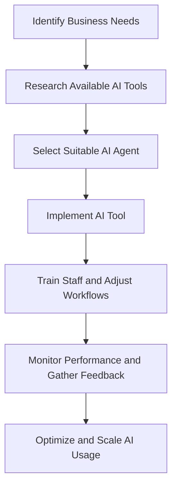

---

# How AI Agents Are Transforming Business Productivity

In today’s fast-paced business environment, companies are constantly searching for ways to boost productivity and streamline operations. One of the most promising advancements in this domain is the use of AI agents. These intelligent systems are designed to assist, automate, and enhance various business processes, leading to significant improvements in efficiency and effectiveness. In this article, we will delve into how AI agents for business are transforming productivity, showcasing practical examples, use cases, and the pros and cons of implementing these technologies.

## What are AI Agents?

AI agents are software programs that utilize artificial intelligence to perform tasks that typically require human intelligence. They can learn from data, adapt to changing environments, and make decisions based on predefined rules or algorithms. AI agents can take various forms, including chatbots, virtual assistants, and automated workflows.

### Types of AI Agents for Business

1. **Chatbots:** These AI agents can engage with customers through messaging platforms, answering queries, and providing support.
2. **Virtual Assistants:** Tools like Siri, Alexa, and Google Assistant help manage personal tasks, set reminders, and provide information.
3. **Automated Workflows:** Systems that automate repetitive tasks, from data entry to project management, enhancing team productivity.

## How AI Agents Enhance Business Productivity

AI agents are transforming business productivity in various ways. Below are some key areas where they make a significant impact:

### 1. Streamlining Customer Service

One of the most noticeable applications of AI agents is in customer service. Businesses are deploying chatbots to handle routine inquiries, allowing human agents to focus on more complex issues. For example, a retail company can use a chatbot on their website to answer FAQs and process simple transactions.

**Pros:**
- 24/7 customer support
- Quick response times
- Reduced workload for human agents

**Cons:**
- Limited understanding of complex queries
- Can frustrate customers if not well-designed

### 2. Enhancing Internal Communication

AI agents can facilitate better internal communication within organizations. Tools like Slack and Microsoft Teams integrate AI bots to help teams manage projects, schedule meetings, and share information seamlessly. For example, an AI bot can automatically schedule a team meeting by checking everyone's availability.

**Pros:**
- Improved collaboration
- Reduced email clutter
- Enhanced information sharing

**Cons:**
- Over-reliance on technology may lead to miscommunication
- Integration challenges with existing tools

### 3. Automating Data Analysis

Businesses today generate vast amounts of data. AI agents can analyze this data quickly and provide actionable insights. For instance, a marketing team can use AI tools to analyze consumer behavior and optimize campaigns accordingly.

**Pros:**
- Swift data processing
- Informed decision-making
- Identifying trends and patterns

**Cons:**
- Data privacy concerns
- Dependence on data quality

### 4. Optimizing Workflow Management

AI agents can significantly enhance workflow management by automating repetitive tasks. For example, project management tools can integrate AI to prioritize tasks and allocate resources effectively, ensuring that teams meet their deadlines.

**Pros:**
- Increased operational efficiency
- Better resource allocation
- Enhanced team focus on high-priority tasks

**Cons:**
- Initial setup costs
- Potential resistance from employees

### 5. Personalizing Marketing Efforts

AI agents can analyze customer data to create personalized marketing campaigns. For instance, an e-commerce platform can recommend products based on a user’s browsing history, increasing the likelihood of conversions.

**Pros:**
- Higher engagement rates
- Improved customer satisfaction
- Increased sales and ROI

**Cons:**
- Risk of data overreach
- Requires continuous optimization

## Practical Examples of AI Agents in Action

### Case Study: Sephora's Virtual Artist

Sephora, a leading beauty retailer, has integrated AI agents into their customer experience through their Virtual Artist tool. This AI-powered application allows users to try on makeup virtually, providing personalized recommendations based on their preferences and skin tones. As a result, Sephora not only enhances customer engagement but also boosts sales through tailored marketing strategies.

### Case Study: Slack's Workflow Builder

Slack has introduced a Workflow Builder that allows teams to automate routine tasks without needing to code. For example, a team can set up a workflow that automatically sends a message to new members, providing them with essential resources and onboarding information. This automation saves time and ensures that new hires receive consistent information.

## Comparing Popular AI Tools for Business Productivity

When considering AI agents for business, it’s essential to evaluate different tools based on their features, usability, and pricing. Here’s a comparison of some popular AI tools that can enhance business productivity:

<table>
  <tr>
    <th>Tool</th>
    <th>Type</th>
    <th>Key Features</th>
    <th>Pricing</th>
  </tr>
  <tr>
    <td>ChatGPT</td>
    <td>Chatbot/Virtual Assistant</td>
    <td>Conversational AI, Content Generation</td>
    <td>Subscription-based</td>
  </tr>
  <tr>
    <td>Zapier</td>
    <td>Workflow Automation</td>
    <td>Task Automation, Integration with Apps</td>
    <td>Free/Paid plans</td>
  </tr>
  <tr>
    <td>IBM Watson</td>
    <td>Data Analysis</td>
    <td>Natural Language Processing, Deep Learning</td>
    <td>Custom pricing</td>
  </tr>
  <tr>
    <td>Salesforce Einstein</td>
    <td>CRM Integration</td>
    <td>AI-Powered Insights, Lead Scoring</td>
    <td>Custom pricing</td>
  </tr>
</table>

### Workflow of Implementing AI Agents

To effectively integrate AI agents into your business, consider the following workflow:

## Conclusion

AI agents for business are not just a trend; they are reshaping how organizations operate, enhancing productivity, and driving growth. From automating customer service to optimizing workflows, these intelligent systems provide valuable support that can significantly impact a company’s bottom line. 

As you consider integrating AI agents into your operations, take the time to assess your business needs and explore the available tools that can cater to those requirements. The future of business productivity lies in the thoughtful adoption of these technologies.

Are you ready to embrace the power of AI agents? Start exploring the tools mentioned in this article and transform your business productivity today!