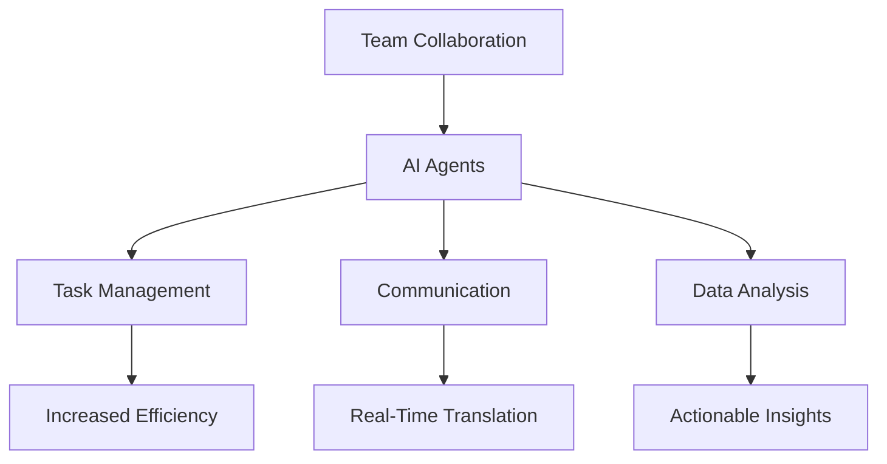

---

# How AI Agents Can Supercharge Team Collaboration by 2026

In an era where remote work and digital collaboration have become the norm, the way teams interact has dramatically changed. The advent of AI agents is set to further revolutionize this landscape. By 2026, we can expect AI agents to play a pivotal role in enhancing team collaboration, streamlining workflows, and boosting overall productivity. Let's delve into how AI agents can transform teamwork and what we might see in the near future.

## What Are AI Agents?

AI agents are software programs designed to perform specific tasks autonomously or semi-autonomously. They can learn from their environment, adapt their actions based on user interactions, and assist in decision-making processes. In a collaborative setting, AI agents can help manage projects, facilitate communication, and provide insights based on data analysis.

### Examples of AI Agents in Collaboration

1. **Virtual Assistants:** Tools like Siri, Alexa, and Google Assistant can schedule meetings, send reminders, and gather information, making them valuable assets for teams.
   
2. **Chatbots:** Integrated into platforms like Slack or Microsoft Teams, chatbots can facilitate communication, answer queries, and even help onboard new team members.

3. **Project Management Tools:** AI-powered tools like Trello or Asana can analyze team performance and suggest optimal workflows based on historical data.

## The Future of AI Agents in Team Collaboration

As we look towards 2026, several trends are emerging that highlight the growing importance of AI agents in collaborative environments.

### Enhanced Communication

AI agents will streamline communication by providing real-time translation services and summarizing conversations. Imagine a team with members from different countries who can communicate seamlessly, thanks to AI-driven language translation. This will break down language barriers and foster a more inclusive work environment.

### Intelligent Task Management

AI agents will take project management to the next level by analyzing workloads, deadlines, and team dynamics. These agents could automatically assign tasks based on team members' strengths, past performance, and current workloads, ensuring that projects flow smoothly and deadlines are met.

### Improved Data-Driven Insights

With the ability to analyze vast amounts of data, AI agents can provide teams with actionable insights. For example, an AI agent could analyze past project performance to identify bottlenecks and recommend solutions. This data-driven approach will empower teams to make informed decisions and optimize their processes.

## Pros and Cons of Using AI Agents for Collaboration

### Pros

- **Efficiency:** AI agents can handle repetitive tasks, allowing team members to focus on more strategic work.
- **24/7 Availability:** Unlike human team members, AI agents are always available, ensuring that support is just a command away.
- **Data Analysis:** AI agents can quickly analyze data, providing insights that would take humans much longer to uncover.

### Cons

- **Dependence on Technology:** Over-reliance on AI may lead to a decrease in human interaction, which is also crucial for team dynamics.
- **Data Privacy Concerns:** With AI agents processing large amounts of data, there are concerns regarding data security and privacy.
- **Implementation Costs:** Integrating AI into existing workflows can be costly and time-consuming, especially for smaller businesses.

## Visualizing the Workflow with AI Agents

To better understand how AI agents will integrate into team workflows, take a look at the following diagram:

## Comparing AI Tools for Collaboration

When it comes to choosing the right AI tools for team collaboration, there are several options available. Below is a comparison table to help you evaluate some popular AI-powered collaboration tools:

<table>
  <tr>
    <th>Tool</th>
    <th>Features</th>
    <th>Pros</th>
    <th>Cons</th>
  </tr>
  <tr>
    <td>Trello</td>
    <td>Task management, automation, integrations</td>
    <td>Easy to use, customizable boards</td>
    <td>Limited reporting features</td>
  </tr>
  <tr>
    <td>Slack</td>
    <td>Real-time messaging, integrations, file sharing</td>
    <td>Great for team communication, lots of integrations</td>
    <td>Can become overwhelming with too many channels</td>
  </tr>
  <tr>
    <td>Asana</td>
    <td>Project tracking, team collaboration, reporting</td>
    <td>Robust features for project management</td>
    <td>Steeper learning curve</td>
  </tr>
  <tr>
    <td>Microsoft Teams</td>
    <td>Chat, video calls, document collaboration</td>
    <td>Integrated with Office 365, great for larger teams</td>
    <td>Can be complex for new users</td>
  </tr>
</table>

## Preparing for the Future

As we approach 2026, it's essential for organizations to start adapting to the changes that AI agents will bring. This means investing in the right tools, training team members to work alongside AI, and fostering an organizational culture that embraces innovation.

### How to Get Started

1. **Assess Your Needs:** Identify areas where collaboration can be improved and determine which AI tools will address those needs.
   
2. **Invest in Training:** Ensure that your team is well-equipped to leverage AI technology effectively. Training sessions can help ease the transition.

3. **Start Small:** Implement AI tools in phases, allowing your team to adjust gradually. Begin with one tool and expand as your team becomes comfortable.

4. **Monitor and Optimize:** Regularly evaluate the effectiveness of the AI agents you implement. Gather feedback from your team to optimize workflows continually.

## Conclusion

AI agents are set to revolutionize team collaboration by 2026, enhancing communication, streamlining task management, and providing valuable insights. As organizations prepare for this shift, embracing AI technology will be key to staying competitive in the ever-evolving landscape of work.

Are you ready to supercharge your team's collaboration with AI agents? Start exploring the tools that best fit your organization's needs today and pave the way for a more productive future!