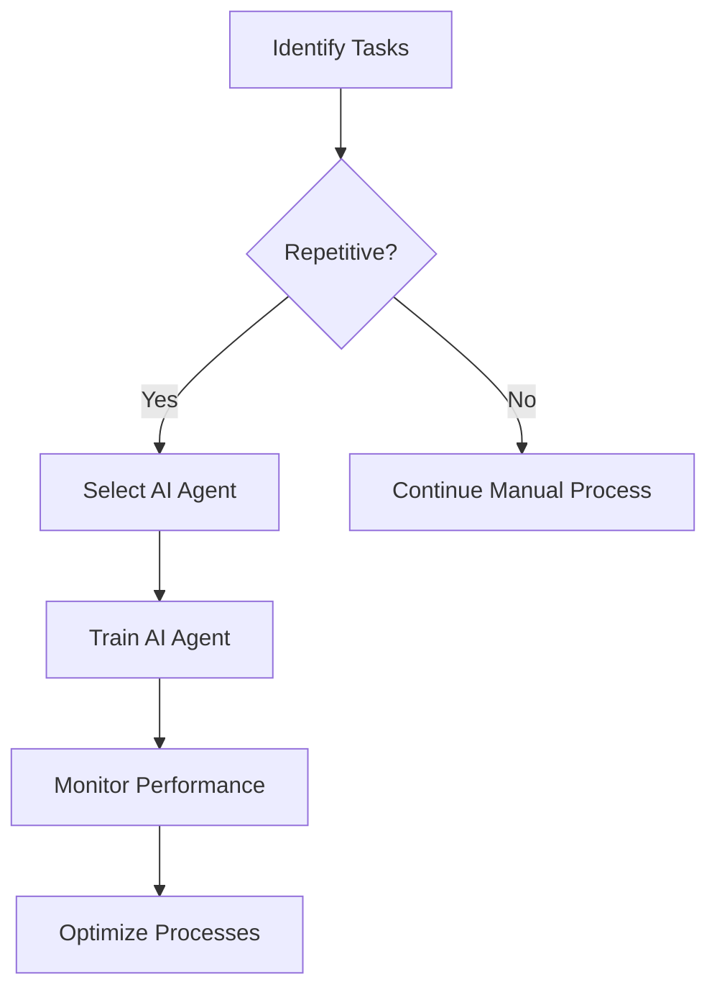

## How AI Agents Enhance Productivity in the Workplace

In today’s fast-paced work environment, productivity is king. Businesses are constantly seeking innovative solutions that can streamline operations, enhance collaboration, and ultimately drive results. Enter AI agents—intelligent software programs designed to perform specific tasks or assist with various functions in the workplace. While the term "AI agent" may sound futuristic, these tools are already making a significant impact on productivity. In this blog post, we’ll explore how AI agents can enhance productivity in the workplace, discuss practical examples and use cases, and evaluate some of the top AI agents available today.

### What Are AI Agents?

AI agents are software applications that utilize artificial intelligence to perform tasks that traditionally require human intelligence. These tasks can range from simple data processing to complex decision-making. AI agents can learn from their interactions and improve over time, making them incredibly versatile and valuable in various business contexts.

### How AI Agents Boost Workplace Productivity

The integration of AI agents into the workplace brings a multitude of benefits that can dramatically enhance productivity. Here are several ways in which AI agents can help:

#### 1. Automation of Repetitive Tasks

One of the primary ways AI agents enhance productivity is by automating repetitive tasks. For instance, chatbots can handle customer inquiries, freeing up customer service representatives to focus on more complex issues. 

**Use Case:**  
A retail company implements an AI chatbot on its website to handle common customer questions. This allows human agents to devote more time to resolving complicated customer issues and improving customer satisfaction.

#### 2. Enhanced Data Analysis and Reporting

AI agents can analyze vast amounts of data quickly and accurately, providing insights that would take humans significantly longer to uncover. This can lead to faster and more informed decision-making.

**Use Case:**  
A marketing team uses an AI agent to analyze customer data and generate reports on consumer behavior trends. By receiving timely insights, the team can adjust its strategies proactively rather than reactively.

#### 3. Improved Collaboration and Communication

AI agents can facilitate better collaboration among team members. Tools like AI-driven project management systems can assign tasks, set deadlines, and track progress, ensuring everyone stays on the same page.

**Use Case:**  
A software development team uses an AI-powered project management tool that automatically prioritizes tasks based on team members’ workloads and deadlines, leading to a smoother workflow.

#### 4. Personalized Customer Experiences

AI agents can analyze customer preferences and behaviors, allowing businesses to tailor their offerings and communications. This leads to increased customer satisfaction and loyalty.

**Use Case:**  
An e-commerce platform uses an AI recommendation engine to suggest products based on previous purchases and browsing behavior, resulting in higher sales and improved customer engagement.

#### 5. Efficient Resource Management

AI agents can optimize resource allocation by analyzing usage patterns and suggesting improvements. This can lead to reduced costs and increased efficiency.

**Use Case:**  
A manufacturing company employs an AI agent to monitor machinery usage and predict maintenance needs, minimizing downtime and maximizing productivity.

### Pros and Cons of Using AI Agents

While the benefits of AI agents are numerous, it’s essential to consider both the advantages and potential drawbacks before implementation.

#### Pros
- **Increased Efficiency:** Automate repetitive tasks and streamline processes.
- **Data-Driven Insights:** Analyze large datasets to provide actionable insights quickly.
- **Cost Savings:** Reduce labor costs by automating tasks that would require human intervention.
- **Enhanced Customer Satisfaction:** Provide personalized experiences and faster response times.

#### Cons
- **Initial Setup Costs:** Implementation of AI tools can require significant upfront investment.
- **Dependence on Technology:** Over-reliance on AI agents may diminish human skills and creativity.
- **Data Privacy Concerns:** Handling sensitive customer data raises privacy and security issues.

### Comparing Popular AI Agents

To help you choose the right AI agent for your workplace, here’s a comparison of some popular tools that enhance productivity:

<table>
    <tr>
        <th>AI Agent</th>
        <th>Primary Function</th>
        <th>Pros</th>
        <th>Cons</th>
    </tr>
    <tr>
        <td>Zapier</td>
        <td>Task Automation</td>
        <td>Simplifies workflows, integrates with many apps</td>
        <td>Can get costly with advanced features</td>
    </tr>
    <tr>
        <td>[ChatGPT](https://chat.openai.com/?ref=AFFILIATE_ID)</td>
        <td>Customer Support</td>
        <td>Natural language processing, learns from interactions</td>
        <td>May struggle with complex queries</td>
    </tr>
    <tr>
        <td>HubSpot AI</td>
        <td>Marketing Automation</td>
        <td>Personalization and analytics, user-friendly</td>
        <td>Less flexibility compared to standalone tools</td>
    </tr>
    <tr>
        <td>Microsoft Power Automate</td>
        <td>Workflow Automation</td>
        <td>Integrates well with Microsoft products</td>
        <td>Steeper learning curve for non-technical users</td>
    </tr>
</table>

### The Future of AI Agents in the Workplace

As AI technology continues to evolve, we can expect AI agents to become even more sophisticated. Future developments may include advanced natural language processing, deeper integration with existing systems, and enhanced learning capabilities. This means that the potential for increased productivity in the workplace will only grow.

#### Workflow Visualization of AI Agent Implementation

To give you a clear understanding of how to integrate AI agents into your workplace, here’s a simple workflow diagram:

### Conclusion

AI agents are not just a trend; they are transforming how businesses operate by enhancing productivity across various functions. Whether you’re looking to automate routine tasks, analyze data, or improve customer interactions, AI agents can be a game-changer for your organization. 

Are you ready to embrace the future of productivity? Start exploring AI agents today to see how they can benefit your workplace. Don’t wait—transform your productivity with AI agents and stay ahead of the competition!

### Call to Action

If you found this article helpful, share it with your colleagues and friends! For more insights into AI tools and productivity, subscribe to our newsletter or check out our other blog posts at AI Tools Lab. Together, let’s harness the power of AI to boost productivity in the workplace!

## 関連記事

- [Boosting Productivity with AI Agents in 2026](/posts/boosting-productivity-with-ai-agents-in-2026/)
- [Enhancing Productivity with AI Agents in 2026](/posts/enhancing-productivity-with-ai-agents-in-2026/)
- [Harnessing AI Agents for Enhanced Workplace Productivity](/posts/harnessing-ai-agents-for-enhanced-workplace-productivity/)
