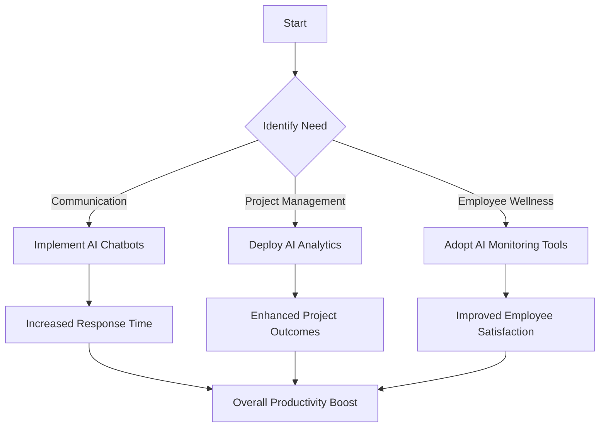

---

# How AI Agents Will Transform Remote Work by 2026

The world of work has undergone significant changes over the past few years, especially with the rapid shift to remote work. As organizations adapt to this new landscape, the role of technology—especially AI—has become more prominent than ever. By 2026, AI agents are poised to redefine remote work, streamlining operations, enhancing collaboration, and boosting productivity. In this blog post, we'll explore how AI agents will transform remote work, the benefits they offer, and practical examples of their potential impact.

## Understanding AI Agents

Before diving into the specifics, let's clarify what AI agents are. Essentially, AI agents are software programs that can perform tasks autonomously or semi-autonomously, using artificial intelligence to learn, adapt, and make decisions. These agents can interact with users, analyze data, and automate repetitive processes, making them invaluable tools for remote teams.

## The Current Landscape of Remote Work

The remote work trend was already on the rise, but the pandemic accelerated its adoption. Companies have realized that remote work can lead to increased flexibility, reduced overhead costs, and access to a broader talent pool. However, remote work also presents challenges, such as communication barriers, feelings of isolation, and difficulties in project management. This is where AI agents come in.

## How AI Agents Will Enhance Remote Work

### 1. Streamlined Communication

One of the most significant challenges remote teams face is effective communication. AI agents can help bridge this gap by facilitating real-time communication and collaboration. For example:

- **Chatbots for Instant Support**: AI-driven chatbots can handle frequently asked questions, allowing team members to get quick answers without waiting for a human response. This can be particularly useful for onboarding new employees or providing technical support.

- **Language Translation**: As teams become more global, language barriers can hinder communication. AI agents can provide real-time translation services, ensuring that all team members are on the same page, regardless of language.

### 2. Enhanced Project Management

AI agents can significantly improve project management by automating routine tasks and providing insights that help teams stay organized. Here’s how:

- **Task Automation**: AI tools like Trello or Asana can automatically assign tasks based on team members' workloads or past performance, ensuring balanced distribution of work.

- **Predictive Analytics**: AI agents can analyze historical data to predict project timelines and potential roadblocks, enabling teams to proactively address challenges.

### 3. Boosted Productivity

AI agents are designed to reduce the time spent on mundane tasks, allowing employees to focus on higher-value activities. Consider the following examples:

- **Email Management**: AI tools can categorize and prioritize emails, ensuring that important messages are addressed promptly. Tools like SaneBox use AI to filter out distractions, helping remote workers maintain focus.

- **Meeting Scheduling**: AI scheduling assistants like x.ai can automate the process of finding suitable times for meetings, eliminating the back-and-forth emails that can waste time.

### 4. Improved Employee Well-being

The shift to remote work can lead to feelings of isolation and burnout. AI agents can play a role in promoting well-being among remote workers:

- **Wellness Monitoring**: AI tools can track employee engagement and wellness metrics, providing managers with insights to support their team's mental health.

- **Virtual Social Activities**: AI can facilitate virtual team-building exercises, helping remote workers connect and foster relationships, which are essential for a healthy work environment.

### 5. Personalized Learning and Development

With the rapid pace of technological change, continuous learning is essential. AI agents can provide personalized learning experiences for employees:

- **Tailored Training Programs**: AI can analyze employee performance and recommend specific training courses or resources, ensuring that team members develop the skills they need to succeed.

- **Microlearning**: AI agents can deliver bite-sized learning modules at the right time, making it easier for remote workers to acquire new skills without disrupting their workflow.

## Potential Challenges of AI Agents in Remote Work

While the benefits of AI agents are substantial, it’s essential to consider potential challenges:

### Pros and Cons

| Pros                                   | Cons                                       |
|----------------------------------------|--------------------------------------------|
| Increased efficiency and productivity   | Potential job displacement                  |
| Enhanced communication and collaboration | Data privacy concerns                       |
| Personalized employee experiences      | Dependence on technology                    |
| Improved project management capabilities | Initial implementation costs                |

### Data Privacy Concerns

As organizations adopt AI agents, data privacy will remain a significant concern. Companies must ensure that sensitive information is protected and comply with regulations like GDPR.

### Job Displacement

While AI agents can enhance productivity, there is a fear that they may replace human jobs. Organizations must strike a balance between leveraging AI and maintaining a human workforce.

## The Future of AI Agents and Remote Work

To illustrate the transformative potential of AI agents in remote work, let’s take a look at a decision tree showing how companies may integrate AI agents into their workflows by 2026:

This diagram illustrates how businesses can identify specific needs and implement AI solutions tailored to their remote work challenges, ultimately leading to improved productivity.

## Conclusion

The future of remote work is bright, thanks to the advent of AI agents. By 2026, we can expect these tools to enhance communication, streamline project management, boost productivity, and promote employee well-being. However, organizations must navigate potential challenges such as data privacy and job displacement to fully harness the power of AI in the remote work landscape.

Are you ready to embrace the future of remote work with AI agents? Start exploring AI tools today and position your organization for success in the evolving digital workspace.

### Call to Action

If you're interested in learning more about AI tools and how they can enhance your remote work experience, subscribe to our newsletter for the latest insights and updates from AI Tools Lab!

## 関連記事

- [AI Agents: The Future of Personal Assistants in 2026](/posts/ai-agents-the-future-of-personal-assistants-in-2026/)
- [AI Automation: A Game Changer for Small Businesses](/posts/ai-automation-a-game-changer-for-small-businesses/)
- [AI Automation: Revolutionizing Business Operations in 2026](/posts/ai-automation-revolutionizing-business-operations-in-2026/)
