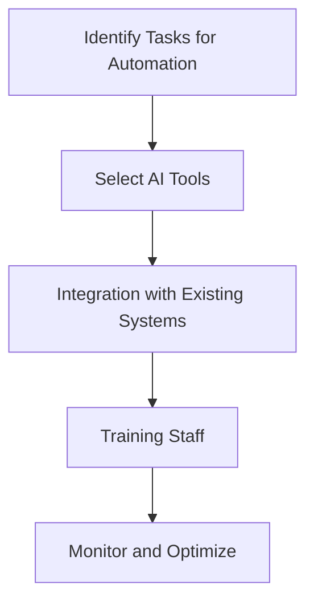

---

# How AI Automation is Revolutionizing Business Operations

In today’s fast-paced business world, efficiency is key, and that’s where AI automation in business comes into play. From streamlining processes to enhancing decision-making, artificial intelligence is fundamentally changing how companies operate. Whether you’re in manufacturing, finance, retail, or any other sector, understanding AI automation can provide you with a competitive edge. 

## What is AI Automation?

AI automation refers to the use of artificial intelligence technologies to perform tasks that traditionally require human intervention. This can include everything from data entry and customer service to complex decision-making processes. By leveraging AI, businesses can automate repetitive tasks, improve accuracy, and free up valuable human resources for more strategic initiatives.

### Why AI Automation Matters

In an era where time is money, AI automation offers several compelling benefits:

- **Increased Efficiency:** Automating routine tasks allows companies to complete operations faster and with fewer errors.
- **Cost Savings:** By reducing labor costs and minimizing human error, businesses can significantly lower their operational expenses.
- **Data-Driven Insights:** AI can analyze vast amounts of data quickly, providing insights that can help businesses make informed decisions.
- **Enhanced Customer Experience:** Automation can streamline customer interactions, providing instant responses and personalized experiences.

## Practical Use Cases of AI Automation in Business

Let’s dive into some real-world applications where AI automation is making waves:

### 1. Customer Service Automation

Many businesses are using AI-powered chatbots to handle customer inquiries. For instance, companies like Zendesk and Drift offer chatbots that can answer frequently asked questions, guide users through processes, and even escalate issues to human agents when necessary. This not only decreases response time but also enhances customer satisfaction.

### 2. Supply Chain Management

AI automation is essential in optimizing supply chains. For example, companies like Amazon utilize AI to forecast demand, manage inventory, and streamline logistics. By analyzing data from various sources, AI systems can predict trends and adjust inventory levels accordingly, reducing waste and ensuring that products are available when customers need them.

### 3. HR and Recruitment

Recruiting can be a daunting task, but AI is simplifying this process. Tools like HireVue and Pymetrics use AI algorithms to screen resumes and even conduct initial interviews. This helps HR teams focus on the most qualified candidates, saving time and improving the quality of hires.

### 4. Financial Analysis and Reporting

Financial institutions are increasingly relying on AI for tasks such as risk assessment and fraud detection. For example, companies like ZestFinance use machine learning algorithms to analyze credit risk, allowing lenders to make better-informed decisions and reduce defaults.

## Pros and Cons of AI Automation in Business

Like any technology, AI automation has its benefits and drawbacks. 

### Pros
- **Increased Efficiency:** Automates repetitive tasks, reducing time spent on manual labor.
- **Cost Reduction:** Lowers operational costs by minimizing labor and errors.
- **Scalability:** Can easily be scaled to handle increased workloads.
- **Enhanced Accuracy:** Reduces human errors, leading to more reliable outcomes.

### Cons
- **Job Displacement:** May lead to job losses in certain sectors if not managed properly.
- **Initial Investment:** High upfront costs for implementation and training.
- **Dependence on Technology:** Over-reliance on AI can create vulnerabilities if systems fail.
- **Data Privacy Concerns:** Increased data collection raises issues regarding customer privacy.

## How to Implement AI Automation in Your Business

Implementing AI automation is a strategic process that involves careful planning. Here’s a structured workflow to guide you through the implementation:

### Step-by-Step Implementation

1. **Identify Tasks for Automation:** Analyze which tasks are repetitive and time-consuming. This could be anything from data entry to customer inquiries.
   
2. **Select AI Tools:** Choose the right tools that fit your business needs. Consider factors such as scalability, ease of use, and cost.

3. **Integration with Existing Systems:** Ensure that the new AI tools can integrate seamlessly with your current systems to avoid disruptions.

4. **Training Staff:** Provide training to your team on how to use the new systems effectively. This is crucial for successful adoption.

5. **Monitor and Optimize:** Continuously track the performance of the automation tools and make adjustments as necessary to maximize efficiency.

## Comparison of AI Automation Tools

When considering AI automation tools, it’s essential to compare different options. Here’s a quick comparison of some popular tools in the market:

<table>
    <tr>
        <th>Tool</th>
        <th>Best For</th>
        <th>Key Features</th>
        <th>Pricing</th>
    </tr>
    <tr>
        <td>Zapier</td>
        <td>Workflow Automation</td>
        <td>Integrates with 2,000+ apps, easy setup</td>
        <td>Starts at $19.99/month</td>
    </tr>
    <tr>
        <td>UiPath</td>
        <td>Robotic Process Automation</td>
        <td>Visual interface, enterprise-level solutions</td>
        <td>Contact for pricing</td>
    </tr>
    <tr>
        <td>Drift</td>
        <td>Conversational Marketing</td>
        <td>AI chatbots, customer engagement</td>
        <td>Starts at $400/month</td>
    </tr>
    <tr>
        <td>HubSpot</td>
        <td>CRM Automation</td>
        <td>Email automation, lead scoring</td>
        <td>Starts at $50/month</td>
    </tr>
</table>

## Conclusion

AI automation in business is not just a trend; it’s a transformative force that can help companies optimize their operations, reduce costs, and enhance customer experiences. As technology continues to evolve, staying ahead of the curve is essential for any business aiming to thrive in a competitive marketplace.

Are you ready to revolutionize your business operations with AI automation? Start by analyzing your current processes and exploring the tools that fit your needs. Don't get left behind—embrace the future of business today!

**Call to Action:** For more insights and guidance on implementing AI tools in your business, subscribe to our newsletter and stay updated with the latest trends in AI automation!

## 関連記事

- [AI Agents: The Future of Personal Assistants in 2026](/posts/ai-agents-the-future-of-personal-assistants-in-2026/)
- [AI Automation: A Game Changer for Small Businesses](/posts/ai-automation-a-game-changer-for-small-businesses/)
- [AI Automation: The Key to Enhanced Business Efficiency](/posts/ai-automation-the-key-to-enhanced-business-efficiency/)
