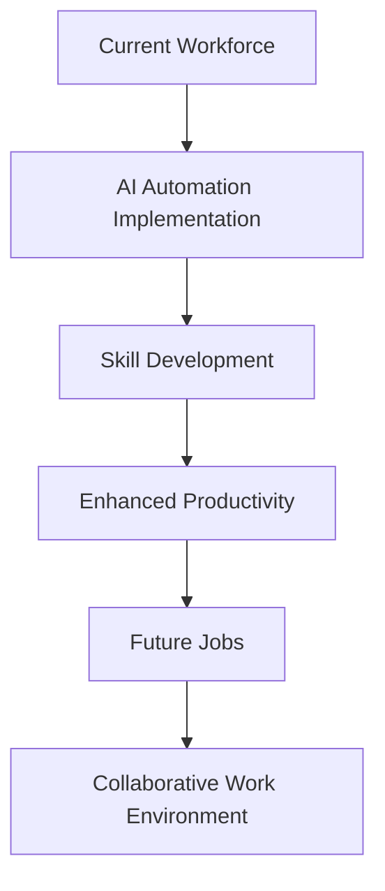

The rapid advancement of technology has set the stage for profound changes in how we work. One of the most significant trends driving this transformation is AI automation. As businesses strive to enhance efficiency and productivity, understanding the implications of AI automation is crucial. This article explores how AI automation is shaping the future of work, its benefits, challenges, and practical use cases across various industries.

## What is AI Automation?

AI automation refers to the use of artificial intelligence to streamline processes and tasks that were traditionally performed by humans. This technology encompasses a wide range of applications, from simple chatbots that handle customer service inquiries to complex algorithms that manage supply chains. The goal is to improve efficiency, reduce human error, and free up employees to focus on more strategic tasks.

### The Rise of AI Automation in the Workplace

AI automation is not just a buzzword; it’s a fundamental shift in the way organizations operate. According to a report by McKinsey, up to 30% of the tasks in about 60% of jobs could be automated with existing technology. This statistic highlights the potential for AI to reshape job roles, enhance efficiency, and drive innovation.

#### Key Drivers of AI Automation Adoption

1. **Cost Reduction**: Companies are increasingly looking to cut costs, and automating repetitive tasks is one way to achieve this. By reducing labor costs associated with manual processes, businesses can allocate resources to growth and innovation.

2. **Enhanced Accuracy**: Human error is inevitable, but AI systems can operate with a high degree of accuracy. This can significantly reduce mistakes in data entry, analysis, and reporting.

3. **Increased Productivity**: AI tools can work around the clock without the need for breaks, leading to increased output and faster turnaround times on projects.

4. **Data-Driven Decision Making**: AI automation can analyze vast amounts of data in real-time, providing insights that enable businesses to make informed decisions quickly.

### Practical Use Cases of AI Automation

AI automation is already making waves across various sectors. Here are some practical examples:

#### 1. Customer Service

AI-powered chatbots are transforming customer interactions. Companies like Zendesk and Drift offer automated systems that can handle a range of inquiries, from answering FAQs to processing orders. These tools not only improve response times but also allow human agents to focus on more complex issues.

#### 2. Human Resources

AI tools like Workday and BambooHR streamline HR processes, such as recruitment and onboarding. They can screen resumes, schedule interviews, and even provide initial training, significantly reducing the workload for HR teams.

#### 3. Marketing Automation

Platforms like HubSpot and Marketo leverage AI to automate marketing campaigns. They analyze customer data to segment audiences, personalize content, and optimize ad spending, leading to higher conversion rates.

#### 4. Supply Chain Management

AI automation is revolutionizing supply chain logistics. Tools like IBM Watson Supply Chain use AI to forecast demand, manage inventory, and optimize delivery routes, ensuring that products are delivered efficiently and cost-effectively.

### Pros and Cons of AI Automation

While the benefits of AI automation are substantial, there are also challenges to consider. Here’s a breakdown of the pros and cons:

| Pros                                   | Cons                                   |
|----------------------------------------|----------------------------------------|
| Increases efficiency and productivity   | Potential job displacement               |
| Reduces errors and improves accuracy    | High initial investment                  |
| Frees up human resources for strategic work | Requires ongoing maintenance and updates |
| Data-driven insights for better decision-making | Can be complex to implement             |

### The Future of Work with AI Automation

As we move forward, the landscape of work will continue to evolve. AI automation is expected to play a pivotal role in how businesses operate, but it will not replace human workers entirely. Instead, the future will likely see a collaboration between AI systems and human employees, where AI handles repetitive tasks while humans focus on creativity, problem-solving, and interpersonal interactions.

#### A New Skillset for the Workforce

With AI automation on the rise, the demand for new skill sets is emerging. Employees will need to adapt by learning to work alongside AI tools, understanding data analysis, and developing soft skills that AI cannot replicate. Organizations should invest in training programs to prepare their workforce for this new era.

### Conclusion

AI automation is undeniably shaping the future of work. Its ability to enhance productivity, reduce costs, and provide valuable insights makes it a powerful tool for businesses. However, organizations must approach this transformation thoughtfully, considering the implications for their workforce and the skills needed for the future. 

As we embrace this new era of AI automation, it’s essential to stay informed and adaptable. Are you ready to integrate AI automation into your workplace? Start exploring the available tools and resources today to ensure you’re not left behind in this rapidly changing landscape.

### Call to Action

Want to learn more about how AI automation can benefit your business? Subscribe to our newsletter for the latest insights, tool reviews, and practical tips on leveraging AI in your workplace!