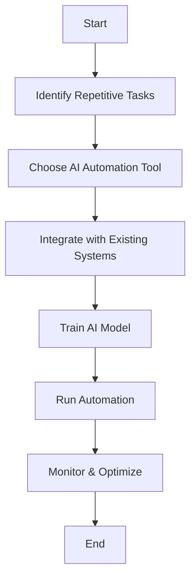

---

# How AI Automation is Transforming Business Operations

In today’s fast-paced digital landscape, businesses are constantly on the lookout for ways to improve efficiency and reduce costs. Enter AI automation—an innovative technology that is not only changing how companies operate but is also redefining the future of work. With its ability to streamline processes, enhance decision-making, and drive productivity, AI automation is becoming an integral part of modern business operations. In this blog post, we’ll explore how AI automation is transforming business operations and the benefits it offers to organizations of all sizes.

## Understanding AI Automation

Before diving into the specific ways AI automation is reshaping business operations, let’s clarify what it entails. AI automation refers to the use of artificial intelligence technologies to automate tasks and processes that traditionally require human intervention. This can range from simple tasks, such as data entry, to more complex processes, like predictive analytics and customer service management.

### How AI Automation Works

At its core, AI automation relies on machine learning algorithms and data analytics to identify patterns, make predictions, and execute tasks without human oversight. It can seamlessly integrate with existing business systems, allowing organizations to leverage their current infrastructure while enhancing capabilities.

## Key Benefits of AI Automation in Business Operations

### 1. Increased Efficiency and Productivity

One of the most significant advantages of AI automation is its ability to boost efficiency. By automating repetitive and mundane tasks, employees can focus on more strategic activities that require human creativity and problem-solving skills. For instance, customer support teams can utilize AI chatbots to handle common inquiries, freeing up human agents to tackle more complex issues.

### 2. Enhanced Decision-Making

AI automation tools can analyze vast amounts of data quickly and accurately, providing businesses with valuable insights to inform decision-making. For example, predictive analytics tools can forecast sales trends, allowing organizations to make data-driven decisions about inventory management and marketing strategies.

### 3. Cost Reduction

Automating processes can lead to significant cost savings. Businesses can reduce labor costs and minimize errors associated with manual processes. For example, automating payroll and accounting tasks can save time and reduce the risk of human error, ultimately leading to more accurate financial reporting.

### 4. Improved Customer Experience

AI automation can significantly enhance customer service by providing quick and accurate responses to inquiries. AI-powered chatbots, for instance, can operate 24/7, offering instant support to customers and improving overall satisfaction levels. This ensures that businesses can meet customer expectations consistently.

### 5. Scalability

As businesses grow, so do their operational complexities. AI automation allows organizations to scale their processes without proportionally increasing costs. By automating tasks, businesses can handle larger volumes of work without needing to hire additional staff.

## Use Cases of AI Automation in Business Operations

To illustrate how AI automation is being applied in real-world scenarios, let’s explore a few use cases across different industries.

### Marketing Automation

In the marketing sector, AI tools like HubSpot and Marketo use automation to streamline campaign management. These platforms can segment audiences, personalize content, and analyze performance metrics automatically, allowing marketers to focus on strategy rather than manual tasks.

### Supply Chain Management

AI automation is revolutionizing supply chain management by predicting demand and optimizing inventory levels. Tools like IBM Watson Supply Chain can analyze data from various sources, enabling businesses to respond proactively to changes in demand and supply fluctuations.

### Human Resources

In HR, AI automation tools like Workday and BambooHR help automate recruitment processes, from screening resumes to scheduling interviews. This not only speeds up the hiring process but also improves the quality of candidate selection by using data-driven insights.

### Financial Services

In finance, AI automation tools such as Kabbage and ZestFinance are changing how businesses assess creditworthiness. By analyzing a wide range of data points, these tools provide faster loan approvals and reduce the risk of defaults.

## Pros and Cons of AI Automation

While AI automation offers numerous benefits, it is essential to consider both its advantages and potential drawbacks. Here’s a quick overview:

| Pros                                      | Cons                                      |
|-------------------------------------------|-------------------------------------------|
| Increases efficiency                      | Initial setup costs can be high          |
| Reduces human error                       | Potential job displacement                 |
| Enhances data analysis and decision-making| Requires ongoing maintenance and updates  |
| Improves customer service                 | May require extensive training for staff  |

### Conclusion

AI automation is undeniably transforming business operations across industries. By enhancing efficiency, improving decision-making, and reducing costs, it empowers organizations to thrive in a competitive landscape. However, it’s crucial for businesses to approach AI automation strategically, considering both its benefits and challenges.

As you explore the potential of AI automation for your business, remember to start small, identify tasks that can be automated, and choose the right tools that align with your goals. The future of work is here, and embracing AI automation is a step toward a more efficient, productive, and innovative business environment.

## Call to Action

Are you ready to take the plunge into the world of AI automation? Start by assessing the processes in your organization that could benefit from automation. Explore the tools available and stay ahead of the curve in your industry. Share your thoughts and experiences in the comments below, and don’t forget to subscribe to our blog for more insights on AI tools and productivity!