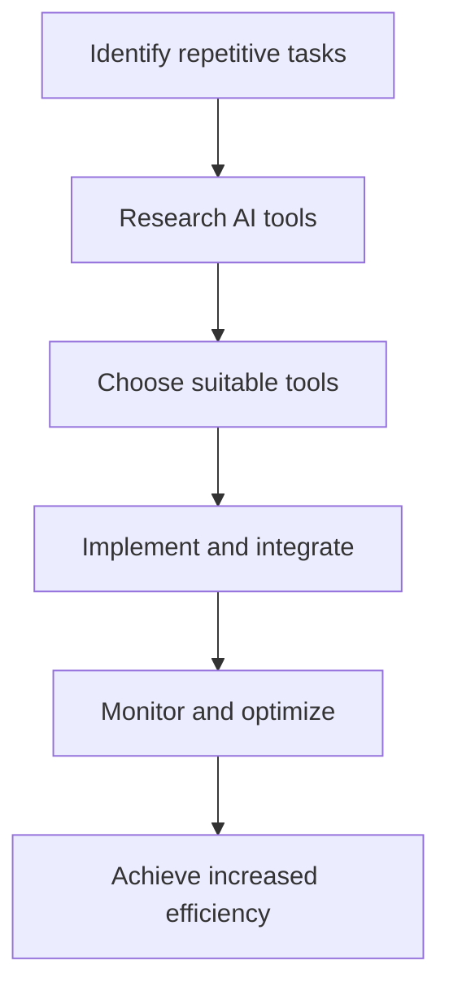

---

## How AI Automation is Transforming Business Operations

In an era where technology is rapidly evolving, AI automation is becoming a cornerstone of modern business operations. Companies are increasingly adopting AI tools to streamline processes, improve efficiency, and drive growth. But what does this mean for your business? Let’s dive into the transformative power of AI automation and explore its implications for various industries.

### Understanding AI Automation

AI automation involves using artificial intelligence technologies to automate repetitive tasks traditionally performed by humans. This can range from simple processes like data entry to more complex tasks like customer service and decision-making. By leveraging AI, businesses can not only save time and reduce operational costs but also enhance accuracy and productivity.

#### Key Components of AI Automation
- **Machine Learning:** Algorithms that learn from data and improve over time.
- **Natural Language Processing (NLP):** Enables machines to understand and respond to human language.
- **Robotic Process Automation (RPA):** Software robots automate rule-based tasks.
  
### Benefits of AI Automation in Business

1. **Increased Efficiency**
   AI tools can process large volumes of data much faster than humans, allowing businesses to complete tasks in significantly less time. For example, AI-driven chatbots can handle customer inquiries around the clock, reducing response time and improving customer satisfaction.

2. **Cost Savings**
   Automating routine tasks allows businesses to reallocate human resources to more strategic activities, ultimately leading to cost reductions. For instance, by implementing AI in inventory management, companies can minimize overstock and stockouts, leading to lower storage costs.

3. **Improved Accuracy**
   AI systems are less prone to human error. By automating data entry and analysis, businesses can reduce mistakes that often occur with manual processes. This is particularly valuable in industries like healthcare, where accuracy is paramount.

4. **Enhanced Decision-Making**
   AI tools can analyze trends and patterns in data, providing insights that inform strategic decisions. For example, predictive analytics can help companies forecast sales and adjust inventory accordingly.

### Use Cases of AI Automation in Different Industries

#### 1. E-commerce
AI automation is revolutionizing the e-commerce sector by optimizing supply chains and enhancing customer experiences. For instance, algorithms can analyze customer behavior to recommend products, while automated warehousing systems can streamline order fulfillment.

#### 2. Finance
In finance, AI is used for fraud detection, risk assessment, and customer service. Automated systems can analyze transactions in real-time, identifying suspicious activity faster than any human ever could.

#### 3. Healthcare
AI tools assist healthcare professionals in diagnosing diseases and predicting patient outcomes. For example, AI can analyze medical images to detect abnormalities, making early diagnosis possible and improving patient care.

#### 4. Manufacturing
In manufacturing, AI-driven robots can perform repetitive tasks on production lines, increasing speed and precision. Predictive maintenance powered by AI helps reduce downtime by forecasting equipment failures before they occur.

### Popular AI Automation Tools

With the growing demand for AI automation, numerous tools have emerged in the market. Below is a comparison of some popular AI automation tools that businesses can consider:

<table>
    <tr>
        <th>Tool Name</th>
        <th>Best For</th>
        <th>Key Features</th>
        <th>Pros</th>
        <th>Cons</th>
    </tr>
    <tr>
        <td>Zapier</td>
        <td>Task Automation</td>
        <td>Integrates with 5,000+ apps, easy workflows</td>
        <td>User-friendly, no coding required</td>
        <td>Limited free plan, can be expensive for advanced features</td>
    </tr>
    <tr>
        <td>UiPath</td>
        <td>Robotic Process Automation</td>
        <td>Drag-and-drop interface, AI integration</td>
        <td>Scalable, enterprise-grade</td>
        <td>Steep learning curve, higher costs</td>
    </tr>
    <tr>
        <td>WorkFusion</td>
        <td>Data Processing</td>
        <td>Combines RPA with machine learning</td>
        <td>Powerful analytics, great for large datasets</td>
        <td>Complex setup, may require dedicated staff</td>
    </tr>
</table>

### Challenges of Implementing AI Automation

Despite its numerous benefits, implementing AI automation is not without challenges. Businesses may face:

- **Resistance to Change:** Employees may be apprehensive about job security. It’s crucial to communicate the benefits of AI automation clearly and involve employees in the transition.
  
- **Integration Issues:** Integrating AI tools with existing systems can be complex and time-consuming. A thoughtful approach is necessary to ensure compatibility.

- **Data Privacy Concerns:** With increased automation comes the responsibility of managing sensitive data. Businesses must ensure compliance with data protection regulations.

### The Future of AI Automation in Business

As AI technology continues to evolve, its impact on business operations will only grow. We can expect to see more sophisticated AI systems that not only automate tasks but also enhance human capabilities. The integration of AI with other technologies, such as the Internet of Things (IoT) and blockchain, will further broaden the scope of automation.

### Conclusion

AI automation is undoubtedly transforming business operations across various industries, driving efficiency, reducing costs, and enhancing decision-making. As businesses continue to embrace this technology, those who adapt and integrate AI tools will find themselves at a competitive advantage.

Now is the time to explore how AI automation can benefit your organization. Whether you're looking to streamline processes, enhance customer service, or improve decision-making, there’s an AI tool that can help. Embrace the future of business operations today!

### Call to Action

Are you ready to transform your business with AI automation? Start exploring the tools mentioned in this article and find the right fit for your needs. Don't miss out on the opportunity to enhance efficiency and drive growth in your organization!

By following these steps, you'll be well on your way to leveraging AI automation for your business success!

## 関連記事

- [AI Automation: Revolutionizing Business Operations in 2026](/posts/ai-automation-revolutionizing-business-operations-in-2026/)
- [Automating Business Processes with AI in 2026](/posts/automating-business-processes-with-ai-in-2026/)
- [Harnessing AI Automation for Business Growth in 2026](/posts/harnessing-ai-automation-for-business-growth-in-2026/)
