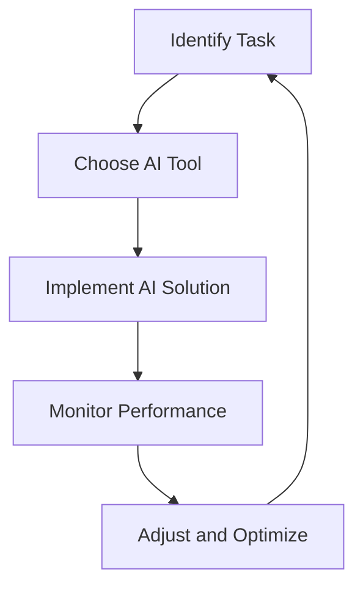

---

## How AI Automation is Transforming Business Operations

In the fast-paced world of business, staying ahead of the competition is crucial. Companies are continually seeking innovative ways to streamline processes, reduce costs, and improve productivity. This is where **AI automation business** solutions come into play. By leveraging artificial intelligence, organizations are not only automating repetitive tasks but also transforming the way they operate. In this blog post, we’ll explore how AI automation is reshaping business operations, the benefits it offers, and some practical examples of its application.

### Understanding AI Automation

AI automation refers to the use of artificial intelligence technologies to perform tasks that typically require human intervention. It involves the integration of machine learning, natural language processing, and robotics to automate complex processes. By utilizing AI, businesses can enhance their operational efficiency, reduce errors, and free up valuable human resources for more strategic tasks.

#### Key Components of AI Automation

- **Machine Learning (ML):** Algorithms that allow systems to learn from data, improving their performance over time without explicit programming.
- **Natural Language Processing (NLP):** Enables machines to understand and respond to human language, facilitating interactions between humans and computers.
- **Robotic Process Automation (RPA):** Software robots that automate repetitive tasks by mimicking human actions, such as data entry and transaction processing.

### How AI Automation is Transforming Business Operations

#### 1. Streamlining Customer Service

One of the most notable applications of AI automation is in customer service. Many companies have adopted chatbots powered by NLP to handle customer inquiries. These chatbots can provide instant responses, troubleshoot issues, and even process orders.

**Example:** Consider a retail company that implements a chatbot on its website. Instead of waiting for a human representative to respond, customers can engage with the chatbot for immediate assistance, significantly reducing response times and improving customer satisfaction.

**Pros:**
- 24/7 availability
- Cost-effective
- Consistent responses

**Cons:**
- Limited understanding of complex queries
- May frustrate customers who prefer human interaction

#### 2. Optimizing Supply Chain Management

AI automation is also revolutionizing supply chain management. By utilizing AI-driven analytics, companies can forecast demand, optimize inventory levels, and even automate order fulfillment processes.

**Example:** A manufacturer can use AI to analyze historical sales data and predict future demand. This allows them to optimize their production schedules and reduce excess inventory, leading to cost savings and improved efficiency.

**Pros:**
- Improved accuracy in demand forecasting
- Reduced operational costs
- Enhanced inventory management

**Cons:**
- High initial setup costs
- Requires continuous data monitoring

### 3. Enhancing Marketing Efforts

AI tools can analyze vast amounts of consumer data to help businesses tailor their marketing strategies. This includes personalized content recommendations, targeted advertising, and automated social media posting.

**Example:** An e-commerce platform can use AI to analyze customer behavior and preferences, enabling it to send targeted email campaigns that lead to higher conversion rates.

**Pros:**
- Enhanced targeting and personalization
- Increased ROI on marketing campaigns
- Time-saving through automation

**Cons:**
- Potential privacy concerns
- Dependence on data quality

#### 4. Improving Human Resources Management

AI automation can streamline various HR processes, from recruitment to employee onboarding and performance evaluation. This not only saves time but also enhances the overall employee experience.

**Example:** An HR department can implement an AI-driven recruitment tool that screens resumes and identifies top candidates based on predefined criteria. This allows HR professionals to focus on interviewing and engaging candidates rather than sifting through a pile of applications.

**Pros:**
- Faster recruitment processes
- Reduced bias in hiring
- Enhanced employee engagement

**Cons:**
- May overlook unique candidate qualities
- Requires regular updates to AI algorithms

### The Future of AI Automation in Business

As technology continues to advance, the potential for AI automation in business operations is immense. From advanced analytics to predictive maintenance, the possibilities are endless. However, it’s essential for businesses to adopt a strategic approach to AI implementation. This includes understanding the specific needs of their organization, investing in quality data, and continuously evaluating and improving their AI systems.

### Comparing Popular AI Automation Tools

When considering AI automation solutions, it's essential to select the right tools for your business needs. Below is a comparison of some popular AI automation tools:

<table>
  <tr>
    <th>Tool</th>
    <th>Features</th>
    <th>Best For</th>
    <th>Pricing</th>
  </tr>
  <tr>
    <td>UiPath</td>
    <td>Robotic process automation, AI integration, analytics</td>
    <td>Enterprise automation</td>
    <td>Custom pricing</td>
  </tr>
  <tr>
    <td>Zapier</td>
    <td>Workflow automation, app integrations, triggers</td>
    <td>Small to medium businesses</td>
    <td>Starts at $19.99/month</td>
  </tr>
  <tr>
    <td>[ChatGPT](https://chat.openai.com/?ref=AFFILIATE_ID)</td>
    <td>Natural language processing, conversational AI</td>
    <td>Customer support, content creation</td>
    <td>Free tier available, paid plans start at $20/month</td>
  </tr>
  <tr>
    <td>Salesforce Einstein</td>
    <td>AI-driven insights, predictive analytics</td>
    <td>Sales and marketing automation</td>
    <td>Custom pricing</td>
  </tr>
</table>

### Visualizing the AI Automation Workflow

To better understand how AI automation can streamline business operations, here’s a simple workflow diagram illustrating the process:

### Conclusion

AI automation is not just a trend; it’s a transformative force reshaping the landscape of business operations. By adopting AI-driven solutions, organizations can improve efficiency, enhance customer experiences, and drive growth. However, successful implementation requires careful planning, ongoing evaluation, and a commitment to adapting to new technologies.

Are you ready to transform your business operations with AI automation? Start exploring the possibilities today and unlock your organization’s full potential! 

### Call to Action

If you found this article helpful, share it with your colleagues and subscribe to our newsletter for the latest insights on AI tools and productivity tips!

## 関連記事

- [Automating Business Processes with AI in 2026](/posts/automating-business-processes-with-ai-in-2026/)
- [Revolutionizing Business with AI Automation Strategies](/posts/revolutionizing-business-with-ai-automation-strategies/)
- [AI Agents: The Future of Personal Assistants in 2026](/posts/ai-agents-the-future-of-personal-assistants-in-2026/)
