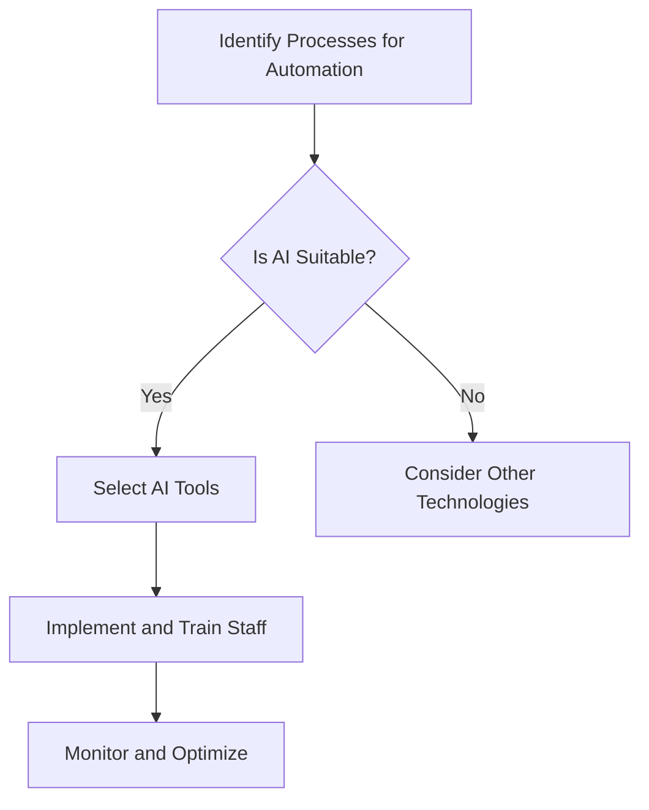

---

## How AI Automation is Transforming Business Operations

In today’s rapidly evolving digital landscape, businesses are increasingly turning to AI automation to streamline their operations and enhance productivity. The integration of artificial intelligence into everyday business practices is no longer a futuristic concept; it’s a present-day reality that is reshaping how companies function. This blog post will explore how AI automation in business is transforming operations, its benefits, and some practical examples of its applications.

### Understanding AI Automation in Business

AI automation refers to the use of artificial intelligence technologies to perform tasks that traditionally required human intervention. This can range from simple data entry to complex decision-making processes. By leveraging AI, businesses can automate routine tasks, allowing employees to focus on higher-value activities.

### Why AI Automation Matters

The significance of AI automation in business cannot be overstated. Here are a few reasons why companies are embracing this technology:

- **Increased Efficiency**: Automating repetitive tasks reduces the time spent on mundane activities and increases overall productivity.
- **Cost Reduction**: By minimizing human error and optimizing processes, businesses can significantly cut operational costs.
- **Enhanced Decision-Making**: AI can analyze vast amounts of data quickly, providing insights that assist in informed decision-making.
- **Improved Customer Experience**: Automation can help personalize customer interactions, leading to greater satisfaction and loyalty.

### Practical Applications of AI Automation

Let’s delve into some practical use cases of AI automation in various business domains.

#### 1. Customer Service Automation

AI-powered chatbots are revolutionizing customer service. These virtual assistants can handle inquiries 24/7, providing instant responses to customers and resolving issues without human intervention. For example, companies like Zendesk utilize AI to streamline customer interactions, enabling support teams to focus on more complex issues.

**Pros**:
- 24/7 availability
- Quick response times
- Cost-effective

**Cons**:
- May lack empathy
- Limited in handling complex queries

#### 2. Marketing Automation

AI automation tools such as HubSpot and Marketo help businesses manage marketing campaigns effectively. These tools can segment audiences, personalize content, and automate email campaigns based on user behavior. With AI-driven analytics, marketers can optimize their strategies in real-time.

**Pros**:
- Personalization at scale
- Improved targeting
- Data-driven insights

**Cons**:
- Requires initial setup and training
- Over-reliance may lead to missing out on creative strategies

#### 3. Supply Chain and Inventory Management

AI algorithms can predict demand fluctuations, optimize inventory levels, and manage supply chain logistics. For instance, companies like Amazon use AI to forecast demand, ensuring they stock the right products at the right time.

**Pros**:
- Reduced waste
- Enhanced inventory accuracy
- Improved supply chain efficiency

**Cons**:
- Dependency on data quality
- High implementation costs

#### 4. Human Resources Automation

HR departments are leveraging AI tools for recruitment, onboarding, and employee engagement. Platforms like Workday and BambooHR automate applicant tracking and streamline onboarding processes. AI can also analyze employee feedback to improve workplace culture.

**Pros**:
- Streamlined hiring processes
- Enhanced employee engagement
- Reduction in administrative tasks

**Cons**:
- Possible bias in algorithms
- Employee resistance to AI-driven processes

### Challenges of Implementing AI Automation

While AI automation offers numerous benefits, businesses must also navigate several challenges:

- **Data Privacy**: Handling sensitive data requires strict compliance with regulations.
- **Change Management**: Employees may resist adopting new technologies, necessitating effective change management strategies.
- **Integration**: Ensuring AI tools work seamlessly with existing systems can be complex.

### The Future of AI Automation in Business

The future of AI automation is bright, with advancements in machine learning, natural language processing, and robotics. As technology continues to evolve, businesses will find even more innovative ways to enhance their operations. According to a report by McKinsey, AI could potentially add $13 trillion to the global economy by 2030. 

### Conclusion

AI automation in business is not just a trend; it’s a transformative force that enhances efficiency, reduces costs, and improves decision-making across various industries. By embracing AI, businesses can stay competitive in an increasingly digital world.

If you’re considering implementing AI automation in your business, start by identifying areas where automation could add the most value. Whether it’s through customer service, marketing, supply chain management, or HR, the potential benefits are enormous. 

### Call to Action

Ready to revolutionize your business operations with AI automation? Explore the tools available today and take the first step toward a more efficient and productive future. Don't let your business fall behind—embrace the power of AI!

### Comparison of Popular AI Tools for Automation

Here’s a quick comparison of some popular AI automation tools to help you choose the right one for your business needs:

<table>
  <tr>
    <th>Tool</th>
    <th>Best For</th>
    <th>Key Features</th>
    <th>Pricing</th>
  </tr>
  <tr>
    <td>HubSpot</td>
    <td>Marketing Automation</td>
    <td>Email campaigns, CRM integration, Analytics</td>
    <td>Starts at $45/month</td>
  </tr>
  <tr>
    <td>Zendesk</td>
    <td>Customer Service</td>
    <td>Chatbots, Ticketing system, Reporting</td>
    <td>Starts at $19/month</td>
  </tr>
  <tr>
    <td>Workday</td>
    <td>HR Management</td>
    <td>Applicant tracking, Employee engagement, Analytics</td>
    <td>Contact for pricing</td>
  </tr>
  <tr>
    <td>Amazon Forecast</td>
    <td>Supply Chain Management</td>
    <td>Demand forecasting, Inventory optimization</td>
    <td>Pay-as-you-go</td>
  </tr>
</table>

Embrace AI automation today and watch your business soar to new heights!

## 関連記事

- [Automating Business Processes with AI: A Step-by-Step Playbook](/posts/automating-business-processes-with-ai-a-complete-guide/)
- [7 AI Automation Strategies to Supercharge Business Efficiency](/posts/boosting-business-efficiency-with-ai-automation-strategies/)
- [AI for Project Management: Automating Planning, Tracking, and Reporting](/posts/how-ai-is-revolutionizing-project-management-tasks/)
