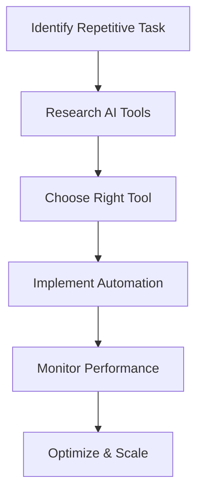

---

# How AI Automation Transforms Business Efficiency in 2026

In 2026, the landscape of business operations is drastically different from just a few years ago, thanks to the rapid advancements in AI automation. Companies across various sectors are harnessing the power of AI tools to streamline processes, enhance productivity, and improve decision-making. In this blog post, we’ll explore how AI automation is transforming business efficiency, showcasing real-world applications, pros and cons, and practical examples that can help you understand its impact on your organization.

## The Rise of AI Automation

AI automation refers to the use of artificial intelligence to perform repetitive tasks, analyze data, and improve workflows. It’s not just about replacing human labor; it’s about augmenting human capabilities and allowing employees to focus on higher-level strategic initiatives. As we enter 2026, businesses are increasingly adopting AI automation tools to manage everything from customer service to supply chain logistics.

### Why AI Automation Matters

1. **Enhanced Efficiency**: By automating mundane tasks, companies can reduce human error and speed up processes.
2. **Cost Savings**: Automation can lead to significant reductions in operational costs, freeing up resources for reinvestment.
3. **Improved Decision-Making**: AI can analyze vast amounts of data at lightning speed, providing insights that facilitate informed decision-making.
4. **Scalability**: AI tools can easily scale as a business grows, making it easier to adapt to changing market conditions.

## Real-World Applications of AI Automation

### 1. Customer Service Automation

Businesses are increasingly deploying AI chatbots to handle customer inquiries. These bots can answer frequently asked questions, assist with order tracking, and even resolve complaints. For example, a retail company implemented an AI chatbot that reduced customer service response times by 70%, allowing human agents to focus on more complex issues.

### 2. Marketing Automation

AI tools like HubSpot and Marketo are transforming marketing departments by automating email campaigns, social media posting, and lead scoring. For instance, a software company used AI-driven marketing automation to segment their audience more effectively, resulting in a 40% increase in conversion rates.

### 3. Supply Chain Management

AI automation is also making waves in supply chain logistics. Companies are using AI to forecast demand, optimize inventory levels, and automate order fulfillment. A notable example is a multinational manufacturer that leveraged AI to predict supply chain disruptions, which helped them save millions in potential losses.

### 4. Human Resources Automation

From recruiting to employee onboarding, AI tools are streamlining HR processes. An HR platform can automatically screen resumes and schedule interviews, thereby reducing the time spent on administrative tasks. For example, a tech startup used AI-driven recruitment software that cut their hiring time in half.

## Pros and Cons of AI Automation

### Pros

- **Increased Productivity**: Automating repetitive tasks allows employees to focus on strategic initiatives.
- **Accuracy**: Reduces human errors in data entry and processing.
- **Cost Efficiency**: Lowers operational costs over time.
- **24/7 Availability**: AI tools can operate around the clock without fatigue.

### Cons

- **Initial Investment**: Implementing AI automation tools can require a significant upfront investment.
- **Job Displacement**: Some roles may become redundant, leading to workforce concerns.
- **Dependence on Technology**: Over-reliance on AI can lead to vulnerabilities if systems fail.
- **Data Privacy Issues**: Handling sensitive data with AI tools raises privacy concerns.

## Comparing Popular AI Automation Tools

To help you explore the best AI automation tools available in 2026, here’s a comparison of some leading platforms:

<table>
  <tr>
    <th>Tool</th>
    <th>Best For</th>
    <th>Key Features</th>
    <th>Pricing</th>
  </tr>
  <tr>
    <td>Zapier</td>
    <td>Small to Medium Businesses</td>
    <td>Integration with thousands of apps, multi-step workflows</td>
    <td>Starts at $19.99/month</td>
  </tr>
  <tr>
    <td>UiPath</td>
    <td>Enterprise Automation</td>
    <td>Robotic Process Automation, advanced analytics</td>
    <td>Starts at $420/month</td>
  </tr>
  <tr>
    <td>HubSpot</td>
    <td>Marketing Automation</td>
    <td>Email automation, lead scoring, CRM integration</td>
    <td>Free tier available, paid plans start at $45/month</td>
  </tr>
  <tr>
    <td>ServiceNow</td>
    <td>IT Service Management</td>
    <td>AI-driven ticketing, workflow automation</td>
    <td>Contact for pricing</td>
  </tr>
</table>

## Workflow of AI Automation in Business

Understanding how AI automation integrates into business processes is crucial. Below is a simple workflow that illustrates the typical steps involved in implementing AI automation:

## Conclusion

As we move through 2026, the transformative power of AI automation will continue to redefine business efficiency. By embracing AI tools, companies can significantly enhance productivity, streamline operations, and make better decisions. However, it’s essential to weigh the pros and cons and understand how these tools can best serve your organization.

Are you ready to take your business to the next level with AI automation? Start exploring the tools mentioned in this post and see how they can fit into your operational strategy. For more insights and updates on AI tools and productivity, subscribe to our newsletter and join the AI Tools Lab community today!

## 関連記事

- [Automating Business Processes with AI: A Step-by-Step Playbook](/posts/automating-business-processes-with-ai-a-complete-guide/)
- [7 AI Automation Strategies to Supercharge Business Efficiency](/posts/boosting-business-efficiency-with-ai-automation-strategies/)
- [AI Automation 101: What It Is and Why Your Business Needs It](/posts/how-ai-automation-is-transforming-business-operations/)
