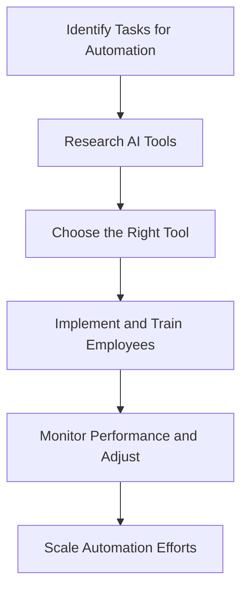

---

### How AI Automation Transforms Business Operations Now

In today’s fast-paced business landscape, organizations are always on the lookout for innovative ways to enhance their operations. Enter AI automation, a game-changer that is reshaping how businesses function. From streamlining workflows to reducing overhead costs, AI automation is not just a trend; it’s a necessity for those looking to stay competitive.

### What is AI Automation?

AI automation refers to the integration of artificial intelligence (AI) technologies with automation processes to perform tasks that typically require human intelligence. This can include anything from simple data entry to complex decision-making processes. By leveraging machine learning, natural language processing, and other AI capabilities, businesses can automate repetitive tasks, thereby freeing up human resources for more strategic activities.

### Why AI Automation Matters in Business

With the increasing complexity of business operations, AI automation offers several advantages:

- **Increased Efficiency:** Automating mundane tasks speeds up operations, allowing employees to focus on higher-value work.
- **Cost Savings:** Reducing human intervention can lead to significant savings on labor costs and minimize errors.
- **Enhanced Decision-Making:** AI can analyze vast amounts of data quickly to provide insights that help in making informed decisions.
- **Scalability:** As your business grows, AI automation can easily adapt to increased workloads without the need for proportional increases in staff.

### Practical Use Cases of AI Automation in Business Operations

#### 1. Customer Support

**Example:** AI chatbots are increasingly being used in customer service to handle inquiries, complaints, and support requests 24/7. 

- **Pros:** 
  - Provides instant responses.
  - Reduces wait times for customers.
  
- **Cons:**
  - May lack the personal touch.
  - Complex queries may still require human intervention.

#### 2. Data Management

**Example:** AI tools like data extraction software automate the collection and organization of data from various sources.

- **Pros:**
  - Saves time and reduces manual errors.
  - Provides real-time data analysis.

- **Cons:**
  - Initial setup can be resource-intensive.
  - Data privacy concerns need to be managed.

#### 3. Marketing Automation

**Example:** AI-driven platforms like HubSpot or Marketo automate email campaigns, social media posting, and lead scoring.

- **Pros:**
  - Personalizes marketing efforts based on user behavior.
  - Increases engagement and conversion rates.

- **Cons:**
  - Requires a learning curve for optimal use.
  - Can be expensive depending on the scale of use.

### Comparison of AI Automation Tools

When it comes to selecting the right AI automation tools for your business, it’s essential to compare what’s available in the market. Below is a comparison of three popular AI automation platforms:

<table>
  <tr>
    <th>Feature</th>
    <th>Tool A</th>
    <th>Tool B</th>
    <th>Tool C</th>
  </tr>
  <tr>
    <td>Ease of Use</td>
    <td>High</td>
    <td>Medium</td>
    <td>High</td>
  </tr>
  <tr>
    <td>Integration Capabilities</td>
    <td>Excellent</td>
    <td>Good</td>
    <td>Very Good</td>
  </tr>
  <tr>
    <td>Cost</td>
    <td>$$</td>
    <td>$$$</td>
    <td>$</td>
  </tr>
  <tr>
    <td>Customer Support</td>
    <td>24/7</td>
    <td>Business Hours</td>
    <td>Limited</td>
  </tr>
</table>

### A Workflow for Implementing AI Automation

Implementing AI automation in your business doesn’t have to be daunting. Here’s a simple workflow to guide your process:

### Challenges of AI Automation

While the benefits of AI automation are clear, it’s important to recognize the challenges that come with it:

- **Resistance to Change:** Employees may be hesitant to adapt to new technologies.
- **Initial Costs:** Investing in AI tools can be high, especially for small businesses.
- **Data Security:** Ensuring the security of data used in AI processes is crucial.

### The Future of AI Automation in Business

As AI technology continues to evolve, so will its applications in business operations. The future promises even more advanced capabilities, such as predictive analytics and fully autonomous systems. Embracing AI automation today will not only streamline your operations but also position your business for long-term success.

### Conclusion

AI automation is not just a buzzword; it’s a transformative force in the business world. By automating routine tasks and enhancing operational efficiency, businesses can not only save costs but also improve service delivery and decision-making processes. 

If you’re considering implementing AI automation in your organization, now is the time to act. Start small, measure your outcomes, and scale your efforts as you gain confidence in these powerful tools.

### Call to Action

Ready to take your business operations to the next level with AI automation? Explore our comprehensive guides and tool reviews at AI Tools Lab, and discover the perfect solutions tailored for your needs. Don’t get left behind—embrace the future of business today!

## 関連記事

- [Automating Business Processes with AI in 2026](/posts/automating-business-processes-with-ai-in-2026/)
- [Harnessing AI Automation for Business Growth in 2026](/posts/harnessing-ai-automation-for-business-growth-in-2026/)
- [How AI Automation is Transforming Business Operations](/posts/how-ai-automation-is-transforming-business-operations/)
