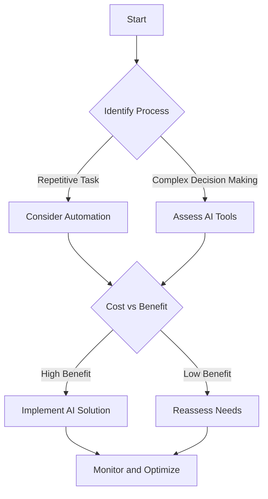

---

# How AI Automation Transforms Business Processes in 2026

As we dive deeper into 2026, the landscape of business operations continues to evolve, largely thanks to the advancements in AI automation technology. Businesses are leveraging AI to streamline processes, enhance productivity, and improve customer experiences. In this blog post, we will explore how AI automation is transforming business processes this year, providing practical examples, use cases, and insights you can implement in your organization.

## Understanding AI Automation

AI automation refers to the use of artificial intelligence technologies to automate complex business processes that traditionally require human intervention. This includes tasks such as data analysis, customer service, supply chain management, and even decision-making. The goal is to increase efficiency, reduce errors, and allow human employees to focus on more strategic activities.

### Key Areas Where AI Automation is Making an Impact

1. **Customer Service**
   - AI-powered chatbots are becoming the frontline of customer service, handling inquiries 24/7. For instance, companies like Zendesk and Drift leverage AI to provide instant responses, reducing wait times and improving customer satisfaction.

2. **Data Management**
   - AI tools like Microsoft Power BI and Tableau can process and analyze large datasets faster than human analysts. For example, a retail business can use AI to analyze sales data in real-time, identifying trends and making data-driven decisions.

3. **Supply Chain Optimization**
   - AI algorithms can predict demand and optimize inventory levels. Companies such as Amazon use AI to manage logistics, ensuring that products are delivered efficiently and cost-effectively.

4. **Human Resources Automation**
   - AI tools streamline recruitment processes by screening resumes and scheduling interviews. Platforms like Workday and HireVue use AI to enhance HR efficiencies.

### The Benefits of Implementing AI Automation in Business Processes

- **Increased Efficiency**: AI automation can process tasks at a speed and accuracy level unmatched by human workers. This leads to faster project completion and improved service delivery.
  
- **Cost Reduction**: By automating repetitive tasks, businesses can save on labor costs and reallocate resources to more strategic initiatives.

- **Improved Accuracy**: AI reduces human error, ensuring that data-driven decisions are based on accurate information.

- **Scalability**: AI systems can easily scale operations to meet increasing demands without the need for proportional increases in staff.

### Potential Drawbacks of AI Automation

While the advantages are numerous, there are also challenges to consider:

- **Initial Investment**: Implementing AI technology can require significant upfront costs, including software, training, and infrastructure.

- **Job Displacement**: Automation may lead to job losses in certain sectors, creating a need for workforce reskilling and transition.

- **Complexity of Integration**: Integrating AI systems with existing processes may be complex and time-consuming.

### Practical Use Cases of AI Automation in 2026

#### Case Study 1: AI in Retail

A large retail chain implemented AI-powered inventory management systems that accurately predicted stock levels. The result was a 30% reduction in overstock and a 20% increase in sales due to improved product availability.

#### Case Study 2: AI in Finance

A financial services firm adopted AI for fraud detection, employing machine learning algorithms to analyze transaction patterns. This led to a 50% reduction in false positives and improved customer trust.

#### Case Study 3: AI in Marketing

A digital marketing agency uses AI tools to analyze customer behavior and personalize marketing campaigns. The use of AI-driven analytics increased their campaign ROI by 40%.

### The Future of AI Automation in Business Processes

As we look ahead, AI automation will continue to advance, with developments in natural language processing, machine learning, and robotics. Businesses that adopt these technologies will not only improve their operational efficiency but also enhance their competitive edge.

#### Decision Tree for Implementing AI Automation

To better visualize the decision-making process for businesses considering AI automation, here’s a simple flowchart:

### Comparison of Popular AI Automation Tools in 2026

When it comes to choosing the right AI automation tools, several options stand out. Below is a comparison table of some of the leading AI automation platforms available this year.

<table>
    <tr>
        <th>Tool</th>
        <th>Best For</th>
        <th>Key Features</th>
        <th>Pricing</th>
    </tr>
    <tr>
        <td>Zapier</td>
        <td>Workflow Automation</td>
        <td>Integration with 3000+ apps, Custom workflows</td>
        <td>Starts at $19.99/month</td>
    </tr>
    <tr>
        <td>UiPath</td>
        <td>Robotic Process Automation</td>
        <td>Drag-and-drop interface, AI integration</td>
        <td>Custom pricing</td>
    </tr>
    <tr>
        <td>Blue Prism</td>
        <td>Enterprise Automation</td>
        <td>Scalability, Security features</td>
        <td>Custom pricing</td>
    </tr>
    <tr>
        <td>Automation Anywhere</td>
        <td>End-to-End Automation</td>
        <td>AI capabilities, Cloud-based</td>
        <td>Starts at $1,200/month</td>
    </tr>
</table>

### Conclusion: Embrace AI Automation for Future Success

As we navigate through 2026, AI automation is not just a trend; it is a pivotal element for businesses aiming to thrive in a competitive environment. Whether you’re in retail, finance, or any other sector, the integration of AI tools can drastically enhance your operational efficiency, reduce costs, and improve customer satisfaction.

Are you ready to transform your business processes with AI automation? Start exploring the tools mentioned in this blog post, evaluate your needs, and take the first steps towards a more efficient, data-driven future. Don’t get left behind—embrace AI automation today!

--- 

By understanding the landscape and potential of AI automation, you can position your business for success in the coming years. Remember, the future is automated, and your journey begins now!

## 関連記事

- [AI Automation: Revolutionizing Business Operations in 2026](/posts/ai-automation-revolutionizing-business-operations-in-2026/)
- [Automating Business Processes with AI in 2026](/posts/automating-business-processes-with-ai-in-2026/)
- [Harnessing AI Automation for Business Growth in 2026](/posts/harnessing-ai-automation-for-business-growth-in-2026/)
