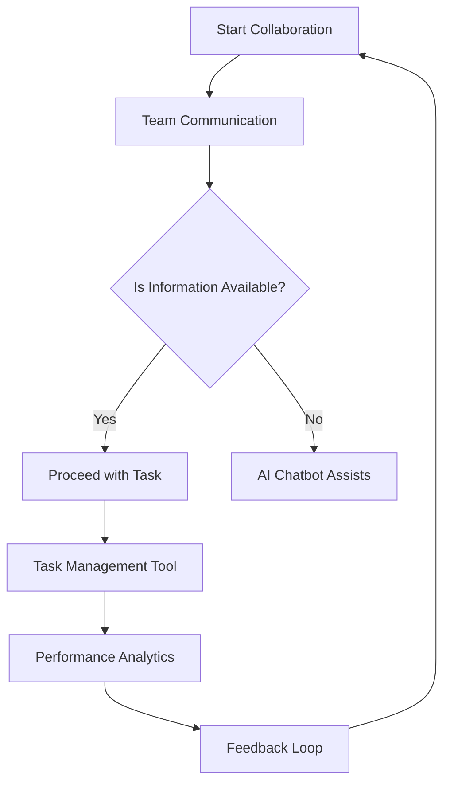

---

# How AI Can Optimize Team Collaboration and Productivity

In today’s fast-paced business environment, teams are often dispersed across different locations, making effective collaboration a challenge. As organizations strive for increased productivity, many are turning to Artificial Intelligence (AI) to optimize team collaboration. By harnessing the power of AI tools, teams can streamline communication, manage tasks more effectively, and enhance overall performance. In this article, we will explore how AI can optimize team collaboration and productivity, provide practical examples, and review some of the best tools available in the market.

## The Importance of Team Collaboration

Before diving into the role of AI in enhancing collaboration, let’s take a moment to consider why effective teamwork is essential. Strong collaboration leads to:

1. **Improved Problem Solving**: Diverse teams can generate a wider range of ideas and solutions.
2. **Increased Efficiency**: Clear communication and defined roles lead to faster project completions.
3. **Higher Employee Satisfaction**: Collaborative cultures contribute to employee engagement and retention.

However, traditional collaboration methods can be hindered by geographical boundaries, miscommunication, and lack of project visibility. This is where AI comes in, offering innovative solutions to overcome these challenges.

## How AI Optimizes Team Collaboration

AI can optimize team collaboration in various ways, enhancing communication, task management, and data analysis. Let’s explore some key areas where AI is making a significant impact.

### 1. Enhanced Communication

AI-powered tools can facilitate better communication among team members, regardless of their physical locations. For instance:

- **Chatbots**: Tools like Slack and Microsoft Teams have integrated AI chatbots that can answer FAQs, schedule meetings, and provide instant updates on project statuses. This reduces the burden on team members to seek information and allows them to focus on their tasks.
  
- **Natural Language Processing (NLP)**: AI tools can analyze communication patterns to identify potential misunderstandings or conflicts. By providing insights, these tools promote healthier interactions and improve team dynamics.

### 2. Smart Task Management

AI can help teams manage tasks more effectively by automating workflows and providing insights into project progress. Consider these examples:

- **Task Assignment**: Tools like Trello and Asana utilize AI algorithms to assign tasks based on team members' skills, availability, and workload. This ensures that tasks are completed by the most suitable individuals and optimizes resource allocation.

- **Deadline Predictions**: AI can analyze historical data to predict project timelines and potential roadblocks, allowing teams to proactively address issues and stay on track.

### 3. Data-Driven Decision Making

AI tools can analyze vast amounts of data to provide actionable insights that drive better decision-making. For example:

- **Sentiment Analysis**: AI can assess team feedback, surveys, and communication to gauge team morale. By identifying areas of concern, management can take corrective actions before issues escalate.

- **Performance Analytics**: Tools like Monday.com can provide real-time performance metrics, helping teams identify strengths and weaknesses in their workflows. This data can inform future strategies and enhance team productivity.

### 4. Automating Repetitive Tasks

By automating routine tasks, AI frees up valuable time for teams to focus on more strategic initiatives. Here are some practical applications:

- **Document Management**: AI tools like DocuSign can automate the signing and management of documents, reducing the time spent on administrative tasks.

- **Email Management**: AI can help prioritize emails and flag important messages, ensuring that team members spend less time sorting through their inboxes.

## Pros and Cons of Using AI Tools for Team Collaboration

While AI offers numerous benefits for team collaboration, it’s essential to consider both the advantages and potential drawbacks.

### Pros

- **Increased Efficiency**: Automation reduces time spent on repetitive tasks, allowing teams to focus on high-value activities.
- **Enhanced Communication**: AI tools can facilitate seamless communication, bridging gaps caused by distance.
- **Data-Driven Insights**: AI provides actionable analytics that can inform strategic decisions and optimize workflows.

### Cons

- **Dependence on Technology**: Over-reliance on AI tools may lead to a decline in interpersonal skills and human interaction.
- **Cost**: Implementing AI tools can be expensive, especially for smaller organizations.
- **Data Privacy**: The use of AI tools raises concerns about data security and privacy, which organizations must address proactively.

## Comparing Top AI Tools for Team Collaboration

To help you choose the right AI tools for optimizing team collaboration, here’s a comparison of some popular options:

<table>
  <tr>
    <th>Tool</th>
    <th>Key Features</th>
    <th>Pros</th>
    <th>Cons</th>
  </tr>
  <tr>
    <td>Slack</td>
    <td>AI chatbots, integrations, file sharing</td>
    <td>Great for communication, easy to use</td>
    <td>Can become cluttered</td>
  </tr>
  <tr>
    <td>Trello</td>
    <td>Task management, workflow automation</td>
    <td>User-friendly interface, customizable boards</td>
    <td>Limited reporting features</td>
  </tr>
  <tr>
    <td>Asana</td>
    <td>Task assignment, deadline predictions</td>
    <td>Excellent for project tracking</td>
    <td>Can be overwhelming for new users</td>
  </tr>
  <tr>
    <td>Monday.com</td>
    <td>Performance analytics, visual project management</td>
    <td>Highly customizable, user-friendly</td>
    <td>Higher cost compared to competitors</td>
  </tr>
</table>

## Workflow Diagram: AI-Driven Team Collaboration

To visualize how AI can optimize team collaboration, here's a simple workflow diagram:

## Conclusion: Embrace AI for Better Collaboration

In conclusion, AI can significantly optimize team collaboration and productivity by enhancing communication, automating tasks, and providing data-driven insights. By integrating AI tools into your team’s workflow, you can overcome geographical barriers and improve overall performance.

Are you ready to embrace AI and transform your team’s collaboration? Start exploring the tools mentioned in this article and see how they can revolutionize your workplace. Don’t let your team fall behind—take the first step towards AI-enhanced productivity today! 

If you found this article helpful, be sure to share it with your colleagues and subscribe to AI Tools Lab for more insights on AI tools and productivity!

## 関連記事

- [Best AI Collaboration Tools for Remote Teams in 2026](/posts/best-ai-tools-for-improving-team-collaboration-in-2026/)
- [AI-Powered Meetings: Tools That Make Every Meeting Count](/posts/boosting-team-collaboration-using-ai-powered-tools/)
- [Async Collaboration with AI: Bridging Time Zones Effortlessly](/posts/boosting-team-collaboration-with-ai-tools-in-2026/)
