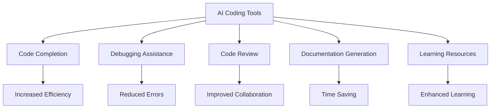

---

## How AI Coding Tools Are Changing the Development Landscape

The world of software development is evolving at an unprecedented pace, thanks in large part to advancements in artificial intelligence (AI). AI coding tools are no longer just a futuristic concept; they are a reality that is transforming the way developers write, test, and optimize code. In this article, we’ll explore how AI coding development is changing the landscape, its benefits, limitations, and practical use cases that illustrate its impact.

### The Rise of AI Coding Tools

AI coding tools leverage machine learning and natural language processing to assist developers in various tasks, from writing code to debugging and even generating entire applications. As the demand for software continues to surge, these tools have emerged as indispensable allies, enabling developers to work more efficiently and effectively.

#### Key Features of AI Coding Tools

1. **Code Completion**: AI tools can predict what developers intend to write and offer suggestions, helping to speed up the coding process.
2. **Debugging Assistance**: They can identify bugs in the code and suggest fixes, reducing the time spent on troubleshooting.
3. **Code Review**: AI can analyze code for best practices and potential vulnerabilities, ensuring higher quality output.
4. **Documentation Generation**: These tools can generate documentation automatically, saving developers time and effort.
5. **Learning Resources**: Many AI coding tools offer tutorials and resources, making it easier for new developers to learn and adapt.

### How AI Coding Tools Boost Productivity

The impact of AI coding tools on productivity is profound. Here are some practical examples of how these tools can enhance a developer's workflow:

- **Faster Development Cycles**: By automating repetitive tasks like code formatting and documentation generation, developers can focus on more complex aspects of their projects.
- **Improved Collaboration**: AI tools can facilitate better communication among team members by providing real-time code suggestions and reviews.
- **Increased Code Quality**: With built-in debugging and optimization suggestions, developers can produce cleaner, more efficient code.

### Popular AI Coding Tools

Several AI coding tools have gained traction in the developer community. Let’s take a closer look at a few of them:

| Tool Name      | Key Features                      | Pricing Model         | Best For                     |
|----------------|-----------------------------------|-----------------------|------------------------------|
| [GitHub Copilot](https://github.com/features/copilot?ref=AFFILIATE_ID) | Code suggestions, autocompletion  | Subscription-based     | Developers of all levels     |
| TabNine        | AI-driven autocompletion          | Free & Paid versions   | Fast coding                  |
| Kite           | Code completions & documentation  | Free                   | Python developers            |
| Codex          | Natural language to code          | Pay-per-use            | Building applications        |

### Pros and Cons of AI Coding Tools

While AI coding tools offer numerous advantages, they also come with their own set of challenges.

#### Pros

- **Increased Efficiency**: Automating mundane tasks saves time.
- **Reduced Errors**: AI tools can catch mistakes that human eyes may overlook.
- **Learning Enhancement**: New developers can learn faster with integrated tips and documentation.
- **Scalability**: AI tools can handle larger codebases and projects more effectively.

#### Cons

- **Dependence on Tools**: Relying too much on AI can hinder a developer's learning and problem-solving skills.
- **Cost**: Subscription fees may be prohibitive for smaller teams or freelancers.
- **Limited Context Understanding**: AI can struggle with complex project requirements and specific business logic.

### Use Cases of AI Coding Tools in Development

1. **Web Development**: A web developer using GitHub [Copilot](https://github.com/features/copilot?ref=AFFILIATE_ID) can quickly generate HTML and CSS structures, allowing them to focus on design and functionality rather than syntax.
2. **Data Science**: Data scientists can leverage Kite to get real-time suggestions for Python code, enhancing their ability to manipulate and analyze data efficiently.
3. **Mobile App Development**: Using AI tools like Codex, mobile developers can translate natural language queries into code, making the app development process intuitive and streamlined.

### Conclusion: Embrace the Future of Development

AI coding tools are not just a trend; they are reshaping the future of software development. By enhancing productivity, improving code quality, and providing valuable learning resources, these tools are becoming essential for developers at all levels. However, it's crucial to strike a balance between leveraging AI capabilities and maintaining one's coding skills.

As the development landscape continues to evolve, now is the perfect time to explore AI coding tools and integrate them into your workflow. Are you ready to enhance your coding experience? Start exploring AI coding tools today and discover how they can transform your development process!

### Call to Action

Want to stay ahead in the tech world? Subscribe to AI Tools Lab for the latest insights on AI coding tools and other productivity-enhancing technologies. Don’t miss out on the future of development—get started now!

## 関連記事

- [AI Agents: The Future of Personal Assistants in 2026](/posts/ai-agents-the-future-of-personal-assistants-in-2026/)
- [AI Tools for Small Businesses: Increase Your ROI](/posts/ai-tools-for-small-businesses-increase-your-roi/)
- [Automating Business Processes with AI in 2026](/posts/automating-business-processes-with-ai-in-2026/)
