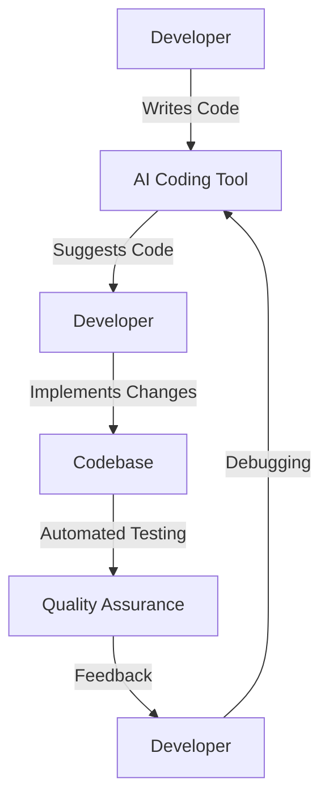

---

# How AI Coding Tools are Revolutionizing Software Development

In recent years, AI coding tools have emerged as game-changers in the software development landscape. By leveraging machine learning and natural language processing, these tools are transforming how developers write code, debug applications, and manage projects. From automating mundane tasks to providing intelligent suggestions, AI coding tools are enhancing productivity and enabling developers to focus on creative problem-solving. 

## The Rise of AI Coding Tools

The demand for software has skyrocketed, leading to an increased pressure on developers to deliver high-quality code at lightning speed. Traditional coding practices can be time-consuming and error-prone, creating a gap that AI tools aim to bridge. With the advent of AI, developers can now automate repetitive tasks, receive real-time code suggestions, and even generate entire code snippets with just a few keystrokes.

### Use Cases for AI Coding Tools

1. **Code Suggestions and Autocompletion**: Tools like GitHub Copilot and Tabnine provide context-aware code suggestions, helping developers write code faster and with fewer errors.

2. **Automated Code Reviews**: AI coding tools can analyze code for potential bugs, vulnerabilities, and adherence to best practices, ensuring a higher standard of code quality.

3. **Natural Language Processing**: With AI-powered tools, developers can write code using plain English commands. For instance, tools like OpenAI's Codex allow you to describe what you want in natural language, and the tool generates the corresponding code.

4. **Bug Detection and Correction**: AI tools can automatically identify and suggest fixes for bugs, reducing the time spent on debugging.

5. **Documentation Generation**: AI can assist in generating documentation for codebases, making it easier for teams to understand and maintain projects.

## Popular AI Coding Tools

With a plethora of AI coding tools available, it can be difficult to choose the right one for your needs. Below, we compare some of the most popular tools to help you make an informed decision.

<table>
  <tr>
    <th>Tool</th>
    <th>Key Features</th>
    <th>Pros</th>
    <th>Cons</th>
  </tr>
  <tr>
    <td>GitHub Copilot</td>
    <td>Contextual code suggestions, natural language prompts</td>
    <td>Fast autocompletion, integrates with popular IDEs</td>
    <td>Can suggest incorrect code, requires internet connection</td>
  </tr>
  <tr>
    <td>Tabnine</td>
    <td>AI autocompletion, team training capabilities</td>
    <td>Supports multiple languages, customizable for teams</td>
    <td>Limited free version, learning curve for setup</td>
  </tr>
  <tr>
    <td>OpenAI Codex</td>
    <td>Natural language to code translation</td>
    <td>Highly versatile, can handle complex queries</td>
    <td>API access may be costly, requires understanding of AI</td>
  </tr>
  <tr>
    <td>Kite</td>
    <td>Code completions, documentation lookup</td>
    <td>Easy to use, offline capabilities</td>
    <td>Limited language support, less powerful than others</td>
  </tr>
</table>

## How AI Tools Enhance Developer Productivity

### Streamlined Workflows

AI coding tools help streamline workflows by reducing the amount of time spent on repetitive tasks. For example, a developer can use GitHub Copilot to generate boilerplate code, which allows them to focus on more complex aspects of the project. This not only saves time but also minimizes frustration, leading to a more enjoyable coding experience.

### Enhanced Collaboration

AI tools foster better collaboration within teams by ensuring that everyone adheres to best practices and coding standards. Automated code reviews can identify issues before they become problems, allowing teams to maintain a high-quality codebase. As a result, developers can work together more effectively, leading to faster project completion times.

### Learning Opportunities

For junior developers or those new to a programming language, AI coding tools can serve as valuable learning aids. By providing real-time suggestions and explanations, these tools help users understand coding concepts and improve their skills. This educational aspect is particularly beneficial in a rapidly evolving field like software development.

## The Future of AI Coding Tools

As AI technology continues to evolve, the capabilities of AI coding tools will undoubtedly expand. We are likely to see more advanced integrations with development environments, improved natural language processing capabilities, and increased support for a wider range of programming languages. 

Moreover, as these tools become more sophisticated, they will likely play an even more significant role in the software development lifecycle, from initial planning to deployment and maintenance. 

### Workflow Diagram

To visualize the impact of AI coding tools on software development, consider the following workflow:

## Pros and Cons of AI Coding Tools

### Pros
- **Increased Efficiency**: Automates repetitive tasks, allowing developers to focus on high-value work.
- **Reduced Errors**: Provides real-time suggestions that can help reduce coding errors.
- **Learning Aid**: Supports junior developers in learning best practices and coding standards.

### Cons
- **Dependence on AI**: Over-reliance on AI suggestions may lead to a decline in problem-solving skills.
- **Cost**: Some advanced tools require subscriptions or API access that could be costly.
- **Accuracy**: AI tools may sometimes suggest incorrect code, necessitating careful review by developers.

## Conclusion

AI coding tools are revolutionizing the software development process by enhancing productivity, fostering collaboration, and providing valuable learning opportunities. As these tools continue to evolve, they will become indispensable assets for developers looking to streamline their workflows and improve code quality.

Are you ready to take your coding experience to the next level? Explore the world of AI coding tools today and see how they can transform your software development process. Whether you're a seasoned developer or just starting, there's an AI tool that can help you code smarter, not harder. Start your journey with AI coding tools now!