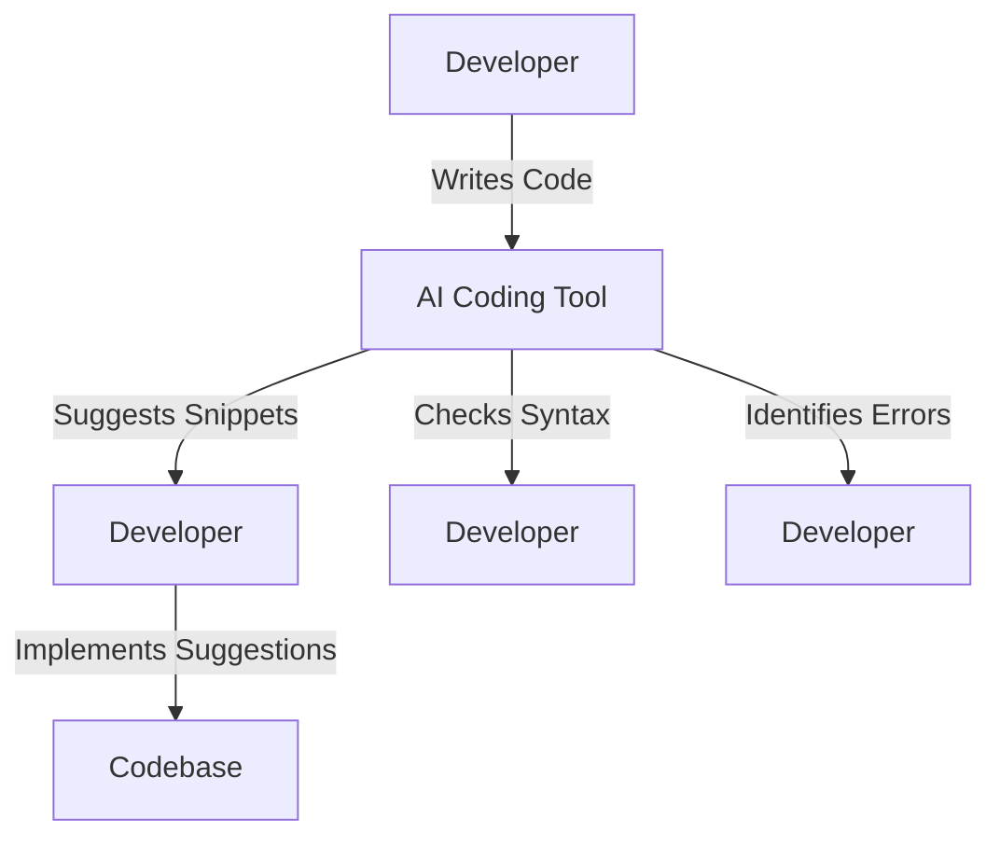

---

# How AI Coding Tools Are Revolutionizing Software Development

In the fast-paced world of software development, the emergence of AI coding tools has ignited a technological revolution that is reshaping how developers create, debug, and maintain code. These sophisticated tools leverage artificial intelligence to enhance productivity, reduce errors, and streamline workflows. If you’re a developer or someone interested in technology, understanding these tools can help you stay ahead of the curve.

## What Are AI Coding Tools?

AI coding tools are software applications that utilize artificial intelligence to assist programmers in various tasks related to coding. They can suggest code snippets, automate repetitive tasks, provide real-time feedback, and even help with debugging. The ultimate goal is to make coding faster, more efficient, and less prone to errors.

### How Do AI Coding Tools Work?

The underlying technology of AI coding tools typically involves machine learning algorithms and natural language processing (NLP). These tools are trained on vast datasets, including public code repositories, documentation, and community forums. This training allows them to understand coding patterns and recommend solutions based on context.

Here’s a simple workflow that illustrates how AI coding tools function:

## Benefits of Using AI Coding Tools

### 1. Enhanced Productivity

One of the most significant advantages of AI coding tools is the boost in productivity. By automating mundane tasks, developers can focus on more complex and creative aspects of coding. For instance, tools like GitHub Copilot can suggest entire lines of code or functions, allowing developers to write code faster than ever.

### 2. Error Reduction

AI coding tools can drastically reduce the number of bugs in code. By providing real-time feedback and error detection, these tools help developers identify issues before they become problematic. This proactive approach saves time during the debugging phase and leads to higher-quality software.

### 3. Learning and Development

For junior developers or those learning a new programming language, AI coding tools can serve as an invaluable resource. They provide context-aware suggestions and explanations, making it easier to learn coding principles on the go. For instance, if you're unsure about a specific syntax in Python, an AI coding tool can offer insights and examples.

### 4. Improved Collaboration

Many AI coding tools integrate seamlessly with version control systems like Git, allowing teams to collaborate more effectively. These tools can also help standardize coding styles across teams, ensuring that codebases remain consistent and easier to maintain.

## Popular AI Coding Tools

Several AI coding tools are gaining traction in the tech community. Here's a comparison of some of the most popular options:

<table>
    <tr>
        <th>Tool</th>
        <th>Key Features</th>
        <th>Pros</th>
        <th>Cons</th>
    </tr>
    <tr>
        <td>GitHub Copilot</td>
        <td>Contextual code suggestions, multi-language support</td>
        <td>Highly intuitive, integrates with IDEs</td>
        <td>Subscription required, not perfect for complex tasks</td>
    </tr>
    <tr>
        <td>Tabnine</td>
        <td>AI-powered code completion, team training options</td>
        <td>Fast and responsive, customizable</td>
        <td>Limited free version, may require setup time</td>
    </tr>
    <tr>
        <td>Kite</td>
        <td>Multi-language support, documentation lookup</td>
        <td>Easy to install, lots of resources</td>
        <td>May slow down IDE, some languages not fully supported</td>
    </tr>
    <tr>
        <td>Codeium</td>
        <td>Real-time suggestions, supports multiple languages</td>
        <td>Free to use, fast performance</td>
        <td>Less known, fewer integrations</td>
    </tr>
</table>

### Case Study: GitHub Copilot in Action

To illustrate the benefits of AI coding tools, let’s take a closer look at GitHub Copilot. This tool has been integrated into various IDEs, such as Visual Studio Code, making it accessible to millions of developers. 

Imagine a scenario where a developer is building a web application and needs to implement a login feature. Instead of manually writing the entire code from scratch, the developer can start typing a few lines, and GitHub Copilot will suggest the rest, including the handling of user authentication and error scenarios. This not only saves time but also helps avoid common pitfalls in coding.

## Challenges of AI Coding Tools

While AI coding tools offer numerous advantages, they are not without their challenges:

### 1. Dependency on Tooling

As developers become accustomed to AI suggestions, there’s a risk of over-reliance on these tools. This dependency can lead to decreased problem-solving skills over time, particularly for novice programmers.

### 2. Quality of Suggestions

AI coding tools are not infallible; they can sometimes suggest incorrect or inefficient code snippets. Developers must remain vigilant and review suggestions critically to ensure they meet the project's requirements.

### 3. Security Concerns

Using AI coding tools can raise security concerns, especially if sensitive code is exposed to the tool's algorithm. Developers should be cautious about sharing proprietary codebases with cloud-based AI tools.

## Future of AI Coding Tools

The future of AI coding tools looks promising. As machine learning algorithms continue to evolve, we can expect even more sophisticated features, such as enhanced context awareness and better understanding of programming logic. Additionally, the integration of AI tools into educational platforms could further accelerate learning for new developers.

### Conclusion

AI coding tools are undoubtedly revolutionizing software development by enhancing productivity, reducing errors, and improving collaboration. Whether you’re a seasoned developer or just starting, these tools can provide invaluable support in your coding journey. 

If you haven’t yet explored the potential of AI coding tools, now is the perfect time to dive in. Consider integrating tools like GitHub Copilot, Tabnine, or Kite into your workflow and experience the difference they can make.

**Ready to boost your coding efficiency? Try out one of these AI coding tools today and watch your productivity soar!**