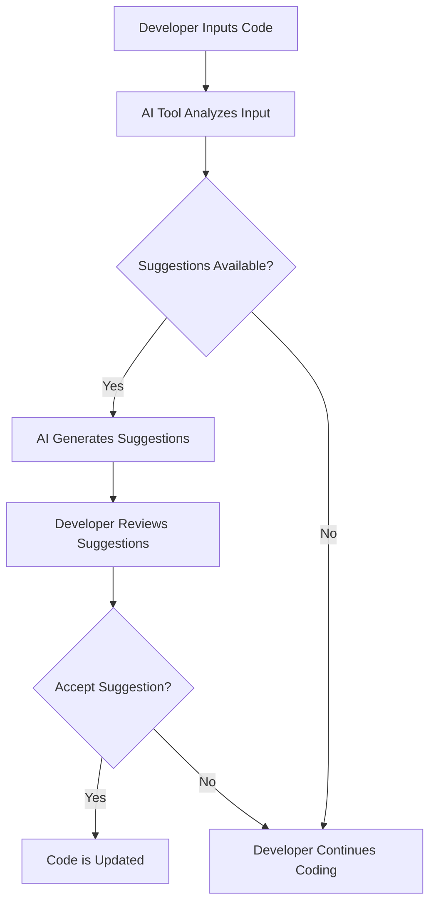

---

## How AI Coding Tools Boost Developer Efficiency in 2026

In the ever-evolving landscape of technology, the role of developers is becoming increasingly complex. As we move through 2026, the integration of AI coding tools has emerged as a game-changer for developers worldwide. These tools not only enhance productivity but also streamline the coding process, allowing developers to focus on what really matters—innovation. In this article, we will explore the various AI coding tools available today, their impact on developer efficiency, and what this means for the future of software development.

### The Rise of AI Coding Tools

AI coding tools have been designed to assist developers in various aspects of the coding process. From code generation and error detection to debugging and optimization, these tools harness the power of artificial intelligence to simplify and enhance the coding experience. But why the sudden surge in their popularity?

#### Efficiency and Speed

With the demand for faster software development cycles, companies are turning to AI coding tools to help bridge the gap between idea and execution. By automating repetitive tasks, these tools reduce the time developers spend on mundane activities, allowing them to focus on higher-level problem-solving.

#### Collaboration and Communication

In an era where remote work is prevalent, AI coding tools facilitate better collaboration among teams. Features such as real-time code sharing and integrated communication channels enable developers to work together seamlessly, regardless of location.

### Practical Use Cases for AI Coding Tools

To truly understand the impact of AI coding tools, let's delve into some practical use cases:

#### 1. Code Completion and Suggestion

One of the most prominent features of AI coding tools is code completion. Tools like [GitHub Copilot](https://github.com/features/copilot?ref=AFFILIATE_ID) and [Tabnine](https://www.tabnine.com/?ref=AFFILIATE_ID) utilize machine learning to predict what a developer is likely to write next. This reduces the amount of boilerplate code that developers have to type out manually.

For example, when writing a function to fetch data from an API, the AI might suggest the relevant syntax and structure, allowing the developer to implement the function faster and with fewer errors.

#### 2. Bug Detection and Fixing

AI tools are also adept at identifying bugs in code. Platforms like Snyk use AI algorithms to scan for vulnerabilities and suggest fixes in real time. This not only enhances code quality but also saves time for developers who would otherwise spend hours debugging.

Imagine a scenario where a developer is working late at night, and their code throws an unexpected error. An AI tool can quickly identify the root cause and suggest a fix, enabling the developer to move forward without losing valuable time.

#### 3. Automated Documentation

Documentation is often seen as a tedious task, yet it is crucial for maintaining code quality and facilitating future development. AI coding tools like Kite can automatically generate documentation based on the code being written. This ensures that the documentation is always up-to-date and relevant, leaving developers free to concentrate on coding.

### Comparison of Popular AI Coding Tools

To help you understand which AI coding tools might be best suited for your needs, here’s a comparison of some popular tools available in 2026:

<table>
  <tr>
    <th>Tool</th>
    <th>Code Completion</th>
    <th>Bug Detection</th>
    <th>Documentation Generation</th>
    <th>Pricing</th>
  </tr>
  <tr>
    <td>GitHub [Copilot](https://github.com/features/copilot?ref=AFFILIATE_ID)</td>
    <td>Yes</td>
    <td>Limited</td>
    <td>No</td>
    <td>$10/month</td>
  </tr>
  <tr>
    <td>[Tabnine](https://www.tabnine.com/?ref=AFFILIATE_ID)</td>
    <td>Yes</td>
    <td>No</td>
    <td>No</td>
    <td>$12/month</td>
  </tr>
  <tr>
    <td>Snyk</td>
    <td>No</td>
    <td>Yes</td>
    <td>No</td>
    <td>$49/month</td>
  </tr>
  <tr>
    <td>Kite</td>
    <td>Yes</td>
    <td>No</td>
    <td>Yes</td>
    <td>Free & Paid versions available</td>
  </tr>
</table>

### Pros and Cons of AI Coding Tools

Like any technology, AI coding tools come with their own set of advantages and disadvantages. Here’s a breakdown to help you make an informed decision:

#### Pros

- **Increased Productivity:** Automates repetitive tasks, allowing developers to focus on more complex issues.
- **Quality Improvement:** Reduces errors and improves code quality through real-time bug detection and suggestions.
- **Time Saving:** Speeds up the coding process, resulting in faster project completion times.
- **Enhanced Collaboration:** Facilitates better teamwork through integrated communication features.

#### Cons

- **Dependency Risk:** Over-reliance on AI tools may lead to a decline in fundamental coding skills.
- **Learning Curve:** Some tools may have a steep learning curve, requiring time and effort to master.
- **Cost:** Premium features can be expensive, which may not be feasible for smaller teams or individual developers.
- **Privacy Concerns:** Developers may have reservations about sharing proprietary code with AI tools.

### The Future of AI Coding Tools

As we progress into the latter part of 2026 and beyond, the capabilities of AI coding tools are expected to expand further. We can anticipate improvements in natural language processing, allowing developers to interact with coding tools in a more conversational manner. Imagine being able to simply explain your coding needs in plain English, and the AI generates the code for you!

#### Workflow of AI Coding Tools

To visualize how AI coding tools fit into the development workflow, consider the following diagram:

### Conclusion

The rise of AI coding tools in 2026 is not just a trend; it is a transformative movement that is redefining how developers work. By enhancing efficiency, improving code quality, and facilitating collaboration, these tools are essential for any developer looking to thrive in today’s fast-paced tech environment. 

If you haven’t yet explored the world of AI coding tools, now is the time to dive in. Embrace these technologies to boost your productivity and stay ahead of the curve. Whether you are a seasoned developer or just starting, integrating AI coding tools into your workflow can make a significant difference.

### Call to Action

Ready to take your coding to the next level? Explore the AI coding tools mentioned in this article and see which ones can best enhance your productivity. Don't wait—start your journey today and unlock your full coding potential!

## 関連記事

- [AI Coding Tools: Boosting Developer Efficiency in 2026](/posts/ai-coding-tools-boosting-developer-efficiency-in-2026/)
- [How AI Coding Tools are Revolutionizing Software Development](/posts/how-ai-coding-tools-are-revolutionizing-software-development/)
- [Revolutionizing Coding with AI: Top Tools for Developers](/posts/revolutionizing-coding-with-ai-top-tools-for-developers/)
