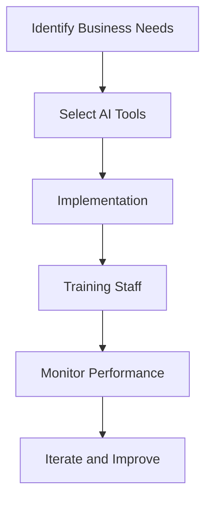

---

### How AI is Revolutionizing Business Productivity

In today’s fast-paced business environment, the quest for increased productivity is relentless. Companies are constantly on the lookout for innovative solutions that can help streamline operations, optimize workflows, and enhance decision-making processes. Enter Artificial Intelligence (AI). AI is not just a buzzword; it’s a game-changer that is reshaping the way businesses operate and interact internally and with their customers. 

In this blog post, we will explore the various ways AI is transforming business productivity, including practical examples, use cases, and a comparative look at some of the leading AI tools in the market.

### Understanding AI and Its Impact on Business Productivity

Artificial Intelligence refers to the simulation of human intelligence in machines that are designed to think and learn like humans. It includes various technologies such as machine learning, natural language processing, and robotics, which can analyze data, recognize patterns, and make informed decisions.

#### Key Benefits of AI in Business Productivity

1. **Enhanced Efficiency**: AI can automate repetitive tasks, allowing employees to focus on more strategic activities.
2. **Data-Driven Insights**: With the ability to process vast amounts of data, AI tools can provide insights that help in making informed decisions.
3. **Improved Customer Experience**: AI-powered chatbots and customer service tools can handle inquiries 24/7, providing instant responses and improving customer satisfaction.
4. **Cost Reduction**: By automating processes and improving efficiency, businesses can significantly reduce operational costs.

### Practical Examples of AI in Business

Let’s delve into some real-world applications of AI that are enhancing productivity across various industries.

#### 1. AI-Powered Customer Support

Companies like Zendesk and Intercom utilize AI chatbots to handle customer inquiries. For instance, a retail brand can deploy an AI chatbot on its website to answer frequently asked questions, assist with product selection, and even process orders. This not only improves response times but also frees up human agents to handle more complex queries.

#### 2. Predictive Analytics in Marketing

AI tools like Google Analytics and HubSpot leverage machine learning algorithms to analyze customer behavior and predict trends. For example, a travel agency can use these insights to tailor marketing campaigns based on customer preferences, ultimately increasing conversion rates.

#### 3. Project Management Automation

Tools like Asana and Trello now incorporate AI features that help teams manage tasks more effectively. An example is the AI-driven scheduling assistant that automatically allocates resources based on team members’ availability and project deadlines, thereby optimizing workflow.

### Comparing Top AI Tools for Business Productivity

When it comes to selecting the right AI tools for boosting business productivity, it’s essential to consider various factors such as ease of use, features, and pricing. Below is a comparison of some leading AI tools designed to enhance business productivity.

<table>
  <tr>
    <th>Tool</th>
    <th>Features</th>
    <th>Pros</th>
    <th>Cons</th>
    <th>Pricing</th>
  </tr>
  <tr>
    <td>Zapier</td>
    <td>Workflow automation, integrations with 2000+ apps</td>
    <td>Highly customizable, saves time on repetitive tasks</td>
    <td>Can become expensive with high usage</td>
    <td>Starts at $19.99/month</td>
  </tr>
  <tr>
    <td>Hootsuite</td>
    <td>Social media management, scheduling, analytics</td>
    <td>User-friendly interface, comprehensive analytics</td>
    <td>Limited features on lower-tier plans</td>
    <td>Starts at $19/month</td>
  </tr>
  <tr>
    <td>HubSpot</td>
    <td>CRM, marketing automation, customer support</td>
    <td>All-in-one platform, excellent customer support</td>
    <td>Can be complex for new users</td>
    <td>Free tier available; paid plans start at $50/month</td>
  </tr>
  <tr>
    <td>Slack</td>
    <td>Team collaboration, integrations, file sharing</td>
    <td>Real-time collaboration, integrates with many tools</td>
    <td>Can be distracting with constant notifications</td>
    <td>Free tier available; paid plans start at $6.67/month</td>
  </tr>
</table>

### The Workflow of AI Integration in Business

To understand how AI can be integrated effectively into your business, it helps to visualize the workflow. Here’s a simple representation of how AI can be infused into business processes:

### Challenges of Implementing AI in Business

While the benefits of AI are clear, there are challenges that businesses may face during implementation:

1. **Data Privacy Concerns**: Ensuring that customer data is handled responsibly is paramount.
2. **Integration Issues**: Existing systems may not always be compatible with new AI tools, requiring additional resources for integration.
3. **Employee Resistance**: Some employees may be hesitant to adopt new technologies, fearing job loss or added complexity.

### Conclusion

AI is undeniably revolutionizing business productivity, providing tools and solutions that streamline operations and enhance decision-making. By leveraging AI technologies, businesses can improve efficiency, gain valuable insights, and ultimately drive better results.

As you consider incorporating AI into your business strategy, remember to assess your specific needs and choose the tools that best align with your goals. 

### Call to Action

Are you ready to embrace AI for better business productivity? Start exploring the tools mentioned above today, and see how they can transform your organization’s operations. For more insights and updates on AI tools, subscribe to our newsletter and stay ahead in the world of technology!

## 関連記事

- [Impact of AI on Business Productivity in 2026](/posts/impact-of-ai-on-business-productivity-in-2026/)
- [AI Agents: The Future of Personal Assistants in 2026](/posts/ai-agents-the-future-of-personal-assistants-in-2026/)
- [AI Automation: A Game Changer for Small Businesses](/posts/ai-automation-a-game-changer-for-small-businesses/)
