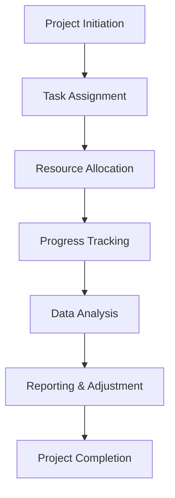

---

# How AI is Revolutionizing Project Management Tasks

In today's fast-paced business environment, managing projects efficiently can make or break an organization. Enter **AI project management** tools—innovative solutions that are reshaping how teams plan, execute, and monitor their projects. From automating mundane tasks to providing insights that drive decision-making, AI is not just a buzzword; it's a powerful ally in project management. Let’s explore how AI is revolutionizing project management tasks and what this means for your organization.

## The Shift Towards AI in Project Management

Traditionally, project management has relied heavily on manual processes, spreadsheets, and pages of documentation. However, as projects become more complex and teams more distributed, the need for smarter, more efficient tools has never been greater. AI project management tools leverage advanced algorithms, machine learning, and data analysis to streamline workflows and improve collaboration.

### What Are AI Project Management Tools?

AI project management tools are software applications that utilize artificial intelligence to assist project managers and teams in various tasks such as scheduling, resource allocation, risk management, and performance tracking. These tools can analyze vast amounts of data to provide insights, automate repetitive tasks, and even predict project outcomes.

## Key Benefits of AI in Project Management

### 1. Enhanced Efficiency

One of the most significant benefits of AI project management tools is the increase in efficiency. By automating routine tasks like scheduling meetings, assigning tasks, and generating reports, project managers can focus on strategic planning and decision-making rather than getting bogged down in administrative work.

**Example:** Tools like **Trello** and **Asana** now offer AI features that automate task assignments based on team members' workloads and past performance, ensuring the right people are always working on the right tasks.

### 2. Improved Collaboration

AI tools break down silos by enabling better communication and collaboration among team members. Many AI project management solutions provide real-time updates and notifications, keeping everyone aligned and informed.

**Example:** **Slack** integrates with AI project management tools to send reminders and updates automatically, fostering a culture of transparency and ensuring that no one misses critical information.

### 3. Data-Driven Insights

AI can analyze historical project data to identify patterns and predict future outcomes. This capability allows project managers to make informed decisions based on data rather than intuition.

**Example:** **Monday.com** uses AI to analyze project timelines and resource allocation, helping teams identify potential bottlenecks before they become issues.

### 4. Risk Management

AI tools can assess risks in projects by analyzing various data inputs. This predictive capability enables teams to proactively address potential challenges.

**Example:** **Wrike**’s AI features can evaluate project health and alert managers to risks based on historical data and current project metrics.

## Practical Use Cases of AI in Project Management

### Use Case 1: Resource Allocation

AI can help project managers allocate resources more effectively by considering team members' workloads, skills, and availability. This ensures that tasks are assigned to the most suitable individuals, optimizing productivity.

### Use Case 2: Time Tracking and Reporting

Automated time tracking through AI tools can save hours of manual work. AI can generate reports that provide insights into how time is being spent across different projects, enabling better planning and budgeting.

### Use Case 3: Predictive Analytics

AI can forecast project timelines and budget outcomes. For instance, if a team consistently misses deadlines on similar projects, AI can highlight this trend and suggest adjustments.

## Comparing Popular AI Project Management Tools

With numerous AI project management tools available, it can be challenging to choose the right one for your team. Below is a comparison of some popular AI project management tools, highlighting their key features and benefits.

<table>
  <tr>
    <th>Tool</th>
    <th>Key Features</th>
    <th>AI Capabilities</th>
    <th>Pros</th>
    <th>Cons</th>
  </tr>
  <tr>
    <td>Trello</td>
    <td>Kanban boards, task management</td>
    <td>Automated task assignments</td>
    <td>User-friendly, customizable</td>
    <td>Limited advanced features</td>
  </tr>
  <tr>
    <td>Asana</td>
    <td>Task tracking, project timelines</td>
    <td>Smart project suggestions</td>
    <td>Great for collaboration</td>
    <td>Can be overwhelming for new users</td>
  </tr>
  <tr>
    <td>Monday.com</td>
    <td>Custom workflows, dashboards</td>
    <td>Predictive analytics</td>
    <td>Highly visual interface</td>
    <td>Can be expensive</td>
  </tr>
  <tr>
    <td>Wrike</td>
    <td>Gantt charts, time tracking</td>
    <td>Risk assessment</td>
    <td>Robust reporting tools</td>
    <td>Steep learning curve</td>
  </tr>
</table>

## Workflow of AI in Project Management

Understanding how AI integrates into project management processes can help teams leverage its full potential. Below is a simplified workflow illustrating how AI can enhance project management tasks:

## Pros and Cons of Using AI Project Management Tools

### Pros

- **Increased Efficiency:** Automates repetitive tasks, allowing teams to focus on strategic activities.
- **Better Decision Making:** Provides data-driven insights that improve project outcomes.
- **Enhanced Collaboration:** Facilitates communication and transparency among team members.
- **Proactive Risk Management:** Identifies potential issues before they escalate.

### Cons

- **Cost:** Some advanced AI tools can be expensive, particularly for small teams.
- **Complexity:** Some users may find AI tools difficult to navigate initially.
- **Dependence on Data Quality:** AI insights are only as good as the data fed into them; poor data can lead to inaccurate predictions.

## Conclusion: Embrace the AI Revolution in Project Management

AI project management tools are here to stay, and embracing them can provide a significant competitive advantage. By automating mundane tasks, enhancing collaboration, and providing valuable insights, these tools empower project managers to lead their teams more effectively.

If you’re looking to optimize your project management processes, consider exploring the various AI tools available today. With the right tool, your team can enhance productivity, reduce risks, and achieve project goals more efficiently.

### Call to Action

Ready to revolutionize your project management tasks with AI? Start exploring the top AI project management tools today! Check out our detailed reviews, and find the perfect solution tailored to your team’s needs. Don't wait—transform your project management experience now!

## 関連記事

- [Automating Business Processes with AI: A Step-by-Step Playbook](/posts/automating-business-processes-with-ai-a-complete-guide/)
- [7 AI Automation Strategies to Supercharge Business Efficiency](/posts/boosting-business-efficiency-with-ai-automation-strategies/)
- [AI Automation 101: What It Is and Why Your Business Needs It](/posts/how-ai-automation-is-transforming-business-operations/)
