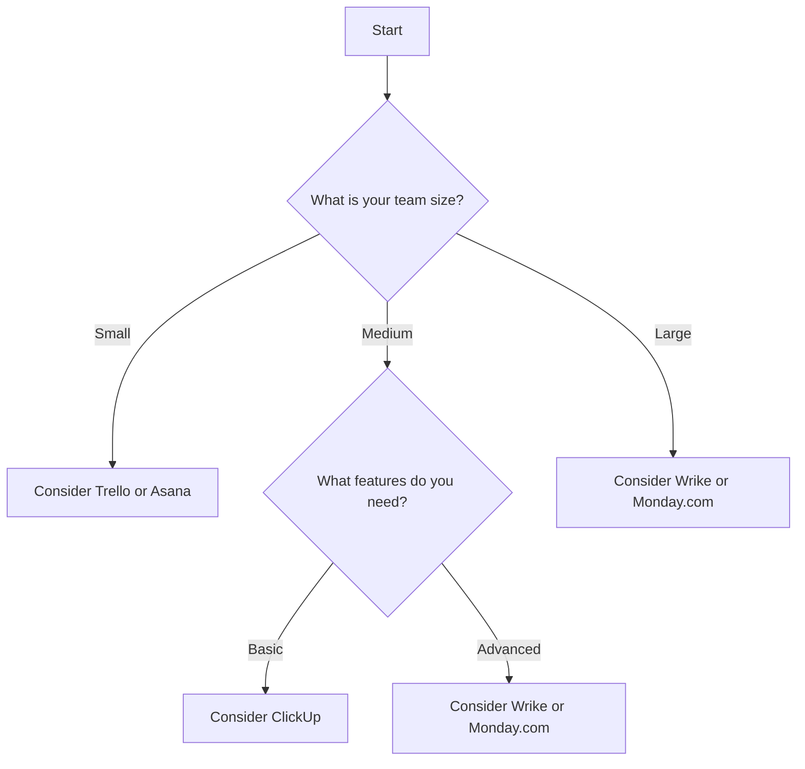

---

# How AI Tools are Revolutionizing Project Management

In the fast-paced world of project management, efficiency and effectiveness are paramount. As teams tackle increasingly complex projects, traditional management methods often fall short. Enter AI project management tools, a game-changing innovation that is reshaping the landscape of how projects are planned, executed, and monitored. In this blog post, we’ll explore how these tools are revolutionizing project management, their key features, and how they can benefit your team.

## The Shift Towards AI in Project Management

AI project management tools leverage machine learning, natural language processing, and advanced analytics to streamline various aspects of project management. They assist in automating repetitive tasks, predicting project outcomes, and enhancing team collaboration. By analyzing vast amounts of data, these tools can provide insights that enable project managers to make informed decisions.

### Why AI Project Management Tools Matter

The growing complexity of projects, paired with tight deadlines and limited resources, necessitates a smarter approach to project management. Here are some reasons why AI project management tools are becoming essential:

1. **Improved Efficiency**: Automating routine tasks frees up time for project managers and team members to focus on higher-value activities.
2. **Enhanced Collaboration**: AI tools facilitate better communication among team members, regardless of their location, leading to more cohesive teamwork.
3. **Data-Driven Insights**: These tools can analyze historical project data to predict future performance, helping you to mitigate risks before they become issues.
4. **Resource Optimization**: AI helps in efficiently allocating resources, ensuring that every team member is utilized to their fullest potential.

## Key Features of AI Project Management Tools

When evaluating AI project management tools, look for the following features that can significantly enhance your project management practices:

### 1. Task Automation

AI tools can automate repetitive tasks such as status updates, scheduling meetings, and tracking project milestones. For example, tools like Asana and Monday.com have automation capabilities that can send reminders or update task statuses without manual input.

### 2. Predictive Analytics

Predictive analytics can forecast project risks and outcomes based on historical data. Tools like Trello and ClickUp utilize this feature to provide insights into potential delays or budget overruns.

### 3. Natural Language Processing

Natural language processing (NLP) enables tools to understand and respond to user queries in natural language. For instance, tools like Wrike incorporate NLP to allow users to create tasks and generate reports simply by typing commands in plain English.

### 4. Collaboration Features

Real-time collaboration is essential for today’s remote teams. AI project management tools can integrate with communication platforms like Slack or Microsoft Teams, allowing teams to stay connected and informed.

### 5. Performance Tracking

AI tools can provide dashboards that visualize project performance metrics, allowing managers to track progress and identify areas for improvement. Tools like Smartsheet offer robust reporting features that help in performance analysis.

## Popular AI Project Management Tools

Now that we’ve discussed the features of AI project management tools, let’s compare some of the most popular options available in the market today.

<table>
  <tr>
    <th>Tool</th>
    <th>Key Features</th>
    <th>Pros</th>
    <th>Cons</th>
  </tr>
  <tr>
    <td>Asana</td>
    <td>Task automation, customizable dashboards</td>
    <td>Easy to use, great for team collaboration</td>
    <td>Can be overwhelming for new users</td>
  </tr>
  <tr>
    <td>Monday.com</td>
    <td>Visual project tracking, automation</td>
    <td>Highly customizable, visually appealing interface</td>
    <td>Can become costly with more users</td>
  </tr>
  <tr>
    <td>Trello</td>
    <td>Kanban boards, integration with other apps</td>
    <td>Simple interface, great for small teams</td>
    <td>Lacks advanced features for large projects</td>
  </tr>
  <tr>
    <td>Wrike</td>
    <td>NLP capabilities, real-time collaboration</td>
    <td>Powerful reporting tools, scalable</td>
    <td>Steeper learning curve</td>
  </tr>
  <tr>
    <td>ClickUp</td>
    <td>All-in-one platform, task management</td>
    <td>Highly versatile, affordable pricing</td>
    <td>Can be too complex for simple projects</td>
  </tr>
</table>

## How to Choose the Right AI Project Management Tool

With so many options available, selecting the right AI project management tool can feel overwhelming. Here’s a simple decision tree to help guide your choice:

### Consider Your Team's Needs

To effectively choose the right tool, consider your team's size, project complexity, and specific needs. For instance, smaller teams may benefit from simpler tools like Trello, while larger organizations might require the robust features of Wrike or Monday.com.

### Budget Considerations

Cost is always a factor in decision-making. While many AI project management tools offer free trials or basic tiers, ensure that the tool you choose fits within your budget, especially as your team grows.

## Conclusion: Embrace the Future of Project Management

AI project management tools are no longer just a trend; they are a necessity for teams looking to enhance productivity and streamline workflows. By leveraging the power of AI, project managers can make better decisions, optimize resources, and foster greater collaboration among team members.

Are you ready to revolutionize your project management approach? Explore the options listed above and find the AI project management tool that best fits your team's needs. Don’t wait—start your journey towards improved productivity today!

Feel free to share your thoughts or experiences with AI project management tools in the comments below. Which tool do you find most effective? Let’s discuss!

## 関連記事

- [AI Agents: The Future of Personal Assistants in 2026](/posts/ai-agents-the-future-of-personal-assistants-in-2026/)
- [AI Automation: A Game Changer for Small Businesses](/posts/ai-automation-a-game-changer-for-small-businesses/)
- [AI Automation: The Key to Enhanced Business Efficiency](/posts/ai-automation-the-key-to-enhanced-business-efficiency/)
