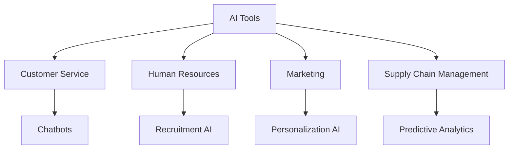

---

### The Impact of AI on Business Productivity in 2026

As we continue to navigate through the evolving landscape of technology, one thing is clear: artificial intelligence (AI) is poised to revolutionize how businesses operate. By 2026, AI business productivity will not just be a buzzword but a fundamental aspect of every organization striving for efficiency and competitive advantage. In this article, we will explore how AI is expected to enhance productivity in various sectors, the tools driving this change, and the challenges businesses may face along the way.

### Understanding AI Business Productivity

AI business productivity refers to the ways in which artificial intelligence technologies optimize operations, streamline processes, and ultimately enhance output in a business setting. This can manifest in several forms, including:

- **Automation of repetitive tasks**: AI can take over mundane tasks, allowing employees to focus on strategic work.
- **Data analysis**: AI tools can analyze large datasets faster than humans, providing actionable insights for decision-making.
- **Enhanced customer interactions**: AI can improve customer service through chatbots and personalized marketing strategies.

### The Rise of AI Tools in Business

By 2026, we can expect a surge in the adoption of AI tools across various industries. Here are some of the key areas where AI is expected to make a significant impact:

#### 1. **Artificial Intelligence in Customer Service**

AI-powered chatbots and virtual assistants are becoming increasingly sophisticated. They can handle multiple inquiries simultaneously, providing instant responses to customer questions. For example, companies like Zendesk and Freshdesk are integrating AI to improve their customer service platforms.

**Pros:**
- 24/7 availability
- Reduced operational costs
- Improved response times

**Cons:**
- Limited understanding of complex queries
- Potential for customer frustration if not executed properly

#### 2. **AI in Human Resources**

Recruitment processes will also see a transformation, with AI tools like HireVue and Pymetrics streamlining talent acquisition. These platforms utilize AI to analyze applications and conduct initial interviews, saving HR teams significant time.

**Pros:**
- Faster hiring processes
- Reduced bias in initial screening
- Enhanced candidate experience

**Cons:**
- Risk of overlooking qualified candidates due to algorithm limitations
- Dependence on data quality for accurate results

#### 3. **AI in Marketing**

AI-driven marketing tools will enable businesses to personalize campaigns at scale. Platforms like HubSpot and Marketo leverage machine learning to analyze consumer behavior and recommend targeted content.

**Pros:**
- Increased conversion rates
- Better customer engagement
- Real-time analytics for campaign optimization

**Cons:**
- High initial investment
- Data privacy concerns

#### 4. **AI in Supply Chain Management**

AI tools are set to revolutionize supply chain operations by predicting demand, optimizing inventory levels, and identifying potential disruptions. For instance, companies like SAP and Oracle are already implementing AI solutions to enhance supply chain efficiency.

**Pros:**
- Improved forecasting
- Reduced waste and costs
- Enhanced agility in response to market changes

**Cons:**
- Complexity in implementation
- Dependence on accurate data

### Future AI Tools to Watch in 2026

As AI technology evolves, several tools are expected to lead the charge in enhancing business productivity. Here’s a glimpse of some promising AI tools that are gaining traction:

### Comparing Popular AI Tools

To give you a clearer picture of the tools available, here's a comparison of some popular AI platforms that enhance business productivity:

<table>
  <tr>
    <th>Tool</th>
    <th>Primary Function</th>
    <th>Key Features</th>
    <th>Pricing</th>
  </tr>
  <tr>
    <td>Zendesk</td>
    <td>Customer Service</td>
    <td>AI Chatbots, Ticketing System</td>
    <td>Starts at $19/month</td>
  </tr>
  <tr>
    <td>HireVue</td>
    <td>Human Resources</td>
    <td>Video Interviews, AI Assessments</td>
    <td>Custom pricing</td>
  </tr>
  <tr>
    <td>HubSpot</td>
    <td>Marketing</td>
    <td>Email Automation, Analytics</td>
    <td>Free to $3,200/month</td>
  </tr>
  <tr>
    <td>SAP</td>
    <td>Supply Chain Management</td>
    <td>Predictive Analytics, Inventory Optimization</td>
    <td>Custom pricing</td>
  </tr>
</table>

### Challenges of AI Adoption

While the benefits of AI in enhancing business productivity are clear, organizations may face several challenges:

- **Integration with existing systems**: Many businesses struggle to integrate AI tools with their current workflows.
- **Employee resistance**: There may be apprehension among employees about job security and changes in their roles.
- **Data privacy and ethical considerations**: Companies must navigate the complexities of data security and ethical AI usage.

### Conclusion

The impact of AI on business productivity in 2026 is set to be profound, reshaping how we work across various sectors. From enhancing customer service to optimizing supply chain management, the potential applications of AI are vast and varied. As AI tools continue to evolve, businesses that embrace these technologies will find themselves better positioned to compete in an increasingly digital landscape.

Are you ready to harness the power of AI for your business? Start exploring AI tools today and take the first step toward transforming your productivity! 

### Call to Action

Don't wait until 2026 to improve your business productivity. Explore the latest AI tools today and see how they can revolutionize your operations. Visit AI Tools Lab for in-depth reviews and insights on the best AI solutions available!