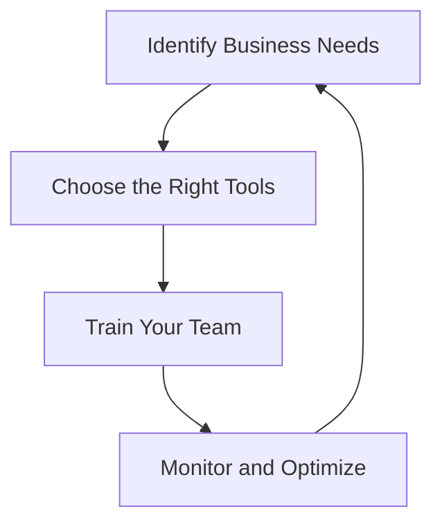

---

# Integrating AI Agents into Your Business Strategy for Success

In today's fast-paced business environment, having a robust AI business strategy can be the difference between thriving and merely surviving. As artificial intelligence continues to evolve, integrating AI agents into your business operations offers unique opportunities for efficiency, productivity, and innovation. In this article, we'll explore how to effectively incorporate AI agents into your business strategy, highlighting practical examples, benefits, and potential challenges.

## Understanding AI Agents

AI agents are systems designed to perform tasks autonomously or semi-autonomously, making decisions based on data analysis and predefined algorithms. They can range from simple chatbots to complex machine learning systems that help with data analysis and predictive modeling.

### The Role of AI Agents in Business

Integrating AI agents into your business strategy means leveraging these tools to enhance operations, improve customer interactions, and drive decision-making processes. Here are a few use cases:

- **Customer Service**: AI chatbots can handle customer inquiries 24/7, providing instant responses and freeing up human agents for more complex issues.
- **Data Analysis**: AI tools can analyze vast amounts of data to identify trends and insights that inform business decisions.
- **Sales Optimization**: AI agents can predict customer behavior and recommend products tailored to individual preferences.

## Crafting an Effective AI Business Strategy

### 1. Identify Business Needs

Before integrating AI agents, it's crucial to assess your business needs. What areas are you looking to improve? Here are some questions to consider:

- Are you struggling with customer service response times?
- Do you need insights from large datasets?
- Is your sales team looking for better leads?

Identifying specific pain points will help you select the right AI tools to address them.

### 2. Choose the Right Tools

With numerous AI tools available, it's essential to choose those that align with your business goals. Let's compare a few popular AI tools for different business functions:

<table>
  <tr>
    <th>Tool</th>
    <th>Function</th>
    <th>Pros</th>
    <th>Cons</th>
  </tr>
  <tr>
    <td>Zendesk</td>
    <td>Customer Support</td>
    <td>Easy integration, robust analytics</td>
    <td>Can be expensive for small businesses</td>
  </tr>
  <tr>
    <td>Tableau</td>
    <td>Data Visualization</td>
    <td>User-friendly, powerful insights</td>
    <td>Steep learning curve for beginners</td>
  </tr>
  <tr>
    <td>HubSpot</td>
    <td>Sales and Marketing</td>
    <td>All-in-one platform, good automation</td>
    <td>Limited features in free version</td>
  </tr>
</table>

### 3. Train Your Team

AI tools are only as effective as the people using them. Implement training sessions to ensure your team understands how to leverage these tools effectively. 

### 4. Monitor and Optimize

Once your AI agents are up and running, it's vital to monitor their performance. Use analytics to track their effectiveness and make necessary adjustments. For example, if a chatbot is not resolving customer queries efficiently, analyze the data to refine its responses.

## Benefits of Integrating AI Agents

### Increased Efficiency

AI agents can automate repetitive tasks, allowing your team to focus on more strategic initiatives. For instance, a finance department can use AI to automate invoice processing, reducing manual errors and saving time.

### Enhanced Decision Making

AI tools can provide insights based on data analysis, enabling informed decision-making. For example, AI algorithms can analyze customer purchasing patterns to recommend inventory adjustments.

### Improved Customer Experience

By integrating AI into customer service, businesses can provide faster and more accurate responses to inquiries. This leads to higher customer satisfaction and loyalty.

## Potential Challenges

While the benefits are significant, there are challenges to consider:

- **Data Privacy**: Ensuring the security of customer data is paramount. Businesses must comply with regulations like GDPR.
- **Implementation Costs**: The initial investment in AI technology can be high, particularly for small businesses.
- **Resistance to Change**: Employees may be hesitant to adopt new technologies. It's essential to communicate the benefits clearly.

## Conclusion

Integrating AI agents into your business strategy is no longer a luxury; it's a necessity. The right AI tools can transform your operations, enhance customer experiences, and provide valuable insights for decision-making. However, it's essential to approach this integration strategically, ensuring that you identify your business needs, choose the right tools, train your team effectively, and continuously monitor performance.

Are you ready to take your business strategy to the next level with AI? Start by evaluating your current operations and identifying where AI can make the most impact. Remember, the future of business is here, and those who adapt will thrive. 

### Call to Action

If you’re interested in learning more about specific AI tools for your industry, contact us today for a personalized consultation! Let's pave the way for your business success with AI.

## 関連記事

- [How to Choose the Right AI Tools for Your Business Size](/posts/choosing-the-right-ai-tools-for-business-growth-in-2026/)
- [5 Must-Have AI Tools to Streamline Your Workflow in 2026](/posts/5-must-have-ai-tools-to-streamline-your-workflow-in-2026/)
- [AI Agents vs. Traditional Productivity Tools: An Honest Comparison](/posts/ai-agents-vs-traditional-tools-which-enhances-productivity/)
