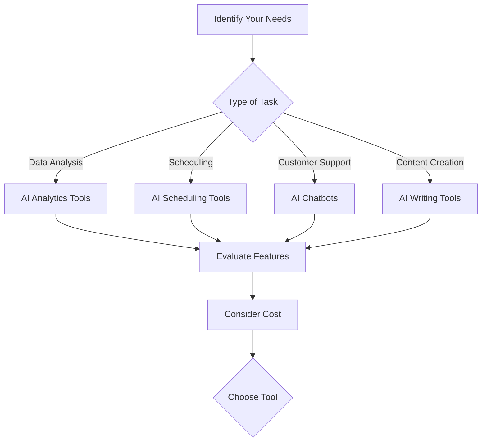

---

# Integrating AI Agents into Your Productivity Workflow

In today's fast-paced digital age, integrating AI agents into your productivity workflow isn't just a luxury—it's a necessity. From managing your daily tasks to streamlining communication, AI tools can help you work smarter, not harder. In this post, we will explore the benefits of incorporating AI agents into your routine, practical examples of their application, and a guide on how to choose the right tools for your needs.

## Understanding AI Agents

Before we dive into the practical aspects, let's clarify what AI agents are. An AI agent is a software program designed to perform tasks autonomously or semi-autonomously. These agents can analyze data, learn from user interactions, and make decisions, thereby freeing up human resources for more strategic work.

### Why Integrate AI Agents into Your Workflow?

Integrating AI agents can dramatically enhance your productivity by automating repetitive tasks, providing insights, and facilitating better decision-making. Here are some compelling reasons to consider:

- **Time Savings**: Automating mundane tasks allows you to focus on higher-value activities.
- **Enhanced Decision-Making**: AI agents can analyze data faster and provide actionable insights.
- **Improved Collaboration**: AI tools can facilitate communication and collaboration among team members, regardless of location.

## Practical Examples of AI Agents in Action

### 1. Administrative Tasks Automation

Imagine having an AI agent that can handle your scheduling, reminders, and even email management. Tools like **x.ai** and **Clara** can automatically schedule meetings based on your availability, freeing you from the back-and-forth emails.

#### Use Case:
A busy executive uses x.ai to schedule meetings with clients. The agent handles inquiries and finds optimal times without requiring manual input.

### 2. Data Analysis

AI agents like **Tableau** and **Power BI** can sift through mountains of data and generate reports, visualizations, and insights that help you make informed business decisions.

#### Use Case:
A marketing team uses Power BI to analyze campaign performance. The AI agent provides real-time insights, allowing them to pivot strategies quickly.

### 3. Customer Support

AI-driven chatbots such as **Drift** or **Intercom** can manage customer inquiries 24/7, providing instant responses to common questions while freeing human agents for more complex issues.

#### Use Case:
An e-commerce company integrates Drift to handle customer queries during peak shopping seasons, significantly reducing response time and increasing customer satisfaction.

### 4. Content Creation

Platforms like **[Copy.ai](https://www.copy.ai/?ref=AFFILIATE_ID)** and **[Jasper](https://www.jasper.ai/?ref=AFFILIATE_ID)** can assist in drafting articles, social media posts, and marketing copy based on minimal input, allowing content creators to focus on strategy and creativity.

#### Use Case:
A social media manager uses [Jasper](https://www.jasper.ai/?ref=AFFILIATE_ID) to generate engaging posts for multiple platforms, maintaining a consistent brand voice while saving hours of writing time.

## Choosing the Right AI Agents for Your Workflow

With numerous AI tools available, it can be overwhelming to choose the right ones for your specific needs. Here’s a decision-making framework to help you evaluate your options:

### Factors to Consider

1. **Ease of Use**: The tool should be user-friendly and integrate seamlessly with your existing systems.
2. **Cost**: Consider your budget. Some tools offer free trials, while others have monthly subscriptions.
3. **Features**: Look for AI agents that provide the functionalities you need without unnecessary extras.
4. **Support and Community**: Strong customer support and an active user community can enhance your experience.

## Comparison of Popular AI Agents

To make your selection process easier, here’s a comparison of some popular AI tools across different categories:

<table>
  <tr>
    <th>Tool</th>
    <th>Type</th>
    <th>Key Features</th>
    <th>Pricing</th>
  </tr>
  <tr>
    <td>x.ai</td>
    <td>Scheduling</td>
    <td>Automated meeting scheduling, AI-driven reminders</td>
    <td>$8/month</td>
  </tr>
  <tr>
    <td>Power BI</td>
    <td>Data Analysis</td>
    <td>Real-time data visualization, integration with various data sources</td>
    <td>$9.99/user/month</td>
  </tr>
  <tr>
    <td>Drift</td>
    <td>Customer Support</td>
    <td>24/7 chatbot, lead qualification, integration with CRM</td>
    <td>$40/month</td>
  </tr>
  <tr>
    <td>Jasper</td>
    <td>Content Creation</td>
    <td>AI-generated text, SEO recommendations, tone customization</td>
    <td>$29/month</td>
  </tr>
</table>

## Pros and Cons of Integrating AI Agents

### Pros

- **Increased Efficiency**: Automating tasks leads to faster completion and less human error.
- **Cost-Effective**: By optimizing resource allocation, AI can reduce operational costs.
- **Scalability**: AI tools can handle increasing workloads without requiring additional staff.

### Cons

- **Initial Setup**: Integrating AI agents can require time and resources upfront.
- **Dependence on Technology**: Over-reliance on AI can lead to gaps in human skills.
- **Privacy Concerns**: The use of AI tools may raise data security and privacy issues.

## Conclusion: Take the Next Step

Integrating AI agents into your productivity workflow can be a game-changer. By automating mundane tasks, providing insights, and facilitating collaboration, you can unlock your full potential. 

Now is the time to explore the world of AI tools and find the perfect fit for your needs. Whether you are looking to streamline your scheduling, enhance customer support, or improve data analysis, there’s an AI agent waiting to boost your productivity.

### Call to Action

Are you ready to transform your productivity? Start exploring AI agents today and experience the difference they can make in your workflow. Share your experiences or any tools you’d like to recommend in the comments below!

## 関連記事

- [The Complete Guide to AI Agent Productivity Tools in 2026](/posts/boost-productivity-with-ai-agents-in-2026-a-guide/)
- [5 Must-Have AI Tools to Streamline Your Workflow in 2026](/posts/5-must-have-ai-tools-to-streamline-your-workflow-in-2026/)
- [AI Agents vs. Traditional Productivity Tools: An Honest Comparison](/posts/ai-agents-vs-traditional-tools-which-enhances-productivity/)
