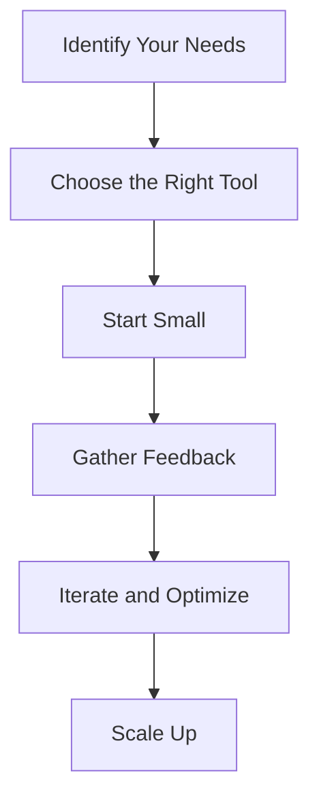

---

# Integrating AI Coding Tools into Your Development Workflow

In today’s fast-paced tech environment, developers are constantly seeking ways to streamline their coding processes and enhance productivity. Enter AI coding tools—powerful software solutions designed to assist developers in writing, debugging, and optimizing code. But how can you effectively integrate these tools into your existing workflow? In this guide, we’ll explore the benefits of AI coding tools, how to incorporate them into your everyday development practices, and review some of the best options available.

## Why Integrate AI Coding Tools?

AI coding tools can significantly enhance your coding experience. Here are some compelling reasons to consider their integration:

### 1. Increased Efficiency
AI tools can automate mundane tasks, allowing developers to focus on complex problem-solving rather than repetitive coding. For example, tools like [GitHub Copilot](https://github.com/features/copilot?ref=AFFILIATE_ID) can suggest entire lines or blocks of code based on context, reducing the time spent on writing boilerplate code.

### 2. Improved Code Quality
These tools often come equipped with features that enhance code quality. They can detect bugs, optimize performance, and even suggest best practices. This ensures that the final product is not only functional but also maintainable.

### 3. Enhanced Learning
For novice developers, AI coding tools serve as an educational resource. By providing real-time feedback and code suggestions, these tools help users learn coding languages and frameworks more effectively.

### 4. Collaboration and Teamwork
AI tools can facilitate collaboration among team members by integrating seamlessly with version control systems. This ensures that everyone is on the same page, reducing the chances of code conflicts and miscommunications.

## Key Considerations Before Integration

Before you dive into integrating AI coding tools, consider the following factors:

### 1. Compatibility
Ensure that the AI tool you choose is compatible with your current development environment and programming languages. Some tools may work well with Python but not with JavaScript, so do your research ahead of time.

### 2. Learning Curve
While many AI coding tools are designed to be user-friendly, some may require a learning curve. Consider the time investment needed for you and your team to become proficient with the new tool.

### 3. Cost
Evaluate the pricing structure of the tools you are considering. Some may offer free tiers with limited capabilities, while others require a subscription or a one-time purchase.

### 4. Security and Privacy
When integrating AI tools, consider the potential security implications. Ensure that the tool complies with best practices for data privacy, especially if you are working with sensitive information.

## Popular AI Coding Tools to Consider

Let’s take a look at some of the leading AI coding tools available and how they can enhance your coding workflow. Here's a comparison to help you decide:

<table>
  <tr>
    <th>Tool</th>
    <th>Key Features</th>
    <th>Pros</th>
    <th>Cons</th>
  </tr>
  <tr>
    <td>GitHub [Copilot](https://github.com/features/copilot?ref=AFFILIATE_ID)</td>
    <td>AI pair programmer, code suggestions, multi-language support</td>
    <td>Increases coding speed, easy integration with VS Code</td>
    <td>Can suggest incorrect code, reliance on internet connection</td>
  </tr>
  <tr>
    <td>[Tabnine](https://www.tabnine.com/?ref=AFFILIATE_ID)</td>
    <td>Code completions, supports multiple IDEs, customizable</td>
    <td>Improves coding efficiency, supports various languages</td>
    <td>Less effective for complex code, premium features are paid</td>
  </tr>
  <tr>
    <td>Kite</td>
    <td>Real-time code completions, documentation lookup</td>
    <td>Supports popular languages, enhances productivity</td>
    <td>Limited support for some languages, local model requires resources</td>
  </tr>
</table>

## How to Integrate AI Coding Tools Into Your Workflow

### Step 1: Identify Your Needs
Before choosing an AI coding tool, assess your specific requirements. Are you looking for a tool to assist with code completion, debugging, or both? Knowing your needs will help you make a more informed decision.

### Step 2: Choose the Right Tool
Based on your assessment, select the AI coding tool that best fits your requirements. Refer to the comparison table above for a quick overview of various options.

### Step 3: Start Small
Begin by integrating the AI tool into a small project. This allows you and your team to familiarize yourselves with the features without overwhelming your workflow.

### Step 4: Gather Feedback
As you start using the tool, gather feedback from all team members. Are they finding it helpful? Are there any issues or limitations? This feedback will be invaluable in fine-tuning your integration process.

### Step 5: Iterate and Optimize
Based on the feedback received, make necessary adjustments to your workflow. This might include additional training sessions or altering how the tool is used within projects.

### Step 6: Scale Up
Once you’re comfortable with the AI tool, scale its use across more projects. This could involve encouraging your entire team to use the tool consistently or integrating it into your CI/CD pipeline.

## Real-World Use Cases

### 1. Debugging with AI
A team of developers at a mid-sized tech firm integrated [GitHub Copilot](https://github.com/features/copilot?ref=AFFILIATE_ID) into their workflow. They found that it greatly reduced the time spent debugging, as the tool suggested fixes for common errors based on context.

### 2. Learning and Mentorship
A junior developer used Kite to assist in learning Python. The tool provided real-time code suggestions and explanations, making the learning process faster and more intuitive.

### 3. Enhancing Team Collaboration
A remote team utilized [Tabnine](https://www.tabnine.com/?ref=AFFILIATE_ID) to ensure consistency in code quality across projects. The AI tool helped maintain coding standards, which resulted in fewer code reviews and faster project completion.

## Conclusion

Integrating AI coding tools into your development workflow can significantly enhance productivity, improve code quality, and foster collaboration among team members. By carefully selecting the right tool and following a structured integration process, you can unlock the full potential of your coding capabilities.

Ready to elevate your development process with AI coding tools? Start exploring your options today and see how they can transform your workflow!

--- 

Feel free to share your experiences or ask any questions in the comments below! Let's embrace the future of coding together!

## 関連記事

- [AI Agents: The Future of Personal Assistants in 2026](/posts/ai-agents-the-future-of-personal-assistants-in-2026/)
- [AI Automation: A Game Changer for Small Businesses](/posts/ai-automation-a-game-changer-for-small-businesses/)
- [AI Automation: The Key to Enhanced Business Efficiency](/posts/ai-automation-the-key-to-enhanced-business-efficiency/)
