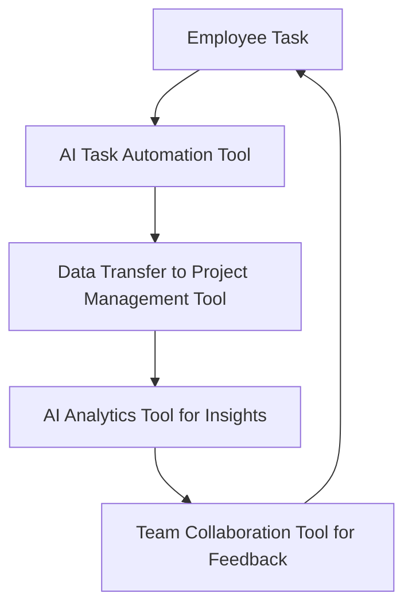

---

# Integrating AI Tools for Enhanced Workplace Efficiency

In today’s fast-paced business environment, enhancing workplace efficiency is not just a goal; it’s a necessity. With the rise of artificial intelligence (AI) tools, organizations can streamline processes, reduce manual effort, and ultimately improve productivity. In this blog post, we’ll explore how AI tools can enhance workplace efficiency, the various types available, and practical examples of their implementation.

## Why AI Tools Matter for Workplace Efficiency

The implementation of AI tools in the workplace addresses common hurdles such as time consumption, repetitive tasks, and data management. By automating mundane activities, employees can focus on more strategic tasks that require human creativity and decision-making. According to studies, companies that integrate AI into their operations can see productivity gains of up to 40%. 

Let’s dive deeper into the types of AI tools available and how they can specifically enhance workplace efficiency.

## Types of AI Tools for Workplace Efficiency

### 1. Task Automation Tools

These tools automate repetitive tasks, allowing employees to redirect their focus toward higher-value activities. For example, tools like Zapier and Microsoft Power Automate allow users to set up workflows that connect various applications, automating data transfers and notifications.

#### Pros:
- Saves time by automating repetitive tasks.
- Reduces human error in data entry.
  
#### Cons:
- May require initial setup time.
- Limited to the functions defined in the automation.

### 2. AI-Powered Project Management Tools

AI project management tools like Asana and Trello leverage AI to streamline project workflows. They can predict project timelines based on historical data and offer insights into resource allocation.

#### Pros:
- Provides data-driven insights for better decision-making.
- Improves team collaboration and transparency.

#### Cons:
- Learning curve for some users.
- Dependence on accurate input data.

### 3. Communication and Collaboration Tools

Tools like Slack and Microsoft Teams incorporate AI features to enhance communication within teams. AI chatbots can manage routine queries, while intelligent search functions help users find relevant documents quickly.

#### Pros:
- Keeps team members informed and engaged.
- Reduces email overload.

#### Cons:
- Can lead to information overload with constant notifications.
- Requires training to maximize potential.

### 4. AI Analytics Tools

AI analytics tools such as Tableau and Google Analytics can process large datasets to deliver actionable insights. These tools help businesses make data-driven decisions, improving efficiency across departments.

#### Pros:
- Offers real-time insights and reporting.
- Helps identify areas for improvement.

#### Cons:
- High learning curve for non-technical users.
- Requires data integrity for accurate analysis.

## Real-World Examples of AI Tool Integration

### Example 1: Automating Customer Support

A retail company implemented AI chatbots to handle customer inquiries during peak shopping seasons. This reduced the response time from hours to seconds, resulting in a 30% increase in customer satisfaction ratings. The employees were then able to focus on complex customer issues rather than routine queries.

### Example 2: Streamlining Project Management

A software development team adopted an AI-powered project management tool that analyzed previous project data to forecast completion times accurately. This allowed them to allocate resources more effectively, leading to a 25% reduction in project delays.

### Example 3: Enhancing Marketing Strategies

A marketing agency used AI analytics to segment its audience better and personalize campaigns. By analyzing customer behavior patterns, they improved their targeting and increased campaign effectiveness by 40%.

## Comparison of Popular AI Tools for Workplace Efficiency

When choosing the right AI tools for your workplace, it's essential to consider features, pricing, and user experience. Below is a comparison of some popular AI tools designed for enhancing workplace efficiency:

<table>
  <tr>
    <th>Tool</th>
    <th>Type</th>
    <th>Key Features</th>
    <th>Pricing</th>
  </tr>
  <tr>
    <td>Zapier</td>
    <td>Task Automation</td>
    <td>Workflow automation, app integrations</td>
    <td>Starts at $19.99/month</td>
  </tr>
  <tr>
    <td>Asana</td>
    <td>Project Management</td>
    <td>Task assignments, timeline projections</td>
    <td>Free & Paid plans starting at $10.99/month</td>
  </tr>
  <tr>
    <td>Slack</td>
    <td>Communication</td>
    <td>Channels, file sharing, AI chatbots</td>
    <td>Free & Paid plans starting at $6.67/month</td>
  </tr>
  <tr>
    <td>Tableau</td>
    <td>Analytics</td>
    <td>Data visualization, real-time data</td>
    <td>Starts at $70/user/month</td>
  </tr>
</table>

## Workflow Integration of AI Tools

Integrating multiple AI tools can create a synergistic effect that enhances workplace efficiency even further. Here’s a simple workflow diagram illustrating how different AI tools can be integrated within a business process to maximize productivity:

## Best Practices for Integrating AI Tools

To get the most out of your AI tools, consider the following best practices:

1. **Define Clear Goals**: Before implementing AI tools, identify the specific areas where you wish to improve efficiency. This could range from reducing response times in customer support to enhancing project management capabilities.

2. **Train Your Team**: Provide adequate training to employees on how to use these tools effectively. This can significantly reduce resistance to change and improve adoption rates.

3. **Monitor and Evaluate**: Regularly assess the performance of the AI tools and their impact on workplace efficiency. Use key performance indicators (KPIs) to measure success.

4. **Stay Updated**: The AI landscape is constantly evolving. Keep abreast of the latest developments and updates to ensure your tools remain effective.

## Conclusion: The Future of Workplace Efficiency

Integrating AI tools into your workplace is not just about keeping up with technology; it’s about unleashing the potential of your team. By automating routine tasks, enhancing collaboration, and enabling data-driven decision-making, AI can significantly improve workplace efficiency.

Are you ready to take the plunge into the world of AI tools? Start exploring the options that best fit your organization’s needs and watch your productivity soar. Don't wait—embrace the future of work today!

### Call to Action

If you found this article helpful, share it with your colleagues and start a conversation about how you can integrate AI tools in your workplace. For more insights on productivity and technology, subscribe to our newsletter for the latest updates and tips!

## 関連記事

- [AI Agents: The Future of Personal Assistants in 2026](/posts/ai-agents-the-future-of-personal-assistants-in-2026/)
- [AI Automation: A Game Changer for Small Businesses](/posts/ai-automation-a-game-changer-for-small-businesses/)
- [AI Automation: Revolutionizing Business Operations in 2026](/posts/ai-automation-revolutionizing-business-operations-in-2026/)
