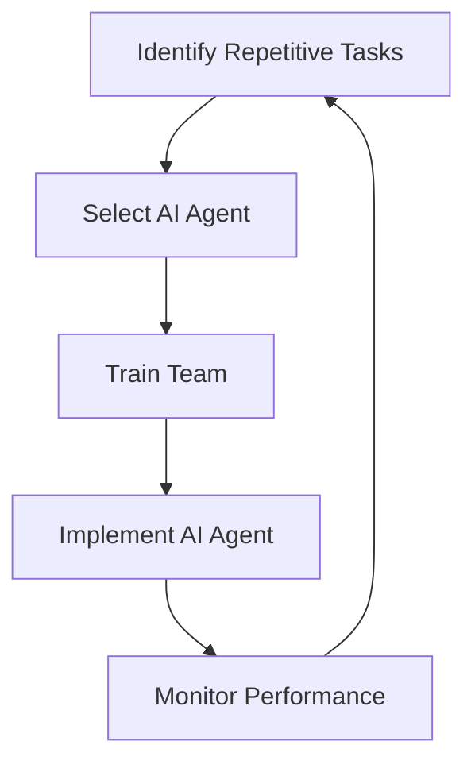

---

## Leveraging AI Agents for Enhanced Workplace Productivity

In the fast-paced world of business, productivity is more than just a buzzword—it's a necessity. Enter AI agents, the innovative tools designed to streamline operations, automate repetitive tasks, and enhance collaboration within teams. As organizations increasingly embrace technology, understanding how to leverage AI agents can unlock unprecedented levels of efficiency and effectiveness in the workplace.

### What Are AI Agents?

AI agents are software programs that utilize artificial intelligence to perform tasks autonomously or semi-autonomously. These tools can interact with users and other systems, making decisions based on data inputs and predefined criteria. Whether it's scheduling meetings, managing emails, or providing customer support, AI agents are transforming the way we work.

### The Rise of AI Agents in the Workplace

The adoption of AI agents in workplaces is on the rise, driven by the need for increased efficiency and reduced operational costs. According to a report by McKinsey, businesses implementing AI technologies have seen productivity gains of 20-30%. From small startups to large enterprises, AI agents are proving to be invaluable assets.

#### Use Cases of AI Agents

1. **Email Management**: AI agents can filter and prioritize emails, ensuring that important communications are highlighted while less critical messages are organized or archived. Tools like Google's Smart Compose use AI to suggest responses, saving time for employees.

2. **Scheduling and Calendar Management**: AI agents like x.ai or Microsoft’s Cortana can handle meeting scheduling by checking participants' availability and suggesting optimal times. This reduces the back-and-forth communication often involved in setting up meetings.

3. **Customer Support**: AI chatbots, such as those powered by Zendesk or Drift, can handle customer inquiries 24/7. They provide instant responses to FAQs, allowing human agents to focus on more complex issues.

4. **Document Automation**: Tools like DocuSign use AI to streamline the document signing process, reducing the time spent on paperwork and ensuring compliance with legal standards.

### Pros and Cons of AI Agents

While the benefits of AI agents are substantial, it's crucial to consider potential drawbacks:

#### Pros:
- **Increased Efficiency**: Automating repetitive tasks allows employees to focus on higher-value activities.
- **24/7 Availability**: AI agents can work around the clock, providing support and services when needed.
- **Cost Savings**: By reducing the need for human intervention in routine tasks, businesses can lower operational costs.

#### Cons:
- **Job Displacement**: There is a concern that AI agents may replace human jobs, leading to unemployment in certain sectors.
- **Dependence on Technology**: Over-reliance on AI can result in a decline in critical thinking and problem-solving skills among employees.
- **Data Privacy Concerns**: The use of AI agents often involves handling sensitive data, raising questions about data security and user privacy.

### Choosing the Right AI Agent for Your Business

With a myriad of AI agents available, selecting the right one can be overwhelming. Here’s a comparison of some popular AI agents that can enhance workplace productivity:

<table>
    <tr>
        <th>Tool</th>
        <th>Best For</th>
        <th>Key Features</th>
        <th>Pricing</th>
    </tr>
    <tr>
        <td>x.ai</td>
        <td>Meeting Scheduling</td>
        <td>Automated meeting scheduling, calendar integration</td>
        <td>Starts at $8/month</td>
    </tr>
    <tr>
        <td>Drift</td>
        <td>Customer Support</td>
        <td>AI chatbots, lead generation, real-time chat</td>
        <td>Starts at $50/month</td>
    </tr>
    <tr>
        <td>DocuSign</td>
        <td>Document Automation</td>
        <td>E-signatures, workflow management, compliance tracking</td>
        <td>Starts at $10/month</td>
    </tr>
    <tr>
        <td>Google's Smart Compose</td>
        <td>Email Management</td>
        <td>Email suggestions, smart replies, integration with Gmail</td>
        <td>Free with Google Workspace</td>
    </tr>
</table>

### Workflow Integration for Maximum Impact

Integrating AI agents into your existing workflows can amplify their benefits. Consider the following steps:

1. **Identify Repetitive Tasks**: Assess your team's daily operations to pinpoint tasks that can be automated.
2. **Select Suitable Tools**: Choose an AI agent that aligns with your specific needs.
3. **Train Your Team**: Provide training sessions to ensure your team understands how to leverage the AI agent effectively.
4. **Monitor Performance**: Regularly evaluate the performance of the AI agent to measure its impact on productivity and make adjustments as necessary.

Here's a simple workflow diagram demonstrating how AI agents can be integrated into workplace processes:

### Future of AI Agents in the Workplace

As AI technology continues to advance, the capabilities of AI agents will only expand. Future developments may include more sophisticated natural language processing, enhanced decision-making abilities, and deeper integrations with other workplace tools. The potential for AI agents to further revolutionize productivity is immense.

### Conclusion

AI agents are not just a passing trend; they represent a significant shift in how businesses operate. By embracing these tools, organizations can enhance productivity, improve efficiency, and reduce operational costs. However, it’s essential to find a balance between leveraging technology and maintaining the human touch in business operations.

Are you ready to take your workplace productivity to the next level? Start exploring AI agents today and see how they can transform your operations!

### Call to Action

Interested in learning more about AI agents and how they can benefit your business? Subscribe to our newsletter for the latest insights and tips on leveraging AI tools for enhanced productivity!

## 関連記事

- [Best AI Collaboration Tools for Remote Teams in 2026](/posts/best-ai-tools-for-improving-team-collaboration-in-2026/)
- [5 Must-Have AI Tools to Streamline Your Workflow in 2026](/posts/5-must-have-ai-tools-to-streamline-your-workflow-in-2026/)
- [AI Agents vs. Traditional Productivity Tools: An Honest Comparison](/posts/ai-agents-vs-traditional-tools-which-enhances-productivity/)
