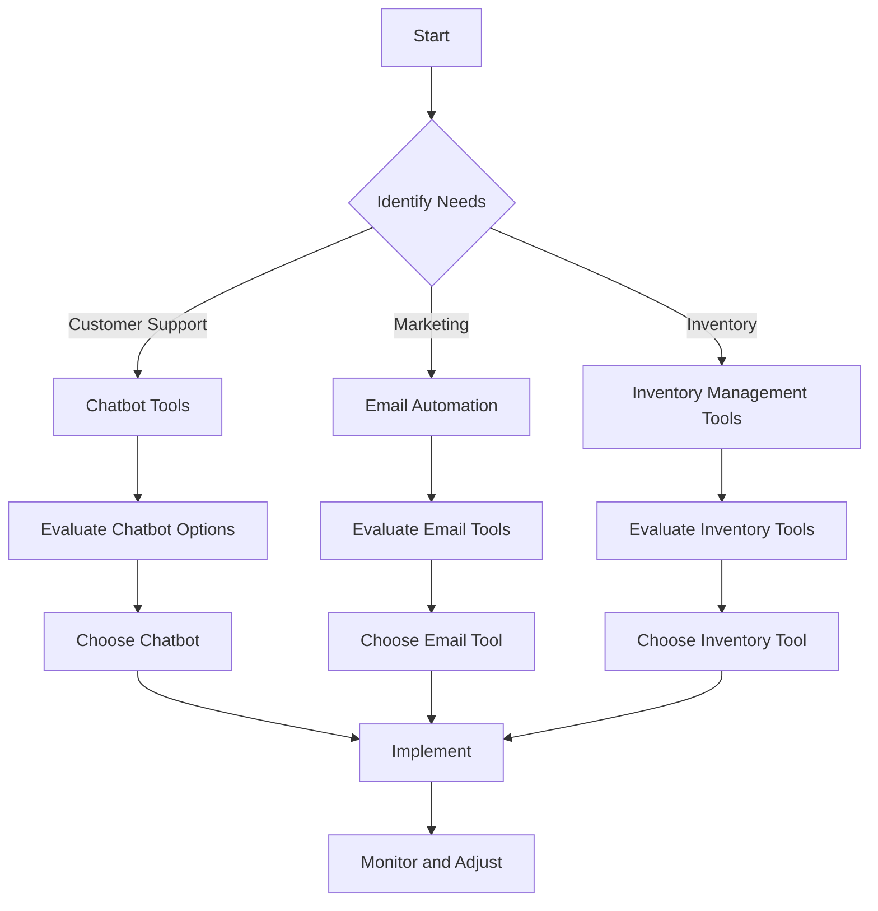

---

# Leveraging AI Automation for Small Business Growth in 2026

As we step into 2026, the landscape of small business operations is evolving rapidly. With advancements in technology, particularly in artificial intelligence (AI), small businesses are presented with unprecedented opportunities to automate processes and enhance productivity. AI automation not only streamlines operations but also drives growth by allowing entrepreneurs to focus on strategic decision-making rather than mundane tasks. In this blog post, we will explore the various ways AI automation can benefit small businesses, practical examples, and a few tools to consider.

## The Importance of AI Automation for Small Businesses

AI automation can significantly impact small businesses by reducing costs, improving efficiency, and enhancing customer experiences. In a world where time is money, automating repetitive tasks allows business owners to allocate their resources more effectively. Here are a few key benefits of integrating AI automation into your small business:

1. **Increased Efficiency**: Automation of routine tasks such as scheduling, data entry, and customer inquiries can save time and reduce human error.
  
2. **Cost Savings**: By automating various processes, businesses can decrease operational costs and reallocate funds to growth-oriented initiatives.
  
3. **Improved Customer Experience**: AI tools can provide personalized interactions, quick responses, and 24/7 availability, ultimately leading to higher customer satisfaction.

4. **Data-Driven Insights**: AI tools can analyze large volumes of data to provide insights that help businesses make informed decisions.

## Practical Examples of AI Automation in Small Businesses

Let’s delve into some real-life scenarios where AI automation has made a significant impact:

### 1. Customer Support Automation

Many small businesses are using AI-powered chatbots to handle customer inquiries. For example, a local bakery might implement a chatbot on its website to answer FAQs about menu items, opening hours, and online orders. This ensures customers receive immediate assistance, even outside regular business hours.

### 2. Marketing Automation

A small marketing agency can leverage AI tools to automate email campaigns. By using platforms like Mailchimp or HubSpot, they can segment their audience and send tailored messages to different customer groups. This not only saves time but also increases engagement rates.

### 3. Inventory Management

Retailers can use AI-powered inventory management systems to predict stock levels based on sales trends and seasonal demands. For instance, a small clothing store could utilize such a tool to automatically reorder popular items, preventing stockouts and lost sales.

## Top AI Automation Tools for Small Businesses

When considering AI automation, choosing the right tools is crucial. Below is a comparison of some popular AI automation tools that cater to small business needs:

<table>
  <tr>
    <th>Tool</th>
    <th>Features</th>
    <th>Pricing</th>
    <th>Pros</th>
    <th>Cons</th>
  </tr>
  <tr>
    <td>Zapier</td>
    <td>Connects apps, automates workflows</td>
    <td>Starting at $19.99/month</td>
    <td>Easy to use, extensive app integrations</td>
    <td>Can become expensive with higher usage</td>
  </tr>
  <tr>
    <td>HubSpot</td>
    <td>CRM, marketing automation, sales tools</td>
    <td>Free tier available, paid plans start at $45/month</td>
    <td>User-friendly, great for inbound marketing</td>
    <td>Can be overwhelming for beginners</td>
  </tr>
  <tr>
    <td>Intercom</td>
    <td>Customer messaging platform, chatbots</td>
    <td>Starting at $39/month</td>
    <td>Effective customer engagement, customizable</td>
    <td>Pricing can be high for small businesses</td>
  </tr>
  <tr>
    <td>QuickBooks</td>
    <td>Accounting, invoicing, payroll</td>
    <td>Starting at $25/month</td>
    <td>Comprehensive financial management, easy to use</td>
    <td>Limited customization options</td>
  </tr>
</table>

## Decision-Making Flowchart for Choosing AI Tools

Before selecting an AI tool, it’s essential to analyze your business needs and goals. Below is a simple decision-making flowchart to guide you through the process:

## Implementing AI Automation in Your Small Business

To effectively implement AI automation, consider the following steps:

### 1. Identify Repetitive Tasks

Start by analyzing your current operations to identify tasks that can be automated. This could include customer inquiries, appointment scheduling, or data entry.

### 2. Choose the Right Tools

Based on your identified needs, select the tools that best fit your business model. Consider factors such as cost, ease of use, and scalability.

### 3. Train Your Team

Ensure that your team is well-equipped to use the new AI tools. Provide training sessions and resources to help them adapt to the changes.

### 4. Monitor Performance

After implementation, continuously monitor the performance of the AI tools. Gather feedback from employees and customers to make necessary adjustments.

### 5. Iterate and Improve

AI tools are not a one-and-done solution. Regularly assess your automation strategy to ensure it remains aligned with your business goals and customer needs.

## Conclusion

AI automation is no longer a luxury; it’s a necessity for small businesses looking to thrive in 2026 and beyond. By leveraging the right tools and strategies, you can streamline operations, reduce costs, and enhance customer experiences. As we navigate this evolving landscape, embracing AI automation could be the key to unlocking sustainable growth for your small business.

Are you ready to take your small business to the next level? Explore the various AI automation tools available and start your journey toward increased efficiency and profitability today! If you have any questions or need guidance on choosing the right tools, feel free to reach out in the comments below!

## 関連記事

- [AI Automation on a Budget: Smart Strategies for Small Businesses](/posts/top-ai-automation-strategies-for-small-businesses/)
- [Automating Business Processes with AI: A Step-by-Step Playbook](/posts/automating-business-processes-with-ai-a-complete-guide/)
- [7 AI Automation Strategies to Supercharge Business Efficiency](/posts/boosting-business-efficiency-with-ai-automation-strategies/)
