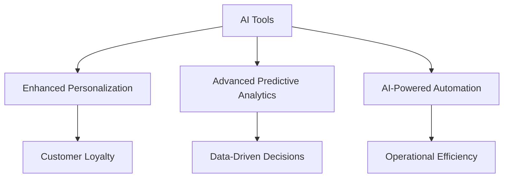

---

## Leveraging AI for Business Growth: 2026 Trends

As we dive deeper into the digital age, businesses are continuously seeking innovative ways to harness technology and improve their operations. Among the most significant advancements is Artificial Intelligence (AI). By 2026, AI for business growth is poised to transform various sectors, boosting efficiency, enhancing customer experiences, and driving profitability. In this article, we will explore the key trends shaping the landscape of AI in business and how you can leverage these tools to achieve your growth objectives.

### The Evolution of AI: A Quick Overview

Before we delve into the trends for 2026, it’s important to understand the evolution of AI. From simple algorithms to complex machine learning models, AI has progressed significantly. Today, businesses utilize AI for various functions, including data analysis, customer service automation, and personalized marketing strategies. By 2026, we expect even more sophisticated applications that will redefine how businesses operate.

### Key Trends in AI for Business Growth by 2026

#### 1. Enhanced Personalization

Personalization has quickly become a cornerstone of successful business strategies. In 2026, AI will enable even deeper levels of personalization by analyzing customer behavior and preferences more accurately. Consider an e-commerce platform that uses AI algorithms to recommend products based on a customer's browsing history and purchase behavior. The result is a tailored shopping experience that not only increases sales but also enhances customer loyalty.

##### Use Case: AI-Driven Recommendations

Imagine a retailer like Amazon using AI to analyze past purchases and browsing habits. By implementing collaborative filtering algorithms, Amazon can provide personalized product suggestions, improving conversion rates and customer satisfaction.

#### 2. Advanced Predictive Analytics

Predictive analytics is set to become a game changer for businesses looking to anticipate market trends and customer needs. In 2026, companies will leverage AI to analyze vast datasets, enabling them to make data-driven decisions. This will help businesses not only to react to changes but to proactively shape their strategies.

##### Use Case: Financial Forecasting

A financial services firm might employ AI-driven predictive analytics to forecast market trends, assess risks, and optimize investment strategies. By analyzing historical data and current market conditions, the firm can make informed decisions that improve profitability.

#### 3. AI-Powered Automation

AI-driven automation is not new, but by 2026, we will see more intelligent systems that can perform complex tasks with minimal human intervention. From automating routine processes to predictive maintenance, AI can significantly reduce operational costs and improve efficiency.

##### Use Case: Customer Service Chatbots

Companies like Zendesk are already using AI chatbots to handle customer inquiries. By 2026, these chatbots will become more sophisticated, utilizing natural language processing (NLP) to understand and respond to customer queries in a more human-like manner, thus improving customer satisfaction.

#### 4. AI for Workforce Management

As businesses strive for higher productivity, AI will play a critical role in workforce management by optimizing scheduling, predicting workforce needs, and enhancing employee engagement. By 2026, AI tools will analyze employee performance data to identify potential areas for improvement and development.

##### Use Case: Smart Scheduling

A large retail chain could implement an AI tool to optimize staff schedules based on predicted customer traffic patterns. This would ensure that the right number of employees is available during peak hours, improving service quality and employee satisfaction.

### Pros and Cons of AI Tools for Business Growth

While AI offers numerous advantages for business growth, it is essential to understand its limitations as well. Here’s a breakdown of the pros and cons of utilizing AI in your business strategies.

| Pros                               | Cons                               |
|------------------------------------|------------------------------------|
| Improved efficiency and productivity | High implementation costs          |
| Enhanced customer experience        | Data privacy concerns              |
| Data-driven decision-making         | Requires ongoing maintenance        |
| Scalability in operations           | Potential for job displacement      |

### Challenges to Consider

Despite the promising trends, businesses must navigate several challenges when adopting AI technologies. These include:

- **Data Privacy**: As AI systems rely heavily on data, ensuring the protection of customer information is paramount.
- **Integration Costs**: The initial investment in AI tools can be substantial, and businesses must weigh the potential ROI against these costs.
- **Skills Gap**: The rapid pace of AI development means that companies may struggle to find employees with the necessary skills to manage and implement these technologies.

### The Future of AI in Business Growth

As we look ahead to 2026, the integration of AI into business strategies will only deepen. Companies that proactively adopt these technologies will likely enjoy a competitive edge. The key to success will be to remain adaptable, leveraging AI tools to streamline operations, enhance customer experiences, and ultimately drive growth.

### Conclusion: Embrace AI for Your Business Growth

AI stands to revolutionize the way businesses operate, offering solutions that can significantly enhance productivity and customer satisfaction. As we move towards 2026, it is crucial for businesses to stay informed about the latest trends and technologies in AI for business growth.

Are you ready to embrace AI and harness its potential for your business? Start by exploring the tools available today, and consider how they can be integrated into your operations. The future is bright for those who adapt!

### Call to Action

If you found this article insightful, don’t forget to share it with your network! Subscribe to our newsletter for more updates on AI tools and business strategies that can propel your growth. Let’s embark on this journey towards AI-powered success together!

## 関連記事

- [Leveraging AI for Smart Business Growth Strategies](/posts/leveraging-ai-for-smart-business-growth-strategies/)
- [AI Agents: The Future of Personal Assistants in 2026](/posts/ai-agents-the-future-of-personal-assistants-in-2026/)
- [AI Automation: A Game Changer for Small Businesses](/posts/ai-automation-a-game-changer-for-small-businesses/)
