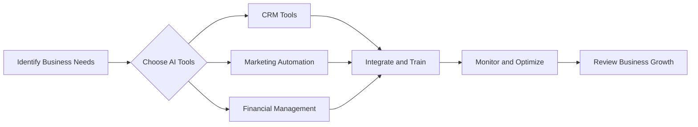

---

# Leveraging AI for Smart Business Growth Strategies

In today's rapidly changing business landscape, organizations are constantly searching for innovative ways to gain a competitive edge. One of the most transformative technologies at our disposal is artificial intelligence (AI). From automating mundane tasks to providing real-time analytics, AI for business growth is becoming an essential component of successful strategies. In this article, we will explore how AI can be leveraged to foster smart business growth strategies, along with practical examples and tools that can help you implement these strategies.

## Understanding AI and Its Role in Business Growth

AI refers to the simulation of human intelligence processes by machines, particularly computer systems. These processes include learning (the acquisition of information and rules for using it), reasoning (using rules to reach approximate or definite conclusions), and self-correction. In the context of business growth, AI can enhance decision-making, improve customer experiences, and drive efficiency.

### Why AI for Business Growth?

1. **Data-Driven Insights**: AI can analyze vast amounts of data to extract actionable insights that inform strategic decisions.
2. **Automation of Processes**: By automating repetitive tasks, businesses can focus on more strategic activities that drive growth.
3. **Enhanced Customer Experience**: AI-powered tools can personalize customer interactions, leading to higher satisfaction and loyalty.
4. **Predictive Analytics**: AI can predict market trends and customer behavior, allowing businesses to stay ahead of the curve.

## Practical Use Cases of AI in Business Growth

### 1. Customer Relationship Management (CRM)

AI can significantly enhance CRM systems by analyzing customer data to identify trends and preferences. For example, Salesforce’s Einstein AI offers predictive lead scoring, which helps sales teams prioritize leads likely to convert. This targeted approach boosts sales efficiency and accelerates revenue growth.

### 2. Marketing Automation

AI tools like HubSpot and Marketo use machine learning algorithms to optimize marketing campaigns. They can identify the best times to send emails, segment audiences for targeted messaging, and even suggest content topics based on current trends. By improving marketing strategies through AI, businesses can see higher engagement rates and improved ROI.

### 3. Supply Chain Optimization

AI can streamline supply chain processes by predicting demand, optimizing stock levels, and identifying potential disruptions. For instance, companies like Amazon use AI-driven algorithms to manage inventory, ensuring that products are available when customers need them, which leads to increased sales and customer satisfaction.

### 4. Financial Forecasting

AI can analyze historical financial data to provide accurate forecasting for future revenues and expenses. Tools like Xero and QuickBooks leverage AI to generate financial reports automatically, allowing businesses to make informed decisions quickly.

## Key AI Tools for Business Growth

When it comes to implementing AI for business growth, selecting the right tools is crucial. Below, we compare some of the most popular AI tools used across various business functions.

<table>
  <tr>
    <th>Tool</th>
    <th>Functionality</th>
    <th>Pros</th>
    <th>Cons</th>
  </tr>
  <tr>
    <td>Salesforce Einstein</td>
    <td>CRM and Sales Analytics</td>
    <td>Integrates seamlessly with Salesforce, powerful predictive capabilities</td>
    <td>Steep learning curve, can be costly for small businesses</td>
  </tr>
  <tr>
    <td>HubSpot</td>
    <td>Marketing Automation</td>
    <td>User-friendly interface, excellent customer support</td>
    <td>Limited features in free version, can get expensive</td>
  </tr>
  <tr>
    <td>Xero</td>
    <td>Financial Management</td>
    <td>Easy to use, real-time financial tracking</td>
    <td>Limited reporting features, internet connection required</td>
  </tr>
  <tr>
    <td>Amazon Forecast</td>
    <td>Demand Forecasting</td>
    <td>Highly accurate predictions, scalable</td>
    <td>Requires technical expertise to implement, can be costly</td>
  </tr>
</table>

## Workflow for Implementing AI in Your Business

To effectively leverage AI for business growth, it is essential to follow a structured workflow. Below is a simple decision-making diagram to help guide your AI implementation process.

## Pros and Cons of Using AI for Business Growth

### Pros

- **Increased Efficiency**: AI automates repetitive tasks, freeing up valuable employee time.
- **Better Decision-Making**: Data-driven insights from AI can lead to better strategic choices.
- **Cost Savings**: Over time, AI can reduce operational costs through increased efficiency and reduced errors.
- **Scalability**: AI solutions can easily scale as your business grows, adapting to increased demands.

### Cons

- **High Initial Investment**: Implementing AI solutions can be costly, particularly for small businesses.
- **Complexity**: The technology can be complex and may require specialized skills to operate effectively.
- **Data Privacy Concerns**: Using AI often involves handling sensitive customer data, raising privacy concerns that must be addressed.

## The Future of AI in Business Growth

As technology continues to advance, the potential applications of AI in business growth will expand. Innovations in natural language processing, machine learning, and data analytics will further enhance the ways businesses operate. Companies that embrace these technologies early will be better positioned to thrive in an increasingly competitive environment.

### Final Thoughts

AI for business growth is not just a trend; it's a necessity for organizations aiming to remain competitive and innovative. By carefully selecting the right tools and following a structured implementation process, you can leverage AI to drive strategic growth for your business.

Are you ready to take your business to the next level with AI? Explore the tools mentioned in this article and start implementing AI-driven strategies today!

**Call to Action**: Don’t let your business fall behind in the digital age. Subscribe to our newsletter for the latest insights on AI tools and strategies for business growth, and start your journey towards success!

## 関連記事

- [Leveraging AI for Business Growth: 2026 Trends](/posts/leveraging-ai-for-business-growth-2026-trends/)
- [AI Agents: The Future of Personal Assistants in 2026](/posts/ai-agents-the-future-of-personal-assistants-in-2026/)
- [AI Automation: A Game Changer for Small Businesses](/posts/ai-automation-a-game-changer-for-small-businesses/)
