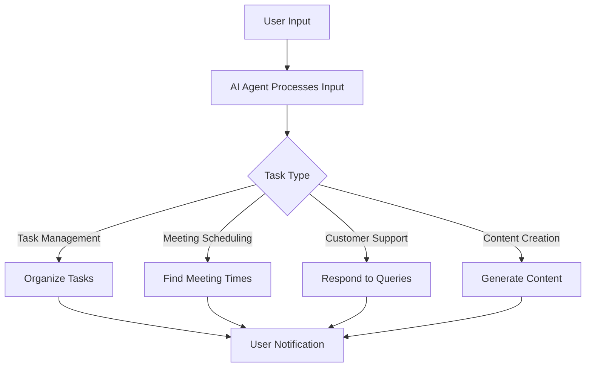

---

## Maximize Productivity with AI Agents in 2026

In the fast-paced world of 2026, the emergence of AI agents has ushered in a new era of productivity. These intelligent digital assistants are transforming the way we work, streamline tasks, and enhance collaboration. If you're looking to maximize your productivity, understanding how AI agents can be utilized in your daily workflow is essential. In this article, we’ll explore their capabilities, practical use cases, and how they can elevate your productivity to new heights.

### What Are AI Agents?

AI agents are autonomous software programs designed to perform tasks on behalf of users. They leverage artificial intelligence, machine learning, and natural language processing to understand user inputs and execute actions efficiently. Whether it's managing your calendar, sending emails, or analyzing data, AI agents can handle a wide range of tasks, allowing you to focus on what truly matters.

### The Rise of AI Agents in 2026

In 2026, AI agents are not just a novelty; they are integral to personal and organizational productivity. With advancements in AI technology, these agents have become more intuitive and capable of handling complex tasks. They can learn from user behavior, adapt to individual preferences, and even predict needs before they arise. 

#### Key Features of AI Agents

- **Automation of Routine Tasks**: AI agents can automate repetitive tasks, such as scheduling meetings, sending reminders, and organizing files, freeing up valuable time for more strategic activities.
- **Data Analysis and Insights**: These agents can analyze vast amounts of data quickly, providing insights that help in decision-making and identifying trends.
- **Personalization**: AI agents learn from user interactions, offering personalized recommendations and solutions tailored to individual preferences and work habits.
- **Collaboration Enhancement**: They can facilitate communication and collaboration among team members by managing project timelines, sharing updates, and tracking progress.

### Practical Use Cases for AI Agents

#### 1. Task Management

Imagine a scenario where your AI agent organizes your to-do list, prioritizes tasks based on deadlines and importance, and even reminds you of upcoming deadlines. Tools like Todoist and Trello have already integrated AI features to help users manage their tasks more effectively. 

#### 2. Meeting Scheduling

Gone are the days of endless email threads to coordinate meeting times. AI agents like x.ai or Clockwise can automatically find suitable times for all participants based on their calendars, significantly reducing the hassle of scheduling.

#### 3. Customer Support

In customer service, AI agents like [ChatGPT](https://chat.openai.com/?ref=AFFILIATE_ID) or Zendesk's Answer Bot can handle queries in real-time, providing instant responses to common questions. This not only improves customer satisfaction but also allows human agents to focus on more complex issues.

#### 4. Content Creation

For marketers and content creators, AI writing tools such as [Jasper](https://www.jasper.ai/?ref=AFFILIATE_ID) or [Copy.ai](https://www.copy.ai/?ref=AFFILIATE_ID) can generate blog posts, social media updates, and marketing copy. This can save hours of brainstorming and writing, enabling creators to focus on strategy and audience engagement.

### Pros and Cons of Using AI Agents

While AI agents offer numerous advantages, they also come with limitations that should be considered.

#### Pros
- **Increased Efficiency**: By automating routine tasks, AI agents save time and allow users to concentrate on high-value activities.
- **Enhanced Collaboration**: AI tools facilitate better communication and project management among teams.
- **Data-Driven Decisions**: AI agents provide insights based on data analysis, improving decision-making processes.

#### Cons
- **Dependence on Technology**: Over-reliance on AI agents can lead to reduced critical thinking and problem-solving skills.
- **Privacy Concerns**: The use of AI agents often involves sharing personal data, raising concerns about privacy and data security.
- **Potential Errors**: Although AI is advanced, it can still make mistakes, which may lead to miscommunication or incorrect outputs.

### Comparing Popular AI Agents for Productivity

As you consider which AI agents may best serve your productivity needs, here's a comparison of some popular tools available in 2026:

<table>
  <tr>
    <th>AI Agent</th>
    <th>Primary Function</th>
    <th>Key Features</th>
    <th>Pricing</th>
  </tr>
  <tr>
    <td>Todoist</td>
    <td>Task Management</td>
    <td>Task prioritization, project tracking, integrations</td>
    <td>Free, Premium $4/month</td>
  </tr>
  <tr>
    <td>x.ai</td>
    <td>Meeting Scheduling</td>
    <td>Calendar integration, time zone management</td>
    <td>Free, Pro $10/month</td>
  </tr>
  <tr>
    <td>Zendesk Answer Bot</td>
    <td>Customer Support</td>
    <td>Real-time responses, integration with ticketing systems</td>
    <td>Starting at $19/month</td>
  </tr>
  <tr>
    <td>[Jasper](https://www.jasper.ai/?ref=AFFILIATE_ID)</td>
    <td>Content Creation</td>
    <td>AI-powered writing, templates for various formats</td>
    <td>Starting at $29/month</td>
  </tr>
</table>

### Workflow of an AI Agent in Action

To visualize how an AI agent can enhance productivity, let’s look at a simple workflow diagram:

### Future of AI Agents in Productivity

As we move further into 2026 and beyond, the potential for AI agents in enhancing productivity is immense. Continued advancements in AI technology will lead to even more sophisticated tools that can understand context, anticipate needs, and provide seamless integration across various platforms.

Organizations that embrace AI agents now will be better positioned to thrive in the competitive landscape of the future. As the technology matures, expect to see more personalized, adaptive solutions that cater to the unique needs of individuals and teams.

### Conclusion

AI agents are revolutionizing productivity in 2026, offering tools that save time, enhance collaboration, and provide valuable insights. Whether you're a solo entrepreneur or part of a large organization, integrating AI agents into your workflow can lead to significant improvements in efficiency and productivity.

Are you ready to unleash the power of AI agents in your work life? Start exploring these tools today and take the first step towards maximizing your productivity. For the latest updates on AI tools and productivity strategies, be sure to subscribe to our newsletter!

--- 

By embracing the capabilities of AI agents, you can ensure that you stay ahead in today's fast-paced world, transforming your productivity and achieving your goals more efficiently.

## 関連記事

- [Boost Productivity with AI Agents: 2026 Strategies](/posts/boost-productivity-with-ai-agents-2026-strategies/)
- [Boosting Productivity with AI Agents in 2026](/posts/boosting-productivity-with-ai-agents-in-2026/)
- [Enhancing Productivity with AI Agents in 2026](/posts/enhancing-productivity-with-ai-agents-in-2026/)
