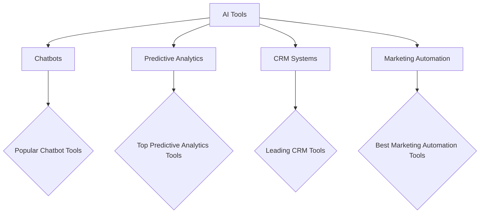

---

## Maximize ROI: Using AI for Business Growth in 2026

As we step into 2026, the landscape of business growth is rapidly evolving, with artificial intelligence (AI) at the forefront of this transformation. Companies that leverage AI for business growth are not only enhancing their operational efficiency but also discovering innovative ways to engage customers and drive profitability. In this blog post, we’ll explore how AI can maximize ROI for your business and provide practical examples and tools to help you succeed in this competitive environment.

### Understanding the Role of AI in Business Growth

AI technologies are designed to analyze vast amounts of data, automate repetitive tasks, and provide insights that can inform strategic decision-making. From predictive analytics to customer relationship management (CRM), AI applications are diverse and impactful. Here’s a brief overview of the key areas where AI can significantly contribute to business growth:

- **Data Analysis and Insights**: AI algorithms can process and analyze data at lightning speed, uncovering patterns and trends that humans might miss.
- **Customer Engagement**: AI-driven chatbots and virtual assistants can enhance customer service, providing instant support and personalized recommendations.
- **Marketing Automation**: AI tools can optimize marketing campaigns by targeting the right audience at the right time, improving conversion rates.
- **Operational Efficiency**: Automating routine tasks allows employees to focus on higher-value activities, increasing productivity.

### Practical Applications of AI for Business Growth

Let’s delve into some specific use cases demonstrating how businesses can utilize AI for growth in 2026.

#### 1. Enhancing Customer Experience with AI Chatbots

Many companies are implementing AI-powered chatbots to improve customer service. These chatbots can handle inquiries 24/7, providing instant responses to customer questions, which can lead to higher satisfaction rates and increased sales.

**Example**: A retail company uses a chatbot on its website to assist customers in finding products, answering questions about shipping, and processing returns. This not only reduces the burden on human agents but also leads to faster resolution times and happier customers.

#### 2. Predictive Analytics for Better Decision-Making

AI can also be used for predictive analytics, allowing businesses to forecast trends and customer behaviors accurately. This capability can guide inventory management, marketing strategies, and sales projections.

**Example**: A logistics company implements AI to analyze historical shipping data, predicting peak seasons and optimizing delivery routes. As a result, they reduce shipping costs and improve customer satisfaction through timely deliveries.

#### 3. Personalized Marketing Campaigns

AI can analyze customer data to create highly personalized marketing campaigns. By understanding customer preferences, businesses can tailor their messages and offers, leading to higher engagement rates.

**Example**: An e-commerce platform utilizes AI to recommend products based on a customer’s browsing history and past purchases. This personalized approach has shown to increase average order value and customer retention.

### Tools for Implementing AI in Your Business

To maximize ROI, businesses must choose the right AI tools tailored to their specific needs. Below, we’ll compare some popular AI tools for business growth in 2026.

### Comparison of AI Tools for Business Growth

Here’s a quick comparison of some of the leading AI tools you might consider for enhancing your business operations:

<table>
    <tr>
        <th>Tool</th>
        <th>Type</th>
        <th>Pros</th>
        <th>Cons</th>
    </tr>
    <tr>
        <td>Drift</td>
        <td>Chatbot</td>
        <td>24/7 customer support, easy integration</td>
        <td>Can be expensive for small businesses</td>
    </tr>
    <tr>
        <td>IBM Watson</td>
        <td>Predictive Analytics</td>
        <td>Highly customizable, strong analytics capabilities</td>
        <td>Complex setup process</td>
    </tr>
    <tr>
        <td>Salesforce Einstein</td>
        <td>CRM</td>
        <td>Robust features, great for sales teams</td>
        <td>Can be overwhelming for new users</td>
    </tr>
    <tr>
        <td>HubSpot</td>
        <td>Marketing Automation</td>
        <td>User-friendly, excellent customer support</td>
        <td>Limited features in the free version</td>
    </tr>
</table>

### Pros and Cons of Using AI for Business Growth

While the benefits of integrating AI into your business are substantial, it’s essential to consider both the advantages and potential drawbacks.

#### Pros:
- **Increased Efficiency**: Automating routine tasks saves time and resources.
- **Data-Driven Decisions**: AI provides actionable insights based on data analysis.
- **Enhanced Customer Experience**: Personalized interactions lead to higher customer satisfaction.
- **Scalability**: AI tools can grow with your business needs.

#### Cons:
- **Initial Costs**: Implementing AI solutions can require significant upfront investment.
- **Data Privacy Concerns**: Handling customer data responsibly is essential to avoid privacy issues.
- **Complexity**: Some AI systems can be difficult to implement and require specialized skills.

### Future-Proofing Your Business with AI

As we look ahead, businesses must remain agile and adapt to emerging AI technologies. The ability to harness AI effectively will be a crucial differentiator for companies seeking sustained growth in the coming years. Here are a few strategies to future-proof your business with AI:

1. **Invest in Training**: Ensure your team is equipped with the skills to leverage AI tools effectively.
2. **Stay Updated**: Regularly review and adopt new AI technologies that align with your business goals.
3. **Focus on Customer-Centric Solutions**: Use AI to understand and meet customer needs more effectively than ever before.

### Conclusion: Embrace AI for Business Growth

In 2026, businesses that embrace AI for growth will not only enhance their operational efficiency but also create lasting relationships with their customers. From chatbots to predictive analytics, there are numerous tools and strategies available to maximize your ROI. 

Now is the time to assess how AI can fit into your business strategy. Don’t get left behind—start exploring AI tools today and pave the way for a successful future!

**Call to Action**: Ready to transform your business with AI? Explore our comprehensive guides and resources on AI tools and strategies to take your business growth to the next level! Visit AI Tools Lab today!

## 関連記事

- [Leveraging AI for Business Growth: 2026 Trends](/posts/leveraging-ai-for-business-growth-2026-trends/)
- [Leveraging AI for Smart Business Growth Strategies](/posts/leveraging-ai-for-smart-business-growth-strategies/)
- [AI Agents: The Future of Personal Assistants in 2026](/posts/ai-agents-the-future-of-personal-assistants-in-2026/)
