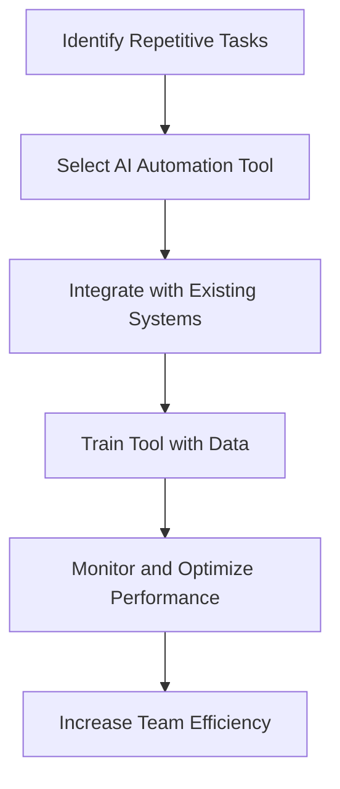

---

# Maximize Team Efficiency with AI Automation Tools

In today's fast-paced digital landscape, efficiency is the name of the game. Teams are constantly on the lookout for ways to streamline workflows, eliminate repetitive tasks, and enhance productivity. One of the most effective solutions to achieve this is through AI automation tools. These powerful technologies help organizations automate routine tasks, allowing teams to focus on higher-value work. In this blog post, we’ll explore the benefits of AI automation tools, practical examples of their application, and how to choose the right tool for your team.

## What Are AI Automation Tools?

AI automation tools use artificial intelligence to perform tasks that typically require human intelligence. These tools can automate a wide range of activities, from data entry and email responses to complex decision-making processes. By leveraging AI, teams can reduce the time spent on mundane tasks and increase overall productivity.

### Key Features of AI Automation Tools

1. **Task Automation**: Automate repetitive tasks without human intervention.
2. **Data Analysis**: Analyze large datasets quickly and accurately.
3. **Integration Capabilities**: Connect with various applications and platforms.
4. **Natural Language Processing**: Understand and generate human language to facilitate communication.
5. **Machine Learning**: Learn from data and improve over time to provide better results.

## Benefits of Using AI Automation Tools

### Increased Efficiency

AI tools can process tasks at a speed and scale that surpasses human capabilities. For instance, chatbots can handle thousands of customer inquiries simultaneously, ensuring that no query goes unanswered.

### Improved Accuracy

By minimizing human error, AI automation tools enhance the accuracy of tasks. For example, automating data entry tasks reduces the risk of errors associated with manual input.

### Cost Savings

Automating repetitive tasks can lead to significant cost savings. Organizations can reallocate human resources to more strategic initiatives, ultimately driving greater value.

### Better Decision Making

AI tools can analyze data trends and provide insights, helping teams make informed decisions faster. For example, marketing automation tools can analyze campaign performance in real-time to optimize strategies.

### Enhanced Collaboration

With routine tasks automated, team members can focus on collaboration and innovation. This shift not only improves morale but also encourages a more creative work environment.

## Practical Use Cases of AI Automation Tools

### 1. Customer Service Automation

AI chatbots, such as Drift and Intercom, can handle customer inquiries 24/7, providing instant responses to common questions. They can escalate more complex issues to human agents when necessary, ensuring a seamless customer experience.

### 2. Marketing Automation

Tools like HubSpot and Marketo allow marketing teams to automate email campaigns, social media postings, and lead scoring. This automation helps marketers engage with prospects at the right time and improves conversion rates.

### 3. Human Resource Processes

AI-driven tools like BambooHR and Workday can streamline HR processes such as recruitment, onboarding, and payroll management. Automating these tasks frees up HR professionals to focus on employee engagement and strategic initiatives.

### 4. Data Management

Tools like Zapier and Integromat (now Make) can automate data transfer between applications. For example, you can automatically add new leads from a web form to your CRM, saving time and reducing errors.

## Popular AI Automation Tools Comparison

When choosing the right AI automation tool for your team, it's essential to compare their features, pricing, and capabilities. Below is a comparison of some popular AI automation tools:

<table>
  <tr>
    <th>Tool</th>
    <th>Best For</th>
    <th>Key Features</th>
    <th>Pricing</th>
  </tr>
  <tr>
    <td>Zapier</td>
    <td>Integration Automation</td>
    <td>Connects apps, automates workflows</td>
    <td>Starts at $19.99/month</td>
  </tr>
  <tr>
    <td>Drift</td>
    <td>Customer Service</td>
    <td>AI chatbots, lead qualification</td>
    <td>Starts at $50/month</td>
  </tr>
  <tr>
    <td>HubSpot</td>
    <td>Marketing Automation</td>
    <td>Email campaigns, analytics</td>
    <td>Free, paid plans start at $50/month</td>
  </tr>
  <tr>
    <td>BambooHR</td>
    <td>Human Resources</td>
    <td>Employee management, payroll</td>
    <td>Contact for pricing</td>
  </tr>
</table>

### Pros and Cons of AI Automation Tools

#### Pros

- **Time-Saving**: Automates routine tasks leading to significant time savings.
- **Scalability**: Easily scales operations without a proportional increase in costs.
- **Improved Accuracy**: Reduces human errors in data handling.
- **Real-Time Insights**: Provides quick data analysis for informed decision-making.

#### Cons

- **Initial Setup Costs**: Some tools may require a significant upfront investment.
- **Complexity**: Learning curve associated with implementing and managing AI tools.
- **Dependence on Technology**: Over-reliance on automation may hinder critical thinking.

## How to Choose the Right AI Automation Tool

When selecting an AI automation tool, consider the following steps:

1. **Identify Your Needs**: Determine which processes need automation.
2. **Research Options**: Explore different tools available in the market.
3. **Assess Integration**: Ensure the tool can integrate with your existing systems.
4. **Test User Experience**: Opt for tools that offer free trials for a hands-on experience.
5. **Evaluate Support**: Check for customer support options and community resources.

## Conclusion

AI automation tools are revolutionizing the way teams work, enhancing efficiency, accuracy, and collaboration. By automating routine tasks, organizations can free up valuable time and resources, allowing employees to focus on strategic initiatives that drive growth. Whether it's improving customer service with chatbots or streamlining marketing efforts, the right AI automation tools can significantly impact your team's productivity.

Are you ready to take your team's efficiency to the next level with AI automation tools? Explore the options mentioned in this post, and start transforming your workflows today!

**Call to Action**: Share your thoughts in the comments below! Have you used any AI automation tools? What was your experience like? Let’s discuss!

## 関連記事

- [Choosing the Right AI Automation Tools for Your Business](/posts/choosing-the-right-ai-automation-tools-for-your-business/)
- [AI Agents: The Future of Personal Assistants in 2026](/posts/ai-agents-the-future-of-personal-assistants-in-2026/)
- [AI Automation: A Game Changer for Small Businesses](/posts/ai-automation-a-game-changer-for-small-businesses/)
