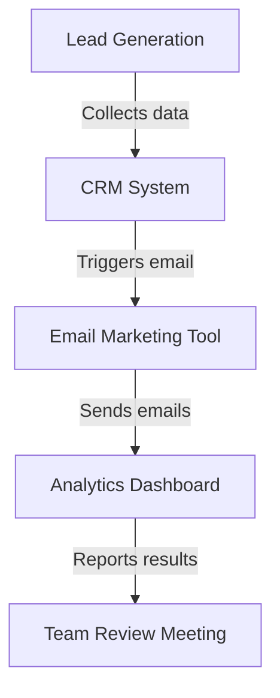

---

# Maximizing Efficiency: AI Automation Tools for Businesses

In today's fast-paced business environment, efficiency is key. Companies are constantly looking for ways to streamline processes, reduce costs, and enhance productivity. Enter AI automation tools—powerful software solutions designed to take repetitive tasks off your plate, allowing your team to focus on what really matters. In this post, we'll explore the top AI automation tools available, their benefits and drawbacks, and practical use cases to help you choose the right tool for your business.

## What Are AI Automation Tools?

AI automation tools are software applications that utilize artificial intelligence to automate repetitive tasks across various business functions. These tools can analyze data, make decisions, and execute tasks with minimal human intervention, ultimately leading to increased efficiency and productivity.

### Benefits of AI Automation Tools

1. **Time Savings**: Automating mundane tasks frees up time for employees to focus on strategic initiatives.
2. **Cost Reduction**: By minimizing manual work, businesses can reduce labor costs and errors associated with human oversight.
3. **Scalability**: AI tools can easily scale operations without the need for a proportional increase in workforce.
4. **Enhanced Accuracy**: AI-driven automation minimizes human errors, leading to better data integrity and decision-making.

### Common Use Cases for AI Automation Tools

- **Customer Support**: Chatbots can handle common inquiries, freeing up human agents for complex issues.
- **Marketing Automation**: Tools can automate email campaigns, social media posting, and customer segmentation.
- **Data Entry and Management**: AI can streamline data collection and reporting processes, reducing manual entry.
- **Project Management**: Automate task assignments, deadline reminders, and progress tracking.

## Top AI Automation Tools for Businesses

When it comes to choosing the right AI automation tool for your business, the options can be overwhelming. Below is a comparison of some of the leading AI automation tools available today.

<table>
  <tr>
    <th>Tool</th>
    <th>Best For</th>
    <th>Key Features</th>
    <th>Pros</th>
    <th>Cons</th>
  </tr>
  <tr>
    <td>Zapier</td>
    <td>Integration and Workflow Automation</td>
    <td>Connects apps, automates workflows, easy to use</td>
    <td>User-friendly, supports 3,000+ apps</td>
    <td>Can get expensive with premium features</td>
  </tr>
  <tr>
    <td>UiPath</td>
    <td>Robotic Process Automation (RPA)</td>
    <td>Automates repetitive tasks across applications</td>
    <td>High scalability, strong RPA capabilities</td>
    <td>Steeper learning curve, higher cost</td>
  </tr>
  <tr>
    <td>Integromat</td>
    <td>Advanced Workflows</td>
    <td>Visual workflow builder, real-time data processing</td>
    <td>Flexible, powerful for complex automations</td>
    <td>Interface can be overwhelming for beginners</td>
  </tr>
  <tr>
    <td>HubSpot</td>
    <td>Marketing Automation</td>
    <td>Email marketing, CRM, analytics</td>
    <td>All-in-one platform, great for inbound marketing</td>
    <td>Higher pricing tiers for advanced features</td>
  </tr>
</table>

### Example Workflow with AI Automation Tools

To visualize how AI automation tools can streamline business processes, consider the following workflow for a marketing team using these tools:

In this example, the workflow begins with lead generation, where data is collected and automatically fed into a CRM system. This triggers an email campaign via an email marketing tool, which then sends out promotional content. Finally, results are reported on an analytics dashboard for the team to review during meetings. Each step is streamlined through automation, allowing the team to focus on strategy rather than manual processes.

## Pros and Cons of Using AI Automation Tools

### Pros

- **Efficiency**: Significantly speeds up processes.
- **Cost-Effective**: Reduces the need for additional hires.
- **Consistency**: Delivers consistent results without variation.
- **Data-Driven Insights**: Provides analytics and insights that can guide decision-making.

### Cons

- **Initial Investment**: Implementing AI tools can require a significant upfront investment.
- **Learning Curve**: Some tools may have a steep learning curve for users.
- **Dependency on Technology**: Over-reliance on automation can lead to issues if systems fail.
- **Limited Creativity**: While AI can handle routine tasks, it lacks the human touch necessary for creative decision-making.

## Getting Started with AI Automation Tools

To maximize the benefits of AI automation tools, follow these steps:

1. **Assess Your Needs**: Identify which processes are repetitive and time-consuming.
2. **Research Tools**: Review various AI automation tools and their features.
3. **Test Options**: Use free trials or demos to find the best fit for your business.
4. **Implement Gradually**: Start with one or two processes before scaling up automation efforts.
5. **Monitor and Optimize**: Continuously monitor the performance of the tools and optimize based on results.

## Conclusion

AI automation tools can significantly enhance the efficiency and productivity of your business. By automating routine tasks, your team can focus on strategic initiatives that drive growth. As you explore your options, consider the pros and cons of each tool to find the best fit for your needs.

If you’re ready to take your business to the next level with AI automation tools, start by assessing your current processes and exploring the tools mentioned above. Remember, the right automation solution can transform your workflow and help you achieve your business goals.

**Call to Action**: Don’t wait—start your journey towards enhanced productivity today! Explore our recommended AI automation tools and see how they can revolutionize your business operations.

## 関連記事

- [AI Agents vs. Traditional Productivity Tools: An Honest Comparison](/posts/ai-agents-vs-traditional-tools-which-enhances-productivity/)
- [Automating Business Processes with AI: A Step-by-Step Playbook](/posts/automating-business-processes-with-ai-a-complete-guide/)
- [7 AI Automation Strategies to Supercharge Business Efficiency](/posts/boosting-business-efficiency-with-ai-automation-strategies/)
