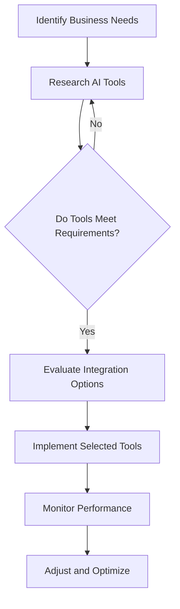

---

# Maximizing Efficiency: Integrating AI Tools in Workflows

In today’s fast-paced digital world, businesses are constantly searching for ways to enhance productivity, streamline processes, and improve collaboration. One of the most effective strategies is integrating AI tools into your workflows. By harnessing the power of artificial intelligence, organizations can automate mundane tasks, analyze data more efficiently, and make informed decisions faster than ever before. In this article, we’ll explore how to effectively integrate AI tools into your workflows and the benefits that come along with it.

## The Importance of Integrating AI Tools

Integrating AI tools into your workflows is no longer just an option—it's a necessity. As companies strive to remain competitive, leveraging technology can provide a significant edge. Here are a few reasons why AI integration is critical:

1. **Increased Efficiency**: Automating repetitive tasks frees up valuable time for employees to focus on higher-level responsibilities.
2. **Data-Driven Decisions**: AI tools can analyze vast amounts of data quickly, providing insights that help in making better decisions.
3. **Enhanced Collaboration**: AI tools can facilitate better communication and collaboration among team members, regardless of location.
4. **Cost Reduction**: Automating routine tasks can lead to lower operational costs in the long run.

## Identifying the Right AI Tools for Your Workflow

Before diving into the integration process, it’s essential to identify which AI tools will be most beneficial for your specific needs. Here’s a simple workflow diagram to help you visualize the decision-making process:

### Common AI Tools to Consider

When considering AI tools for integration, it’s vital to explore various options that cater to different aspects of your workflow. Here are some popular categories of AI tools you might consider:

- **Project Management**: Tools like Trello and Asana can be enhanced with AI features to prioritize tasks and predict project timelines.
- **Data Analysis**: Platforms such as Tableau and Google Analytics utilize AI to provide deeper insights into data patterns.
- **Customer Support**: AI chatbots can handle customer queries, providing instant responses and freeing up human agents for complex issues.
- **Content Generation**: Tools like Jasper and Copy.ai can assist in creating marketing copy, social media posts, or even entire articles.

## Pros and Cons of Integrating AI Tools

While the benefits of integrating AI tools are compelling, it’s essential to consider the potential drawbacks. Here’s a quick overview:

### Pros

- **Time-Saving**: Automating repetitive tasks allows employees to dedicate time to more strategic initiatives.
- **Improved Accuracy**: AI can reduce human error in data entry and analysis, leading to more reliable outcomes.
- **Scalability**: AI tools can grow with your business, easily adapting to increased workloads.

### Cons

- **Cost**: Some AI tools can be expensive to implement and maintain.
- **Learning Curve**: Employees may need training to effectively use new tools, which can take time and resources.
- **Dependency**: Over-reliance on AI tools can lead to a lack of critical thinking among team members.

## Practical Examples of AI Tool Integration

To illustrate the power of AI integration, let’s look at a few practical examples across various industries:

### 1. Marketing Automation with AI

Imagine a digital marketing agency using an AI tool like HubSpot. By integrating HubSpot’s AI capabilities, the agency can analyze customer behavior, segment their audience effectively, and automate email marketing campaigns based on user engagement signals. This not only improves the efficiency of marketing efforts but also enhances customer experience.

### 2. Enhanced Customer Support

A retail company can implement an AI chatbot on its website to handle customer inquiries. This chatbot can provide instant responses to frequently asked questions, reducing the workload on human agents. As a result, customers receive faster service, and agents can focus on more complex issues, leading to higher customer satisfaction.

### 3. Streamlined Project Management

A software development firm could integrate AI-powered project management tools like Monday.com to enhance task allocation. The AI can predict project timelines based on historical data and team performance, ensuring that deadlines are met consistently. This leads to improved team productivity and project outcomes.

## A Comparative Look at Popular AI Tools

When it comes to integrating AI tools, it’s crucial to choose the right one for your needs. Below is a comparison table that highlights some popular AI tools across different categories:

<table>
    <tr>
        <th>Tool</th>
        <th>Type</th>
        <th>Key Features</th>
        <th>Pricing</th>
    </tr>
    <tr>
        <td>Jasper</td>
        <td>Content Generation</td>
        <td>AI writing assistant, SEO optimization</td>
        <td>Starts at $29/month</td>
    </tr>
    <tr>
        <td>HubSpot</td>
        <td>Marketing Automation</td>
        <td>Email marketing, lead tracking, analytics</td>
        <td>Free tier available; Paid plans start at $50/month</td>
    </tr>
    <tr>
        <td>Trello</td>
        <td>Project Management</td>
        <td>Task automation, collaboration features</td>
        <td>Free tier available; Paid plans start at $10/month</td>
    </tr>
    <tr>
        <td>LivePerson</td>
        <td>Customer Support</td>
        <td>AI chatbots, analytics, omnichannel support</td>
        <td>Contact for pricing</td>
    </tr>
</table>

## Best Practices for Successful Integration

To ensure a smooth integration of AI tools into your workflows, consider the following best practices:

1. **Start Small**: Choose one or two tools to implement initially. Once you see results, you can expand.
2. **Involve Your Team**: Engage employees in the decision-making process to ensure buy-in and ease of adoption.
3. **Monitor and Adjust**: Continuously assess the performance of the tools and be willing to pivot your strategy if necessary.
4. **Training and Support**: Provide ample training and resources to help your team adapt to new tools effectively.

## Conclusion

Integrating AI tools into your workflows can significantly enhance efficiency, productivity, and collaboration. By carefully selecting the right tools and following best practices for integration, you can transform your business operations for the better. Remember to keep your team engaged throughout the process and monitor the performance of the tools to ensure you’re reaping the maximum benefits.

Are you ready to take the leap and integrate AI tools into your workflow? Start exploring your options today and watch your productivity soar!

--- 

By leveraging AI tools effectively, you can not only streamline your operations but also create a more empowered and agile workforce. Don't wait—begin your journey towards maximizing efficiency now!