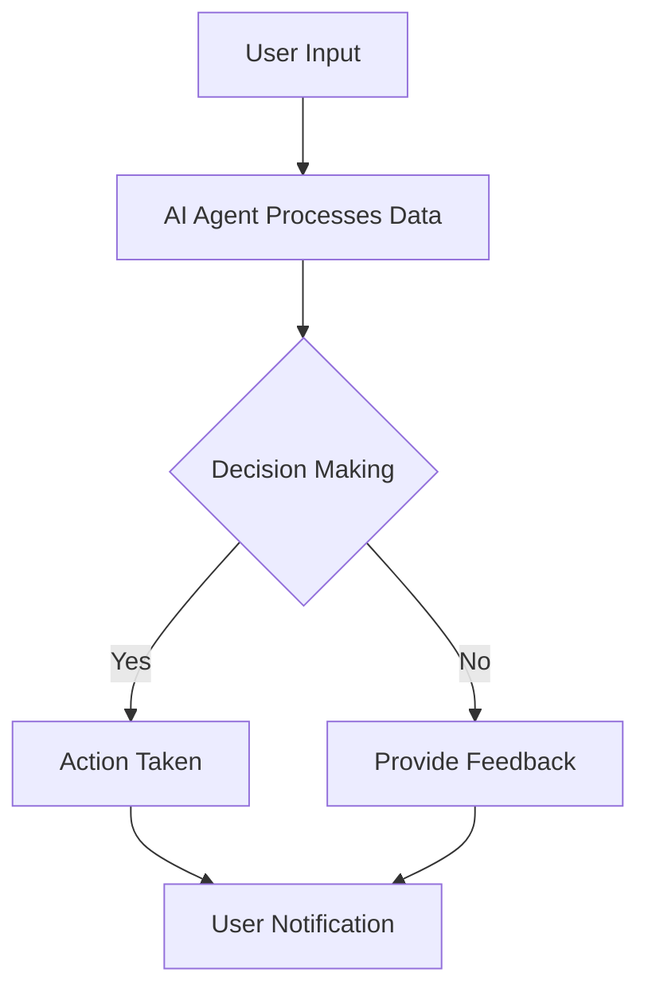

---

## Maximizing Productivity with AI Agents in 2026

As we step into 2026, the landscape of productivity is undergoing a seismic shift, driven largely by the rise of AI agents. These intelligent tools are no longer just futuristic concepts; they are integral to our daily workflows, helping us streamline tasks, manage time more effectively, and ultimately boost our productivity. In this blog post, we will explore how AI agents can maximize your productivity, practical examples of their applications, and the pros and cons of various AI tools available today.

### What Are AI Agents?

AI agents are software programs designed to perform tasks autonomously or semi-autonomously using artificial intelligence. They can analyze data, learn from interactions, and execute tasks based on predefined rules or adaptive algorithms. In 2026, these agents have evolved to be more user-friendly, adaptable, and capable of handling complex workflows.

### How AI Agents Enhance Productivity

The power of AI agents lies in their ability to handle repetitive tasks, analyze large datasets, and provide insights that can lead to better decision-making. Here are several ways AI agents are enhancing productivity in 2026:

1. **Automating Routine Tasks**: By offloading mundane activities such as scheduling meetings, sending reminders, and managing emails, AI agents free up valuable time for professionals to focus on more strategic tasks.

2. **Data Analysis and Insights**: AI agents can sift through massive datasets in seconds, providing actionable insights that would take humans much longer to uncover. This capability allows teams to make informed decisions based on real-time data.

3. **Personalized Learning and Development**: AI agents can analyze an individual’s performance and suggest personalized learning paths, ensuring continuous improvement and skill development.

4. **Enhanced Collaboration**: AI agents facilitate better communication and collaboration among team members by providing tools for project management, file sharing, and real-time feedback.

5. **Proactive Problem Solving**: With predictive analytics, AI agents can foresee potential issues and suggest solutions before they escalate, ensuring smoother operations.

### Practical Examples of AI Agents in Action

Let’s take a deeper look at some practical applications of AI agents in different industries:

- **Customer Support**: AI chatbots are revolutionizing customer service by handling common queries 24/7, allowing human agents to focus on more complex issues. For instance, companies like Zendesk and Drift use AI agents to automate responses and improve customer satisfaction.

- **Project Management**: Tools like Asana and Trello have integrated AI agents that can predict project timelines based on historical data, helping teams allocate resources more efficiently.

- **Sales and Marketing**: Platforms like HubSpot utilize AI agents to analyze customer behavior, segment audiences, and optimize marketing campaigns, leading to higher conversion rates.

- **Healthcare**: AI agents in telehealth platforms, such as Ada Health, can assess symptoms based on patient inputs and offer preliminary diagnoses, which can streamline the patient care process.

### Pros and Cons of AI Agents

While AI agents offer numerous advantages, they also come with challenges. Here’s a breakdown of the pros and cons:

| Pros                                          | Cons                                          |
|-----------------------------------------------|-----------------------------------------------|
| Automates repetitive tasks                    | May lead to job displacement                  |
| Provides real-time insights                   | Data privacy concerns                         |
| Enhances decision-making                      | Requires ongoing maintenance and updates      |
| Scalable solutions for businesses             | Can be expensive to implement                 |
| Improves customer engagement                  | Potential for errors in critical situations    |

### Which AI Agents Should You Consider?

As the market for AI agents grows, choosing the right tool can be daunting. Below is a comparison of some of the leading AI productivity tools available in 2026:

<table>
  <tr>
    <th>Tool</th>
    <th>Best For</th>
    <th>Key Features</th>
    <th>Pricing</th>
  </tr>
  <tr>
    <td>Zapier</td>
    <td>Automation</td>
    <td>Workflow automation, app integrations, customizable triggers</td>
    <td>$19.99/month</td>
  </tr>
  <tr>
    <td>Notion AI</td>
    <td>Project Management</td>
    <td>Task tracking, collaborative documents, AI-powered suggestions</td>
    <td>$8/month/user</td>
  </tr>
  <tr>
    <td>Grammarly</td>
    <td>Writing Assistance</td>
    <td>Grammar checking, style suggestions, plagiarism detection</td>
    <td>$12/month</td>
  </tr>
  <tr>
    <td>Salesforce Einstein</td>
    <td>Sales Optimization</td>
    <td>Predictive analytics, lead scoring, automated customer interactions</td>
    <td>Custom pricing</td>
  </tr>
</table>

### Visualizing the AI-Agent Workflow

To help you understand how AI agents integrate into your daily workflows, here’s a simple diagram illustrating the process:

### The Future of AI Agents in Productivity

As we look ahead, the capabilities of AI agents will continue to expand. In 2026, we can expect to see advancements in natural language processing, machine learning, and integrated systems that will provide even more seamless experiences. Furthermore, ethical considerations surrounding data privacy and AI transparency will become increasingly important as these tools become more prevalent.

### Final Thoughts

AI agents are not just a trend; they represent a fundamental shift in how we approach productivity. By embracing these tools, you can streamline your workflows, enhance collaboration, and ultimately achieve more in less time. However, it’s essential to choose the right tools that align with your specific needs and to remain aware of the challenges that come with their implementation.

Are you ready to maximize your productivity with AI agents? Explore the tools mentioned above and see how they can transform your daily tasks. Start your journey toward enhanced productivity today!

### Call to Action

Have you tried using AI agents to boost your productivity? Share your experiences in the comments below or reach out to us for personalized recommendations on the best AI tools for your workflow!