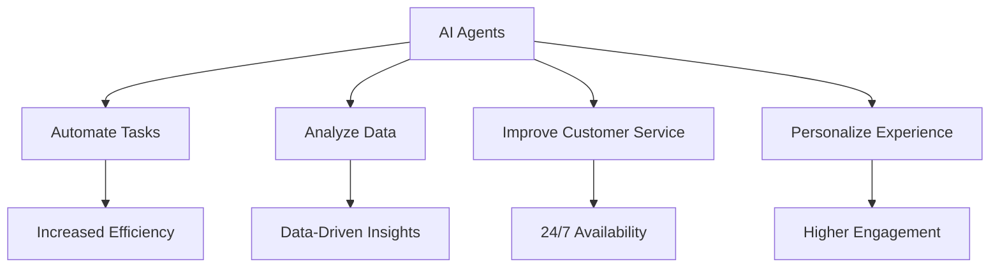

---

## Maximizing Productivity with AI Agents in 2026

In the rapidly evolving landscape of technology, AI agents have emerged as pivotal tools for maximizing productivity. As we step into 2026, businesses and individuals alike are leveraging AI agents to streamline tasks, improve decision-making, and enhance operational efficiency. But what exactly are AI agents? How can they significantly boost your productivity? Let’s dive in!

### What Are AI Agents?

AI agents are intelligent software programs designed to perform tasks autonomously or semi-autonomously. They can analyze data, make decisions, and interact with users to enhance overall productivity. These agents range from simple chatbots that handle customer inquiries to sophisticated virtual assistants capable of managing complex workflows.

### The Evolution of AI Agents

In recent years, AI agents have evolved from basic automation tools to advanced systems powered by machine learning and natural language processing. By 2026, these agents have become integral in various sectors, including healthcare, finance, marketing, and customer service. 

### How AI Agents Enhance Productivity

#### 1. Automating Routine Tasks

One of the primary benefits of AI agents is their ability to automate repetitive tasks. For instance, AI-driven scheduling assistants can manage your calendar, send reminders, and even reschedule appointments based on your preferences. 

**Practical Example:** Imagine a scenario where you have back-to-back meetings. An AI agent can analyze your calendar, find gaps, and suggest optimal times for breaks or additional meetings, freeing you from the hassle of manual scheduling.

#### 2. Improving Decision-Making

AI agents can process vast amounts of data quickly, providing insights that humans might overlook. This capability is especially beneficial in fields like finance, where timely decisions can significantly impact profitability.

**Practical Example:** In stock trading, AI agents can analyze market trends and historical data to suggest when to buy or sell assets, potentially increasing returns on investment.

#### 3. Enhancing Customer Interactions

Customer service is another area where AI agents shine. Chatbots and virtual assistants can handle inquiries 24/7, providing instant responses that improve customer satisfaction without overwhelming human staff.

**Practical Example:** A retail company can deploy an AI chatbot that assists customers with product searches, returns, and FAQs, allowing human agents to focus on more complex issues.

#### 4. Personalizing User Experience

AI agents can analyze user behavior and preferences to deliver personalized experiences. This is particularly useful in marketing, where tailored messages can lead to higher engagement rates.

**Practical Example:** E-commerce platforms often use AI agents to recommend products based on a user's browsing history, significantly improving conversion rates.

### Pros and Cons of Using AI Agents for Productivity

| Pros                                    | Cons                                     |
|-----------------------------------------|------------------------------------------|
| **Increased Efficiency**: Automation of repetitive tasks saves time. | **Job Displacement**: Potential for reduced human roles in certain tasks. |
| **Data-Driven Insights**: AI agents analyze data faster than humans. | **Dependence on Technology**: Over-reliance may lead to skills degradation. |
| **24/7 Availability**: AI agents can operate round the clock. | **Privacy Concerns**: Data handling by AI can raise security issues. |
| **Personalization**: Tailored experiences enhance user satisfaction. | **Implementation Costs**: Initial setup can be expensive for small businesses. |

### Popular AI Agents for Productivity in 2026

Here's a comparison of some leading AI agents available today, showcasing their key features and suitability for different use cases.

<table>
    <tr>
        <th>AI Agent</th>
        <th>Key Features</th>
        <th>Best For</th>
    </tr>
    <tr>
        <td>Zapier</td>
        <td>Workflow automation, integrations with various applications</td>
        <td>Businesses needing to automate tasks across platforms</td>
    </tr>
    <tr>
        <td>ChatGPT</td>
        <td>Natural language processing, conversational AI</td>
        <td>Customer service, content creation</td>
    </tr>
    <tr>
        <td>Otter.ai</td>
        <td>Transcription services, meeting notes</td>
        <td>Professionals needing accurate meeting documentation</td>
    </tr>
    <tr>
        <td>Notion AI</td>
        <td>Project management, task automation, note-taking</td>
        <td>Teams looking for an all-in-one productivity tool</td>
    </tr>
</table>

### The Future of AI Agents in Productivity

As we continue to advance into the future, the capabilities of AI agents will only expand. We can expect to see more sophisticated integration with IoT devices, deeper analytics capabilities, and enhanced user interfaces that make these tools even more accessible and intuitive.

### Conclusion

In 2026, leveraging AI agents for productivity is not just an option but a necessity for anyone looking to stay competitive. By automating routine tasks, improving decision-making, enhancing customer interactions, and personalizing user experiences, AI agents can significantly boost productivity in various fields. However, it’s essential to weigh the pros and cons and consider how these tools fit into your workflow.

Are you ready to embrace the future of productivity? Start exploring AI agents today and transform the way you work!

### Call to Action

If you found this article helpful, share it with your colleagues and friends! For more insights on AI tools and productivity strategies, subscribe to our newsletter and stay ahead in the ever-evolving tech landscape.