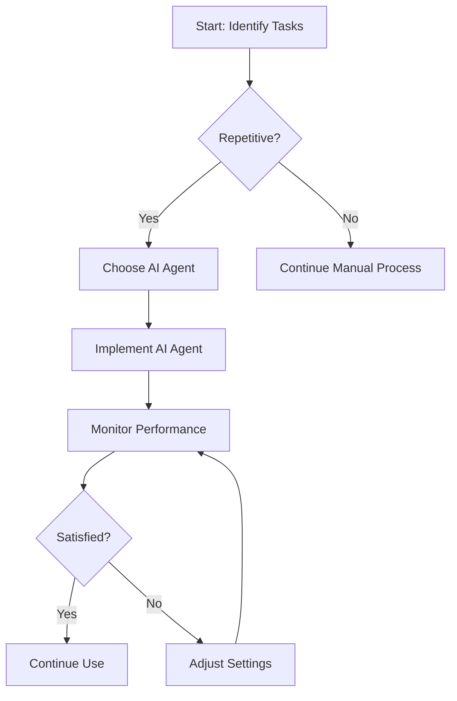

---

# Maximizing Productivity with AI Agents in 2026

As we venture deeper into 2026, the landscape of productivity is evolving faster than ever, largely due to the integration of AI agents. These intelligent tools are not just gimmicks; they are game-changers that can optimize your workflow, automate mundane tasks, and enhance your overall efficiency. In this article, we will explore the capabilities of AI agents in boosting productivity, practical use cases, and the pros and cons of implementing them in your daily routine.

## What are AI Agents?

AI agents are software programs designed to perform tasks automatically, often using machine learning and natural language processing to interact with users. They can take various forms, from virtual assistants like Siri and Alexa to specialized bots that handle customer service inquiries, manage schedules, or even analyze data trends.

With the rise of remote work and digital collaboration, AI agents have become essential tools for businesses and individuals alike, enabling seamless communication and efficient task management.

## How AI Agents Enhance Productivity

### 1. Task Automation

One of the primary advantages of AI agents is their ability to automate repetitive tasks, freeing up valuable time for more strategic work. For instance, you can use AI agents to:

- **Schedule Meetings**: Tools like x.ai can analyze your calendar and suggest optimal meeting times without any back-and-forth emails.
- **Email Management**: AI-powered tools like Clean Email can sort, categorize, and even respond to emails based on your preferences, reducing inbox clutter.

### 2. Data Analysis and Insights

AI agents excel at sifting through vast amounts of data to provide actionable insights. For businesses, this means:

- **Sales Forecasting**: Tools like Salesforce's Einstein can predict sales trends based on historical data, helping teams make informed decisions.
- **Customer Insights**: AI agents can analyze customer behavior and feedback to tailor marketing strategies, improving customer engagement.

### 3. Enhanced Communication

With the rise of remote work, effective communication is crucial. AI agents like ChatGPT can facilitate this by:

- **Drafting Messages**: Whether it's composing emails or creating reports, AI can help draft and edit your communication.
- **Translating Languages**: Tools like DeepL can break down language barriers, enabling smooth communication across global teams.

## Practical Examples of AI Agents in Action

Let’s take a look at how various industries are leveraging AI agents to enhance productivity:

### Healthcare

In the healthcare sector, AI agents such as IBM Watson assist doctors by analyzing patient data to recommend treatment plans. This not only speeds up decision-making but also improves patient outcomes.

### Finance

Financial advisors increasingly use AI agents to analyze market trends and provide real-time investment advice. For example, Wealthfront uses AI to help users manage their investments without constant oversight.

### Education

AI agents like Duolingo enhance language learning by adapting to user progress and providing personalized feedback, making the learning process more efficient and enjoyable.

## Pros and Cons of Using AI Agents

While AI agents bring many advantages, it's essential to consider their limitations:

### Pros

- **Increased Efficiency**: Automating tasks allows employees to focus on high-priority initiatives.
- **Cost Savings**: Reducing the need for human intervention in repetitive tasks can lead to significant savings.
- **Scalability**: AI agents can handle increased workloads without additional resources, making them ideal for growing businesses.

### Cons

- **Dependence on Technology**: Over-reliance on AI can lead to skill degradation among employees.
- **Data Privacy Concerns**: Handling sensitive information through AI raises concerns about data security and compliance.
- **Limited Understanding**: AI agents may misinterpret human emotions or nuanced requests, leading to potential misunderstandings.

## Comparing Popular AI Agents for Productivity

To help you choose the right AI agent for your needs, here’s a comparison of some popular tools:

<table>
    <tr>
        <th>AI Agent</th>
        <th>Key Features</th>
        <th>Ideal For</th>
        <th>Price</th>
    </tr>
    <tr>
        <td>Zapier</td>
        <td>Task automation across apps</td>
        <td>Businesses looking for integration</td>
        <td>Starts at $19.99/month</td>
    </tr>
    <tr>
        <td>ChatGPT</td>
        <td>Natural language processing</td>
        <td>Content creation, customer service</td>
        <td>Free basic version; $20/month for Pro</td>
    </tr>
    <tr>
        <td>Otter.ai</td>
        <td>Transcription and note-taking</td>
        <td>Meeting documentation</td>
        <td>Free tier available; Pro at $12.99/month</td>
    </tr>
    <tr>
        <td>Calendly</td>
        <td>Meeting scheduling</td>
        <td>Individuals and teams</td>
        <td>Free basic version; Premium at $15/month</td>
    </tr>
</table>

## A Workflow for Implementing AI Agents

To help visualize the process of integrating AI agents into your workflow, here’s a simple decision tree:

## Future Trends in AI Agents

As technology continues to advance, the capabilities of AI agents will only improve. We can expect to see:

- **Greater Personalization**: AI will learn user preferences more effectively, leading to tailored experiences.
- **Integration with Other Technologies**: AI agents will increasingly work alongside other technologies such as IoT devices and blockchain to create a more connected ecosystem.
- **Improved Emotional Intelligence**: Future AI agents may be better equipped to understand human emotions, making them more effective in roles requiring empathy and understanding.

## Conclusion: Embrace AI Agents for Enhanced Productivity

In 2026, AI agents are more than just a trend; they are essential tools that can dramatically enhance productivity across various sectors. By automating tasks, providing insights, and facilitating communication, these agents can help you and your organization work smarter, not harder.

Are you ready to take your productivity to the next level with AI agents? Start exploring the tools mentioned above, assess your specific needs, and watch your efficiency soar!

For more insights on AI tools and productivity, be sure to subscribe to our blog and stay updated with the latest trends and tools in the tech world!